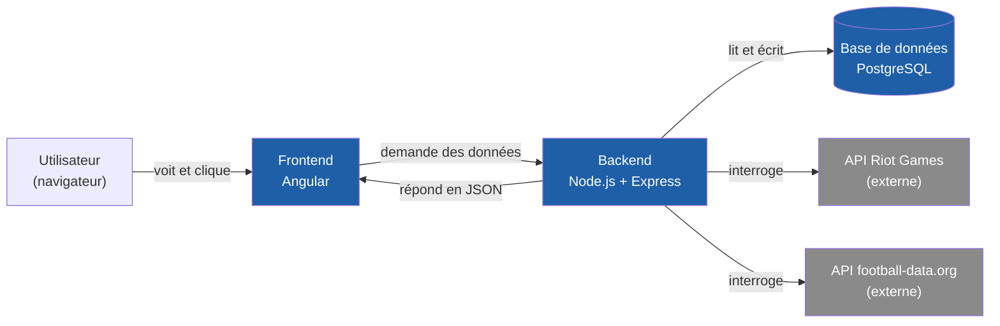
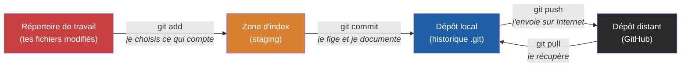
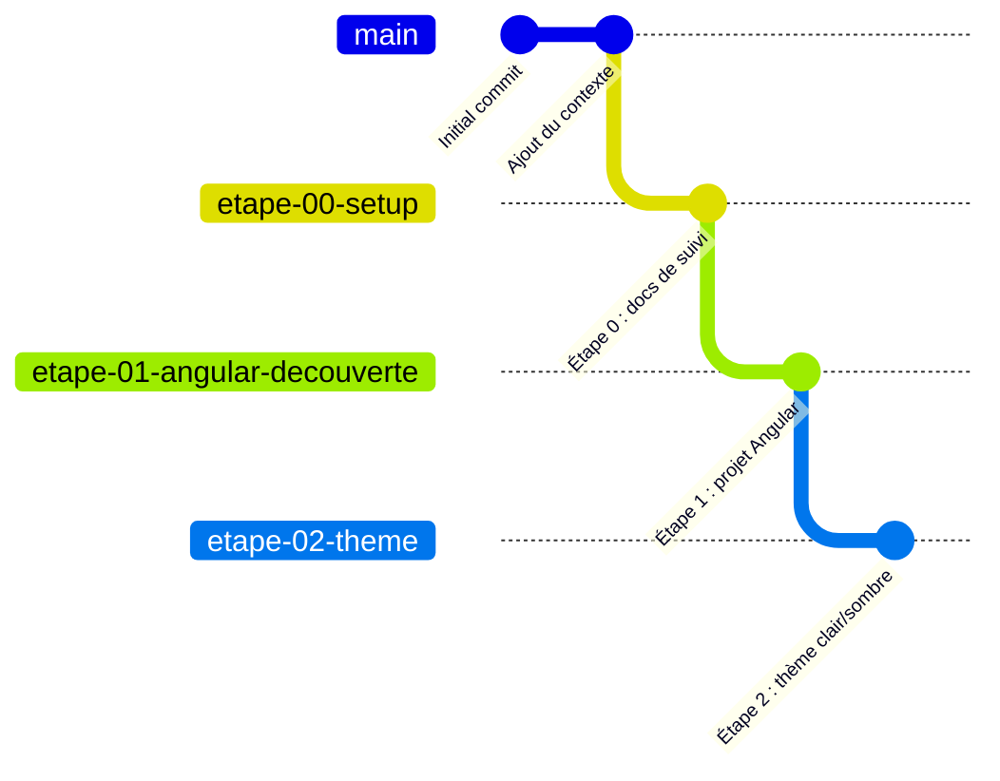
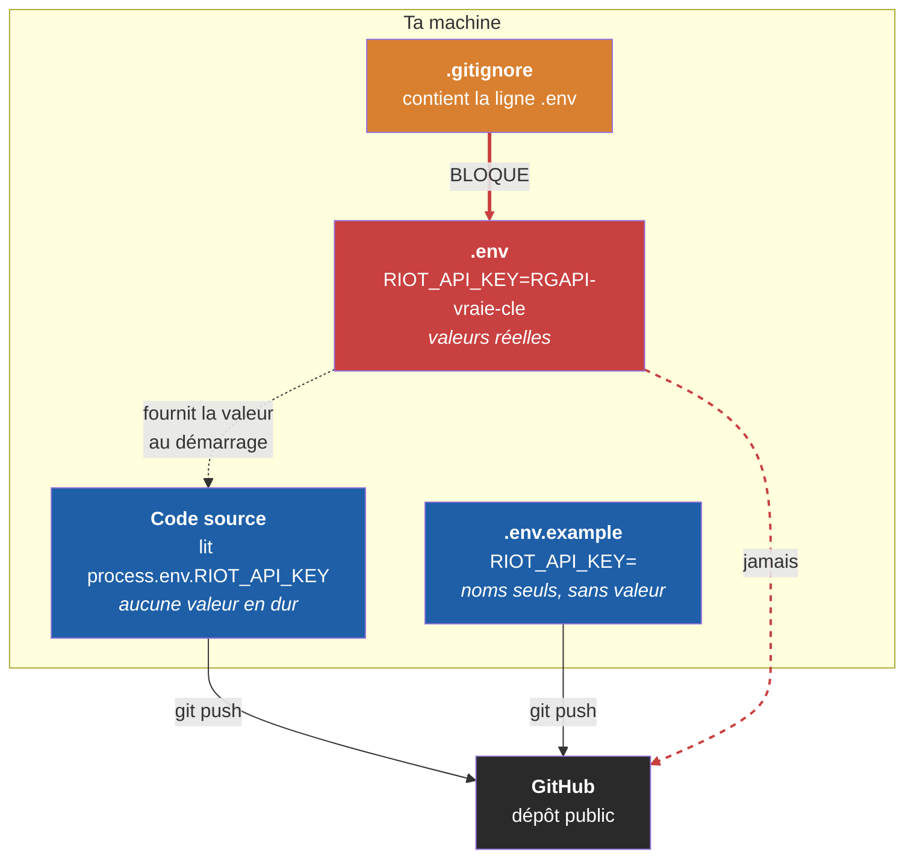
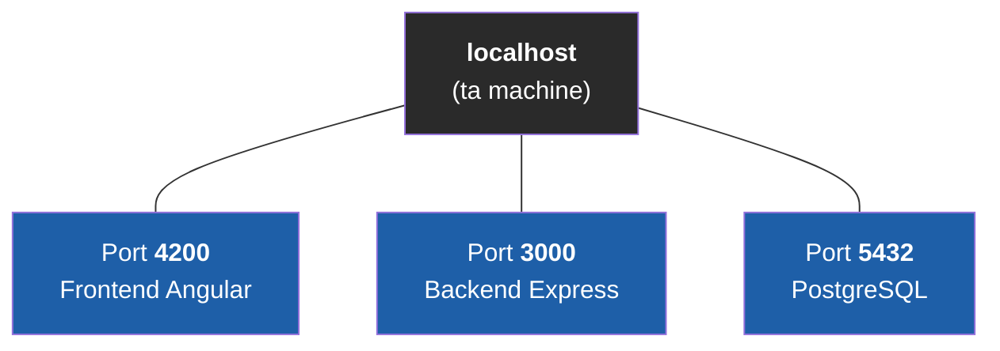

# Document d'apprentissage — Plateforme de suivi eSport

Ce document est le cours du projet. Il est rempli au fur et à mesure, une section par étape, et suit toujours la même structure : objectifs, concepts, prérequis, déroulé, livrable, checklist, branche d'arrivée.

Il part systématiquement du principe qu'aucune notion n'est acquise : chaque terme est défini au moment où il apparaît, et repris dans le [glossaire](GLOSSAIRE.md).

## Sommaire

- [Étape 0 — Mise en place de l'environnement](#étape-0--mise-en-place-de-lenvironnement)

---

# Étape 0 — Mise en place de l'environnement

## 1. Objectifs

À la fin de cette étape, tu dois savoir :

- expliquer **à quoi sert chacun des outils installés** et à quel moment du projet il intervient ;
- vérifier dans un terminal qu'un outil est bien installé et lire le numéro de version qu'il affiche ;
- expliquer la différence entre **Git** et **GitHub**, et ce que contient un dépôt ;
- expliquer pourquoi le projet utilise **une branche par étape**, et comment revenir à une étape antérieure ;
- expliquer pourquoi un mot de passe ou une clé d'API ne doit **jamais** être écrit dans le code, et par quoi on le remplace.

## 2. Concepts abordés

### 2.1 L'architecture générale de ce qu'on va construire

Avant d'installer quoi que ce soit, il faut comprendre **ce que chaque outil vient occuper comme place** dans l'application finale. Sans cette vue d'ensemble, une liste d'installations n'est qu'une suite de clics sans signification.

Une application web moderne est presque toujours découpée en trois morceaux distincts, qui tournent séparément et se parlent par le réseau.

Le premier est le **frontend** (littéralement « la façade »). C'est la seule partie que l'utilisateur voit : elle s'exécute **dans son navigateur**, sur sa machine à lui. Elle affiche les pages, réagit aux clics, mais ne détient aucune donnée en propre — elle doit les demander. C'est le rôle d'**Angular** ici.

Le deuxième est le **backend** (« l'arrière-boutique »). Il s'exécute sur un serveur, jamais chez l'utilisateur. Il reçoit les demandes du frontend, décide si elles sont légitimes, va chercher les données et les renvoie. C'est lui, et lui seul, qui détient les secrets : mot de passe de la base, clés d'API. C'est le rôle d'**Express**, exécuté par **Node.js**.

Le troisième est la **base de données**, qui conserve durablement les informations. Elle n'est accessible que par le backend. C'est le rôle de **PostgreSQL**.

S'ajoutent enfin les **APIs externes** — Riot Games et football-data.org — qui sont des services appartenant à d'autres entreprises, interrogés par le backend pour récupérer les vrais résultats de matchs.



Le point important, sur ce schéma : **le frontend ne parle jamais directement ni à la base de données, ni aux APIs externes.** Tout passe par le backend. Ce n'est pas une contrainte technique arbitraire, c'est une question de sécurité — on y revient en 2.4.

### 2.2 Git, GitHub, et pourquoi les deux ne sont pas la même chose

**Git** est un logiciel installé sur ta machine. Son travail est d'enregistrer l'historique complet des modifications du projet. Chaque fois que tu fais un **commit**, Git fige l'état de tous les fichiers à cet instant et l'ajoute à l'historique, avec un message qui explique le changement.

La différence avec une sauvegarde classique est fondamentale : une sauvegarde écrase la version précédente, un commit **s'ajoute**. Rien n'est jamais perdu, et on peut revenir à n'importe quel point du passé.

**GitHub** est un service web qui héberge une copie de ce dépôt sur Internet. Git fonctionne très bien sans GitHub — l'historique est complet en local. GitHub apporte trois choses : une sauvegarde hors de ta machine, une interface web pour consulter le code, et la possibilité de collaborer.

Le passage du travail en cours jusqu'à GitHub se fait en trois temps, qu'il faut bien distinguer :



L'étape intermédiaire — la **zone d'index**, ou *staging* — surprend souvent au début. Pourquoi ne pas commiter directement tout ce qui a changé ? Parce qu'elle permet de **choisir** : si tu as modifié cinq fichiers pour deux raisons différentes, tu peux faire deux commits séparés, chacun cohérent et correctement décrit. Un historique lisible vaut beaucoup mieux qu'un historique exhaustif mais confus.

### 2.3 Pourquoi une branche par étape

Une **branche** est une ligne de développement parallèle dans le dépôt. Créer une branche revient à poser un marque-page dans l'historique et à continuer à écrire à partir de là, sans toucher à ce qui précède.

Le cadre du projet impose une branche par étape, nommée `etape-XX-nom-court`. Cette règle a un but précis : **chaque branche est un état du projet connu comme fonctionnel.** Si l'étape 7 part en vrac et devient impossible à déboguer, il reste toujours possible de repartir de l'étape 6 intacte, sans avoir à défaire les modifications une par une.



Chaque branche part de la précédente et contient donc tout son contenu, plus le sien. `main` reste de côté jusqu'à la toute fin : elle est réservée au projet terminé et aux deux documents finaux.

### 2.4 Les secrets, et pourquoi ils ne vivent pas dans le code

C'est le concept le plus important de cette étape, et le seul dont une erreur est **définitive**.

Le projet manipulera des **secrets** : le mot de passe de PostgreSQL, la clé d'API Riot Games, la clé football-data.org. Un secret est une information qui donne un accès — quiconque la possède peut agir à ta place.

Le réflexe naturel du débutant est d'écrire la clé directement dans le code, parce que c'est ce qui fonctionne le plus vite. Le problème n'apparaît qu'au moment du `git push` : le code part sur GitHub, et le secret avec lui. Et comme Git conserve **tout l'historique**, le supprimer dans un commit ultérieur ne le retire pas — il reste consultable dans les commits précédents. Un secret publié une fois doit être considéré comme perdu et régénéré.

La solution est de sortir le secret du code et de le placer dans un fichier `.env`, que le `.gitignore` empêche d'être commité :



Le fichier `.env.example`, lui, part bien sur GitHub. Il ne contient que les **noms** des variables, sans les valeurs. Son rôle est documentaire : il indique à quiconque récupère le projet quelles variables il doit renseigner, sans qu'aucun secret n'ait circulé.

C'est aussi ce qui explique le point relevé en 2.1 : le frontend s'exécute dans le navigateur de l'utilisateur, donc **tout ce qu'il contient est lisible par cet utilisateur**. Une clé d'API placée dans le frontend est une clé publique. C'est pour ça qu'elle reste côté backend, qui tourne sur un serveur auquel personne n'a accès.

### 2.5 Les ports

Plusieurs programmes vont tourner en même temps sur ta machine et communiquer par le réseau. Le **port** est le numéro qui permet de les distinguer : l'adresse identifie la machine, le port identifie le programme à l'intérieur.



`localhost` est le nom réservé qui désigne toujours « la machine sur laquelle je suis ». Ouvrir `http://localhost:4200` dans le navigateur signifie donc : « contacte le programme qui écoute sur le port 4200 de cette machine », c'est-à-dire le serveur de développement Angular.

Les valeurs `4200`, `3000` et `5432` sont des conventions, pas des obligations. `5432` est le port historique de PostgreSQL, et le conserver évite d'avoir à le préciser dans chaque outil de connexion.

## 3. Prérequis

Pars de la branche **`main`**.

```
git checkout main
```

Aucune connaissance préalable n'est nécessaire pour cette étape.

## 4. Déroulé détaillé

### 4.1 Installer les outils

Sept outils sont nécessaires pour démarrer. Voici ce que chacun apporte et comment vérifier qu'il fonctionne.

| Outil | Rôle dans le projet | Commande de vérification |
|---|---|---|
| **Node.js** | Exécute le JavaScript hors navigateur — fait tourner le backend et les outils de développement | `node -v` |
| **npm** | Installe les bibliothèques ; livré avec Node.js | `npm -v` |
| **Angular CLI** | Crée et sert le projet Angular | `ng version` |
| **Git** | Gère l'historique des versions | `git --version` |
| **VS Code** | Éditeur de code | `code -v` |
| **PostgreSQL** | Base de données | via pgAdmin |
| **pgAdmin** *(ou DBeaver)* | Explorer la base à la souris | ouvrir l'application |

La vérification n'est pas une formalité. Une commande qui répond `command not found` signifie que le programme n'est pas installé **ou** que le système ne sait pas où le trouver — dans les deux cas, il faut régler le problème avant d'avancer, sinon l'erreur ressurgira plus tard sous une forme plus difficile à diagnostiquer.

Angular CLI s'installe avec npm, en mode **global** :

```
npm install -g @angular/cli
```

L'option `-g` (*global*) installe le paquet pour toute la machine plutôt que dans un projet. C'est indispensable ici : la commande `ng` sert justement à **créer** le projet Angular, donc elle doit exister avant lui.

À l'installation de PostgreSQL, deux écrans demandent un choix :

- le **port** : conserver `5432`, la valeur standard ;
- la **locale** : conserver `DEFAULT`, qui reprend les réglages régionaux français de Windows — utile pour que les tris sur des noms accentués se comportent correctement.

L'assistant **Stack Builder** proposé en fin d'installation peut être annulé : il sert à ajouter des composants optionnels dont le projet n'a pas besoin.

Le mot de passe choisi pour l'utilisateur `postgres` pendant l'installation est un **secret** : il sera nécessaire à l'étape 6 et devra être placé dans `.env`.

### 4.2 Installer les extensions VS Code

| Extension | Ce qu'elle apporte |
|---|---|
| Angular Language Service | Autocomplétion et détection d'erreurs dans les fichiers Angular |
| ESLint | Signale les erreurs et les mauvaises pratiques pendant la frappe |
| Prettier | Met en forme le code automatiquement à la sauvegarde |
| GitLens | Affiche qui a modifié chaque ligne et quand |
| DotENV | Colore les fichiers `.env` pour les rendre lisibles |
| Thunder Client | Teste les routes du backend sans passer par le frontend |
| Markdown Preview Mermaid Support | Affiche les schémas Mermaid dans l'aperçu Markdown de VS Code |

La dernière mérite une explication : sans elle, les blocs ` ```mermaid ` de ce document s'affichent comme du texte brut dans VS Code. Ils se rendent correctement sur GitHub dans tous les cas, mais l'extension évite d'avoir à ouvrir le navigateur pour relire un schéma.

### 4.3 Structurer le dépôt

Le dépôt existe déjà sur GitHub. Il s'agit maintenant d'y créer la branche de l'étape et les documents que le projet impose de tenir à jour.

```
git checkout -b etape-00-setup
```

`checkout -b` fait deux choses : `-b` crée la branche, `checkout` bascule dessus. Toute modification faite ensuite appartiendra à cette branche, pas à `main`.

Quatre fichiers constituent le socle documentaire du projet :

| Fichier | Rôle |
|---|---|
| `CONTEXTE.md` | Cadre du projet — règles, stack, découpage des étapes. Fait foi en cas de doute. |
| `GLOSSAIRE.md` | Tous les termes techniques rencontrés, définis simplement |
| `DOCUMENT-APPRENTISSAGE.md` | Ce document — le cours, une section par étape |
| `.env.example` | Liste des variables d'environnement nécessaires, sans les valeurs |

### 4.4 Vérifier le `.gitignore`

Le `.gitignore` est déjà en place. Deux lignes sont critiques et méritent d'être vérifiées à l'œil :

```
node_modules/
.env
```

La première évite d'envoyer sur GitHub un dossier de plusieurs centaines de mégaoctets, entièrement reconstructible par `npm install`. La seconde est la protection décrite en 2.4 — c'est elle qui empêche les secrets de partir.

### 4.5 Enregistrer le travail

```
git add .
git commit -m "Etape 0 : structuration du depot et documents de suivi"
git push -u origin etape-00-setup
```

`git add .` place tous les fichiers modifiés dans la zone d'index. `git commit -m` fige cet ensemble avec un message. `git push -u origin etape-00-setup` envoie la branche sur GitHub ; l'option `-u` établit le lien entre la branche locale et sa jumelle distante, ce qui permettra d'écrire simplement `git push` les fois suivantes.

## 5. Livrable attendu

- Les sept outils sont installés et répondent à leur commande de vérification.
- Les extensions VS Code sont installées.
- La branche `etape-00-setup` existe en local et sur GitHub.
- Elle contient `CONTEXTE.md`, `GLOSSAIRE.md`, `DOCUMENT-APPRENTISSAGE.md`, `.env.example`, `.gitignore` et `README.md`.
- Aucun secret ne figure dans le dépôt.

## 6. Checklist d'auto-vérification

Réponds sans relire le document — si une réponse ne vient pas, la notion mérite une relecture.

1. Quelle est la différence entre Git et GitHub ? Lequel des deux fonctionne sans connexion Internet ?
2. Que se passe-t-il si tu écris ta clé d'API Riot directement dans le code et que tu fais `git push` ? Pourquoi la supprimer dans un commit suivant ne règle-t-il pas le problème ?
3. Pourquoi le fichier `node_modules/` est-il exclu du dépôt alors qu'il est indispensable pour faire tourner le projet ?
4. Le frontend pourrait techniquement appeler l'API Riot directement, sans passer par le backend. Pourquoi ne fait-on pas ça ?
5. Si l'étape 7 devient impossible à déboguer, comment reviens-tu à un état fonctionnel ?
6. Que signifie le `-g` dans `npm install -g @angular/cli`, et pourquoi est-il nécessaire ici ?

## 7. Branche d'arrivée

À la fin de cette étape, ton code doit être poussé sur **`etape-00-setup`**.

L'étape suivante partira de cette branche pour créer `etape-01-angular-decouverte`.
