# Document d'apprentissage — Plateforme de suivi eSport

Ce document est le cours du projet. Il est rempli au fur et à mesure, une section par étape, et suit toujours la même structure : objectifs, concepts, prérequis, déroulé, livrable, checklist, branche d'arrivée.

Il part systématiquement du principe qu'aucune notion n'est acquise : chaque terme est défini au moment où il apparaît, et repris dans le [glossaire](GLOSSAIRE.md).

## Sommaire

- [Étape 0 — Mise en place de l'environnement](#étape-0--mise-en-place-de-lenvironnement)
- [Étape 1 — Découverte d'Angular](#étape-1--découverte-dangular)
- [Étape 2 — Charte graphique et thèmes clair/sombre](#étape-2--charte-graphique-et-thèmes-clairsombre)
- [Étape 3 — Données mockées](#étape-3--données-mockées)

---

# Étape 0 — Mise en place de l'environnement

## 1. Objectifs

À la fin de cette étape, tu dois savoir :

- expliquer **à quoi sert chacun des outils installés** et à quel moment du projet il intervient ;
- vérifier dans un terminal qu'un outil est bien installé et lire le numéro de version qu'il affiche ;
- expliquer la différence entre **Git** et **GitHub**, et ce que contient un dépôt ;
- expliquer pourquoi le projet utilise **une branche par étape**, et comment revenir à une étape antérieure ;
- expliquer pourquoi un mot de passe ou une clé d'API ne doit **jamais** être écrit dans le code, et par quoi on le remplace.

## 2. Concepts abordés

### 2.1 L'architecture générale de ce qu'on va construire

Avant d'installer quoi que ce soit, il faut comprendre **ce que chaque outil vient occuper comme place** dans l'application finale. Sans cette vue d'ensemble, une liste d'installations n'est qu'une suite de clics sans signification.

Une application web moderne est presque toujours découpée en trois morceaux distincts, qui tournent séparément et se parlent par le réseau.

Le premier est le **frontend** (littéralement « la façade »). C'est la seule partie que l'utilisateur voit : elle s'exécute **dans son navigateur**, sur sa machine à lui. Elle affiche les pages, réagit aux clics, mais ne détient aucune donnée en propre — elle doit les demander. C'est le rôle d'**Angular** ici.

Le deuxième est le **backend** (« l'arrière-boutique »). Il s'exécute sur un serveur, jamais chez l'utilisateur. Il reçoit les demandes du frontend, décide si elles sont légitimes, va chercher les données et les renvoie. C'est lui, et lui seul, qui détient les secrets : mot de passe de la base, clés d'API. C'est le rôle d'**Express**, exécuté par **Node.js**.

Le troisième est la **base de données**, qui conserve durablement les informations. Elle n'est accessible que par le backend. C'est le rôle de **PostgreSQL**.

S'ajoutent enfin les **APIs externes** — Riot Games et football-data.org — qui sont des services appartenant à d'autres entreprises, interrogés par le backend pour récupérer les vrais résultats de matchs.

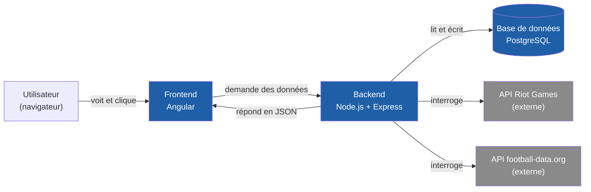
```mermaid
flowchart LR
    U["Utilisateur<br/>(navigateur)"]
    F["Frontend<br/>Angular"]
    B["Backend<br/>Node.js + Express"]
    D[("Base de données<br/>PostgreSQL")]
    R["API Riot Games<br/>(externe)"]
    FB["API football-data.org<br/>(externe)"]

    U -->|"voit et clique"| F
    F -->|"demande des données"| B
    B -->|"répond en JSON"| F
    B -->|"lit et écrit"| D
    B -->|"interroge"| R
    B -->|"interroge"| FB

    style F fill:#1e5fa8,color:#fff
    style B fill:#1e5fa8,color:#fff
    style D fill:#1e5fa8,color:#fff
    style R fill:#8a8a8a,color:#fff
    style FB fill:#8a8a8a,color:#fff
```

Le point important, sur ce schéma : **le frontend ne parle jamais directement ni à la base de données, ni aux APIs externes.** Tout passe par le backend. Ce n'est pas une contrainte technique arbitraire, c'est une question de sécurité — on y revient en 2.4.

### 2.2 Git, GitHub, et pourquoi les deux ne sont pas la même chose

**Git** est un logiciel installé sur ta machine. Son travail est d'enregistrer l'historique complet des modifications du projet. Chaque fois que tu fais un **commit**, Git fige l'état de tous les fichiers à cet instant et l'ajoute à l'historique, avec un message qui explique le changement.

La différence avec une sauvegarde classique est fondamentale : une sauvegarde écrase la version précédente, un commit **s'ajoute**. Rien n'est jamais perdu, et on peut revenir à n'importe quel point du passé.

**GitHub** est un service web qui héberge une copie de ce dépôt sur Internet. Git fonctionne très bien sans GitHub — l'historique est complet en local. GitHub apporte trois choses : une sauvegarde hors de ta machine, une interface web pour consulter le code, et la possibilité de collaborer.

Le passage du travail en cours jusqu'à GitHub se fait en trois temps, qu'il faut bien distinguer :

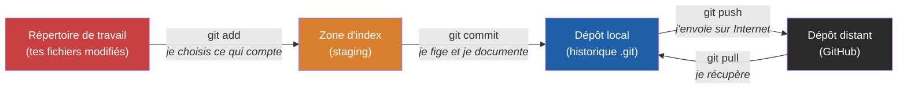
```mermaid
flowchart LR
    W["Répertoire de travail<br/>(tes fichiers modifiés)"]
    S["Zone d'index<br/>(staging)"]
    L["Dépôt local<br/>(historique .git)"]
    R["Dépôt distant<br/>(GitHub)"]

    W -->|"git add<br/><i>je choisis ce qui compte</i>"| S
    S -->|"git commit<br/><i>je fige et je documente</i>"| L
    L -->|"git push<br/><i>j'envoie sur Internet</i>"| R
    R -->|"git pull<br/><i>je récupère</i>"| L

    style W fill:#c94040,color:#fff
    style S fill:#d98030,color:#fff
    style L fill:#1e5fa8,color:#fff
    style R fill:#2a2a2a,color:#fff
```

L'étape intermédiaire — la **zone d'index**, ou *staging* — surprend souvent au début. Pourquoi ne pas commiter directement tout ce qui a changé ? Parce qu'elle permet de **choisir** : si tu as modifié cinq fichiers pour deux raisons différentes, tu peux faire deux commits séparés, chacun cohérent et correctement décrit. Un historique lisible vaut beaucoup mieux qu'un historique exhaustif mais confus.

### 2.3 Pourquoi une branche par étape

Une **branche** est une ligne de développement parallèle dans le dépôt. Créer une branche revient à poser un marque-page dans l'historique et à continuer à écrire à partir de là, sans toucher à ce qui précède.

Le cadre du projet impose une branche par étape, nommée `etape-XX-nom-court`. Cette règle a un but précis : **chaque branche est un état du projet connu comme fonctionnel.** Si l'étape 7 part en vrac et devient impossible à déboguer, il reste toujours possible de repartir de l'étape 6 intacte, sans avoir à défaire les modifications une par une.

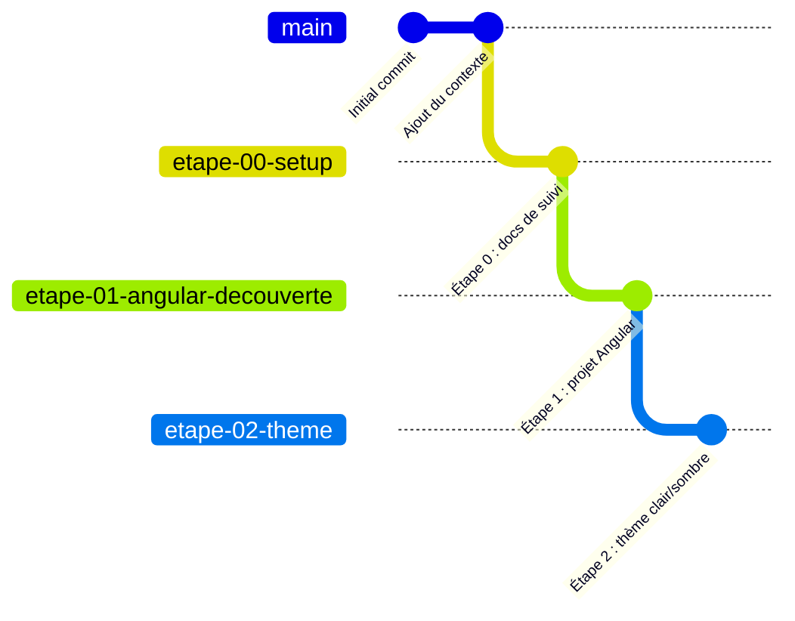
```mermaid
gitGraph
    commit id: "Initial commit"
    commit id: "Ajout du contexte"
    branch etape-00-setup
    commit id: "Étape 0 : docs de suivi"
    branch etape-01-angular-decouverte
    commit id: "Étape 1 : projet Angular"
    branch etape-02-theme
    commit id: "Étape 2 : thème clair/sombre"
```

Chaque branche part de la précédente et contient donc tout son contenu, plus le sien. `main` reste de côté jusqu'à la toute fin : elle est réservée au projet terminé et aux deux documents finaux.

### 2.4 Les secrets, et pourquoi ils ne vivent pas dans le code

C'est le concept le plus important de cette étape, et le seul dont une erreur est **définitive**.

Le projet manipulera des **secrets** : le mot de passe de PostgreSQL, la clé d'API Riot Games, la clé football-data.org. Un secret est une information qui donne un accès — quiconque la possède peut agir à ta place.

Le réflexe naturel du débutant est d'écrire la clé directement dans le code, parce que c'est ce qui fonctionne le plus vite. Le problème n'apparaît qu'au moment du `git push` : le code part sur GitHub, et le secret avec lui. Et comme Git conserve **tout l'historique**, le supprimer dans un commit ultérieur ne le retire pas — il reste consultable dans les commits précédents. Un secret publié une fois doit être considéré comme perdu et régénéré.

La solution est de sortir le secret du code et de le placer dans un fichier `.env`, que le `.gitignore` empêche d'être commité :

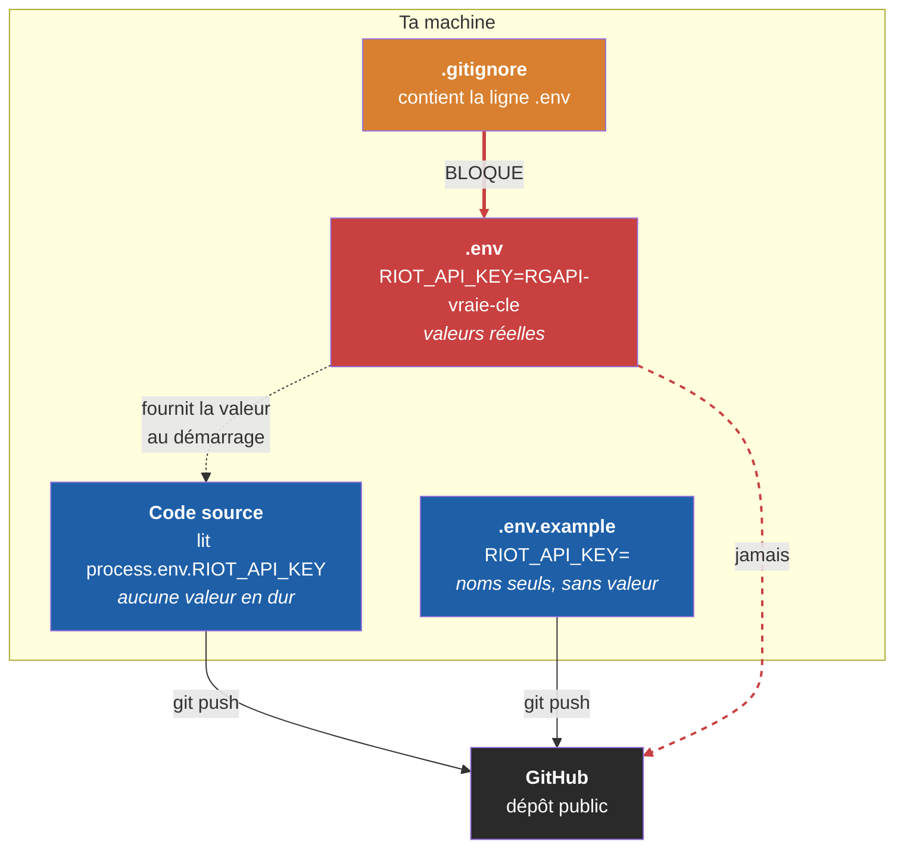
```mermaid
flowchart TB
    subgraph machine ["Ta machine"]
        ENV["<b>.env</b><br/>RIOT_API_KEY=RGAPI-vraie-cle<br/><i>valeurs réelles</i>"]
        CODE["<b>Code source</b><br/>lit process.env.RIOT_API_KEY<br/><i>aucune valeur en dur</i>"]
        EX["<b>.env.example</b><br/>RIOT_API_KEY=<br/><i>noms seuls, sans valeur</i>"]
        GI["<b>.gitignore</b><br/>contient la ligne .env"]
    end

    GH["<b>GitHub</b><br/>dépôt public"]

    ENV -.->|"fournit la valeur<br/>au démarrage"| CODE
    GI ==>|"BLOQUE"| ENV
    CODE -->|"git push"| GH
    EX -->|"git push"| GH
    ENV -->|"jamais"| GH

    linkStyle 1 stroke:#c94040,stroke-width:3px
    linkStyle 4 stroke:#c94040,stroke-width:2px,stroke-dasharray: 5 5

    style ENV fill:#c94040,color:#fff
    style EX fill:#1e5fa8,color:#fff
    style CODE fill:#1e5fa8,color:#fff
    style GI fill:#d98030,color:#fff
    style GH fill:#2a2a2a,color:#fff
```

Le fichier `.env.example`, lui, part bien sur GitHub. Il ne contient que les **noms** des variables, sans les valeurs. Son rôle est documentaire : il indique à quiconque récupère le projet quelles variables il doit renseigner, sans qu'aucun secret n'ait circulé.

C'est aussi ce qui explique le point relevé en 2.1 : le frontend s'exécute dans le navigateur de l'utilisateur, donc **tout ce qu'il contient est lisible par cet utilisateur**. Une clé d'API placée dans le frontend est une clé publique. C'est pour ça qu'elle reste côté backend, qui tourne sur un serveur auquel personne n'a accès.

### 2.5 Les ports

Plusieurs programmes vont tourner en même temps sur ta machine et communiquer par le réseau. Le **port** est le numéro qui permet de les distinguer : l'adresse identifie la machine, le port identifie le programme à l'intérieur.

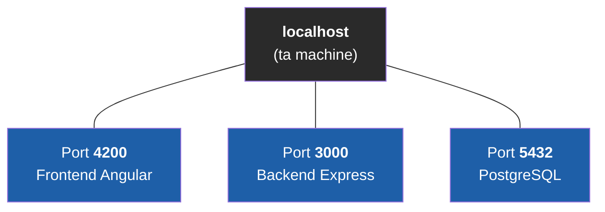
```mermaid
flowchart TB
    M["<b>localhost</b><br/>(ta machine)"]
    A["Port <b>4200</b><br/>Frontend Angular"]
    E["Port <b>3000</b><br/>Backend Express"]
    P["Port <b>5432</b><br/>PostgreSQL"]

    M --- A
    M --- E
    M --- P

    style M fill:#2a2a2a,color:#fff
    style A fill:#1e5fa8,color:#fff
    style E fill:#1e5fa8,color:#fff
    style P fill:#1e5fa8,color:#fff
```

`localhost` est le nom réservé qui désigne toujours « la machine sur laquelle je suis ». Ouvrir `http://localhost:4200` dans le navigateur signifie donc : « contacte le programme qui écoute sur le port 4200 de cette machine », c'est-à-dire le serveur de développement Angular.

Les valeurs `4200`, `3000` et `5432` sont des conventions, pas des obligations. `5432` est le port historique de PostgreSQL, et le conserver évite d'avoir à le préciser dans chaque outil de connexion.

## 3. Prérequis

Pars de la branche **`main`**.

```
git checkout main
```

Aucune connaissance préalable n'est nécessaire pour cette étape.

## 4. Déroulé détaillé

### 4.1 Installer les outils

Sept outils sont nécessaires pour démarrer. Voici ce que chacun apporte et comment vérifier qu'il fonctionne.

| Outil | Rôle dans le projet | Commande de vérification |
|---|---|---|
| **Node.js** | Exécute le JavaScript hors navigateur — fait tourner le backend et les outils de développement | `node -v` |
| **npm** | Installe les bibliothèques ; livré avec Node.js | `npm -v` |
| **Angular CLI** | Crée et sert le projet Angular | `ng version` |
| **Git** | Gère l'historique des versions | `git --version` |
| **VS Code** | Éditeur de code | `code -v` |
| **PostgreSQL** | Base de données | via pgAdmin |
| **pgAdmin** *(ou DBeaver)* | Explorer la base à la souris | ouvrir l'application |

La vérification n'est pas une formalité. Une commande qui répond `command not found` signifie que le programme n'est pas installé **ou** que le système ne sait pas où le trouver — dans les deux cas, il faut régler le problème avant d'avancer, sinon l'erreur ressurgira plus tard sous une forme plus difficile à diagnostiquer.

Angular CLI s'installe avec npm, en mode **global** :

```
npm install -g @angular/cli
```

L'option `-g` (*global*) installe le paquet pour toute la machine plutôt que dans un projet. C'est indispensable ici : la commande `ng` sert justement à **créer** le projet Angular, donc elle doit exister avant lui.

À l'installation de PostgreSQL, deux écrans demandent un choix :

- le **port** : conserver `5432`, la valeur standard ;
- la **locale** : conserver `DEFAULT`, qui reprend les réglages régionaux français de Windows — utile pour que les tris sur des noms accentués se comportent correctement.

L'assistant **Stack Builder** proposé en fin d'installation peut être annulé : il sert à ajouter des composants optionnels dont le projet n'a pas besoin.

Le mot de passe choisi pour l'utilisateur `postgres` pendant l'installation est un **secret** : il sera nécessaire à l'étape 6 et devra être placé dans `.env`.

### 4.2 Installer les extensions VS Code

| Extension | Ce qu'elle apporte |
|---|---|
| Angular Language Service | Autocomplétion et détection d'erreurs dans les fichiers Angular |
| ESLint | Signale les erreurs et les mauvaises pratiques pendant la frappe |
| Prettier | Met en forme le code automatiquement à la sauvegarde |
| GitLens | Affiche qui a modifié chaque ligne et quand |
| DotENV | Colore les fichiers `.env` pour les rendre lisibles |
| Thunder Client | Teste les routes du backend sans passer par le frontend |
| Markdown Preview Mermaid Support | Affiche les schémas Mermaid dans l'aperçu Markdown de VS Code |

La dernière mérite une explication : sans elle, les blocs ` ```mermaid ` de ce document s'affichent comme du texte brut dans VS Code. Ils se rendent correctement sur GitHub dans tous les cas, mais l'extension évite d'avoir à ouvrir le navigateur pour relire un schéma.

### 4.3 Structurer le dépôt

Le dépôt existe déjà sur GitHub. Il s'agit maintenant d'y créer la branche de l'étape et les documents que le projet impose de tenir à jour.

```
git checkout -b etape-00-setup
```

`checkout -b` fait deux choses : `-b` crée la branche, `checkout` bascule dessus. Toute modification faite ensuite appartiendra à cette branche, pas à `main`.

Quatre fichiers constituent le socle documentaire du projet :

| Fichier | Rôle |
|---|---|
| `CONTEXTE.md` | Cadre du projet — règles, stack, découpage des étapes. Fait foi en cas de doute. |
| `GLOSSAIRE.md` | Tous les termes techniques rencontrés, définis simplement |
| `DOCUMENT-APPRENTISSAGE.md` | Ce document — le cours, une section par étape |
| `.env.example` | Liste des variables d'environnement nécessaires, sans les valeurs |

### 4.4 Vérifier le `.gitignore`

Le `.gitignore` est déjà en place. Deux lignes sont critiques et méritent d'être vérifiées à l'œil :

```
node_modules/
.env
```

La première évite d'envoyer sur GitHub un dossier de plusieurs centaines de mégaoctets, entièrement reconstructible par `npm install`. La seconde est la protection décrite en 2.4 — c'est elle qui empêche les secrets de partir.

### 4.5 Enregistrer le travail

```
git add .
git commit -m "Etape 0 : structuration du depot et documents de suivi"
git push -u origin etape-00-setup
```

`git add .` place tous les fichiers modifiés dans la zone d'index. `git commit -m` fige cet ensemble avec un message. `git push -u origin etape-00-setup` envoie la branche sur GitHub ; l'option `-u` établit le lien entre la branche locale et sa jumelle distante, ce qui permettra d'écrire simplement `git push` les fois suivantes.

## 5. Livrable attendu

- Les sept outils sont installés et répondent à leur commande de vérification.
- Les extensions VS Code sont installées.
- La branche `etape-00-setup` existe en local et sur GitHub.
- Elle contient `CONTEXTE.md`, `GLOSSAIRE.md`, `DOCUMENT-APPRENTISSAGE.md`, `.env.example`, `.gitignore` et `README.md`.
- Aucun secret ne figure dans le dépôt.

## 6. Checklist d'auto-vérification

Réponds sans relire le document — si une réponse ne vient pas, la notion mérite une relecture. Sous chaque question, la ligne *À relire* indique la partie du cours où se trouve la réponse.

1. Quelle est la différence entre Git et GitHub ? Lequel des deux fonctionne sans connexion Internet ?
   - *À relire :* § 2.2 « Git, GitHub, et pourquoi les deux ne sont pas la même chose »
2. Que se passe-t-il si tu écris ta clé d'API Riot directement dans le code et que tu fais `git push` ? Pourquoi la supprimer dans un commit suivant ne règle-t-il pas le problème ?
   - *À relire :* § 2.4 « Les secrets, et pourquoi ils ne vivent pas dans le code »
3. Pourquoi le fichier `node_modules/` est-il exclu du dépôt alors qu'il est indispensable pour faire tourner le projet ?
   - *À relire :* § 4.4 « Vérifier le `.gitignore` »
4. Le frontend pourrait techniquement appeler l'API Riot directement, sans passer par le backend. Pourquoi ne fait-on pas ça ?
   - *À relire :* § 2.1 « L'architecture générale de ce qu'on va construire », puis fin du § 2.4 « Les secrets, et pourquoi ils ne vivent pas dans le code »
5. Si l'étape 7 devient impossible à déboguer, comment reviens-tu à un état fonctionnel ?
   - *À relire :* § 2.3 « Pourquoi une branche par étape »
6. Que signifie le `-g` dans `npm install -g @angular/cli`, et pourquoi est-il nécessaire ici ?
   - *À relire :* § 4.1 « Installer les outils »

## 7. Branche d'arrivée

À la fin de cette étape, ton code doit être poussé sur **`etape-00-setup`**.

L'étape suivante partira de cette branche pour créer `etape-01-angular-decouverte`.

---

# Étape 1 — Découverte d'Angular

## 1. Objectifs

À la fin de cette étape, tu dois savoir :

- expliquer ce qu'est un **composant** Angular et pourquoi une interface se découpe en composants ;
- reconnaître les quatre fichiers qui forment un composant et dire à quoi sert chacun ;
- retrouver ton chemin dans l'arborescence d'un projet Angular ;
- expliquer ce qui se passe entre l'ouverture de `index.html` et l'affichage de la page ;
- expliquer ce qu'est une **application monopage** et en quoi le routage Angular diffère d'un lien HTML classique ;
- créer un composant, lui associer une route, et naviguer vers lui.

## 2. Concepts abordés

### 2.1 Le composant, brique de base

Une page web construite « à l'ancienne » est un seul fichier HTML. Tant qu'elle est petite, ça tient. Passé quelques centaines de lignes, trois problèmes apparaissent : on ne retrouve plus rien, le moindre changement risque d'en casser un autre ailleurs, et tout ce qui se répète doit être copié-collé — puis corrigé à dix endroits le jour où il change.

Angular répond à ça avec le **composant** : un morceau d'écran autonome, qui embarque *avec lui* tout ce qui le concerne — son HTML, son CSS et sa logique. La page n'est plus un bloc, c'est un assemblage.

Voici ce qu'on obtient à la fin de cette étape — la page d'accueil de l'application :

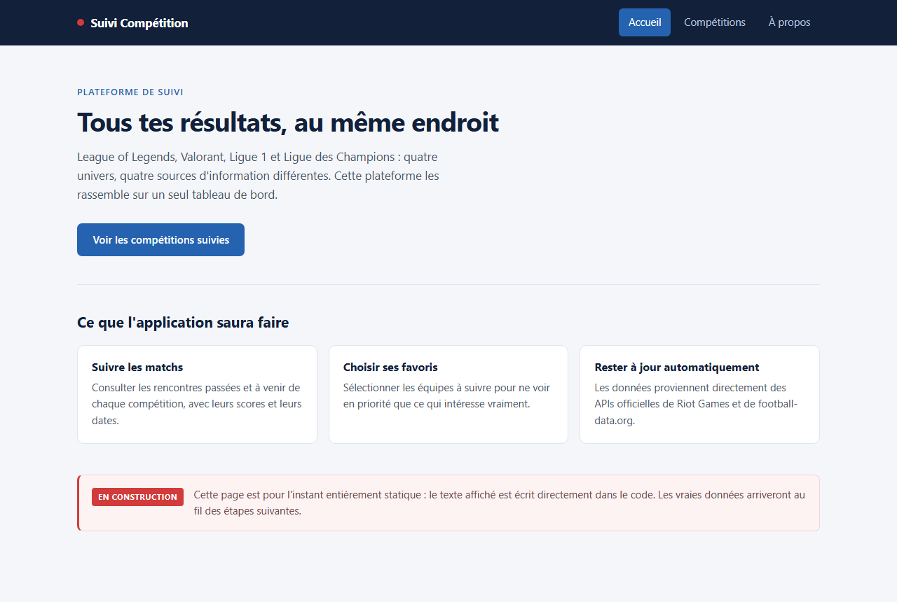

Cet écran n'est pas un bloc unique. Il est assemblé à partir de deux composants distincts : la **barre sombre du haut** est le composant `Header`, et **tout ce qui est en dessous** est le composant `Accueil`. Ce sont deux fichiers séparés, développés indépendamment l'un de l'autre.

Concrètement, notre application est un emboîtement de composants :

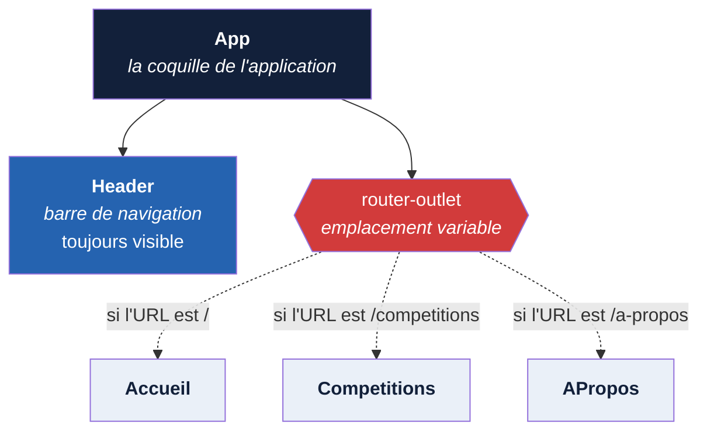
```mermaid
flowchart TB
    APP["<b>App</b><br/><i>la coquille de l'application</i>"]
    HEAD["<b>Header</b><br/><i>barre de navigation</i><br/>toujours visible"]
    OUT{{"router-outlet<br/><i>emplacement variable</i>"}}
    ACC["<b>Accueil</b>"]
    COMP["<b>Competitions</b>"]
    PROP["<b>APropos</b>"]

    APP --> HEAD
    APP --> OUT
    OUT -.->|"si l'URL est /"| ACC
    OUT -.->|"si l'URL est /competitions"| COMP
    OUT -.->|"si l'URL est /a-propos"| PROP

    style APP fill:#12203a,color:#fff
    style HEAD fill:#2563b0,color:#fff
    style OUT fill:#d23b3b,color:#fff
    style ACC fill:#eaf0f8,color:#12203a
    style COMP fill:#eaf0f8,color:#12203a
    style PROP fill:#eaf0f8,color:#12203a
```

Ce schéma explique une chose qu'on observe directement dans le navigateur : quand tu cliques sur un onglet, **la barre de navigation ne clignote pas**. Elle n'est pas rechargée, parce qu'elle ne fait pas partie de la zone qui change. Seul le contenu du `router-outlet` est remplacé.

### 2.2 Anatomie d'un composant : quatre fichiers

Chaque composant généré par Angular CLI produit quatre fichiers qui portent le même nom :

| Fichier | Rôle | Analogie |
|---|---|---|
| `header.ts` | La logique : les données et le comportement | Le cerveau |
| `header.html` | Le **gabarit** : ce qui est affiché | Le corps |
| `header.css` | L'apparence, appliquée à ce composant seul | Les vêtements |
| `header.spec.ts` | Les tests automatiques | Le contrôle qualité |

Le fichier `.ts` est le point d'entrée. Voici celui de notre barre de navigation, ligne par ligne :

```ts
import { Component } from '@angular/core';
import { RouterLink, RouterLinkActive } from '@angular/router';

@Component({
  imports: [RouterLink, RouterLinkActive],
  selector: 'app-header',
  styleUrl: './header.css',
  templateUrl: './header.html',
})
export class Header {}
```

Les deux lignes `import` vont chercher des outils dans Angular — comme on sortirait deux outils d'une boîte avant de commencer.

`@Component({ ... })` est un **décorateur** : une étiquette posée sur la classe qui suit, qui dit à Angular « ceci n'est pas une classe ordinaire, c'est un composant ». Sans lui, la classe `Header` ne serait qu'un objet TypeScript sans aucun lien avec l'affichage.

À l'intérieur, quatre réglages :

- `selector: 'app-header'` — le **nom de balise** sous lequel ce composant s'utilise ailleurs. C'est ce qui permet d'écrire `<app-header />` dans un autre gabarit. Le préfixe `app-` évite toute confusion avec une vraie balise HTML.
- `templateUrl` et `styleUrl` — les chemins vers le HTML et le CSS du composant.
- `imports: [RouterLink, RouterLinkActive]` — la liste de ce dont **le gabarit** a besoin. C'est le point le plus contre-intuitif au début : si `header.html` utilise `routerLink`, il faut que `header.ts` l'ait importé, sinon Angular ne reconnaît pas l'attribut et l'ignore silencieusement.

Ce tableau `imports` est la marque des composants dits **standalone** (« autonomes ») : chaque composant déclare lui-même ses besoins. C'est le fonctionnement par défaut d'Angular aujourd'hui. Attention en cherchant de l'aide en ligne : une grande partie des tutoriels décrit encore l'ancienne approche, à base de `NgModule`, où les dépendances étaient déclarées en bloc pour un groupe de composants. Si un exemple trouvé sur Internet parle de `declarations` ou de `@NgModule`, il est antérieur à ce qu'on utilise ici.

Enfin, `export class Header {}` : la classe est vide pour l'instant parce que la barre de navigation n'a aucune donnée ni aucun comportement — elle se contente d'afficher des liens fixes. C'est ici que viendront les variables et les fonctions à partir de l'étape 2.

### 2.3 L'arborescence du projet

Le projet Angular a été créé dans un sous-dossier `frontend/`, et non à la racine du dépôt. C'est un choix d'anticipation : à l'étape 4, un dossier `backend/` viendra à côté. Les deux resteront ainsi nettement séparés, chacun avec ses propres dépendances.

```
Appli-suivi-competition/          <- le depot Git
├── CONTEXTE.md                    <- cadre du projet
├── DOCUMENT-APPRENTISSAGE.md      <- ce document
├── GLOSSAIRE.md
├── .env.example
└── frontend/                      <- le projet Angular
    ├── package.json               <- dependances et scripts
    ├── angular.json               <- configuration de l'outil Angular
    ├── tsconfig.json              <- configuration de TypeScript
    ├── node_modules/              <- bibliotheques (jamais versionne)
    ├── public/
    │   └── favicon.ico            <- icone de l'onglet
    └── src/                       <- TOUT le code ecrit a la main
        ├── index.html             <- la seule vraie page HTML
        ├── main.ts                <- point de demarrage
        ├── styles.css             <- styles globaux
        └── app/
            ├── app.ts             <- composant racine
            ├── app.html
            ├── app.css
            ├── app.config.ts      <- configuration de l'application
            ├── app.routes.ts      <- table des routes
            ├── header/            <- composant barre de navigation
            │   ├── header.ts
            │   ├── header.html
            │   ├── header.css
            │   └── header.spec.ts
            └── pages/             <- un dossier par page
                ├── accueil/
                ├── competitions/
                └── a-propos/
```

La règle à retenir : **tout ce que tu écris à la main vit dans `src/`.** Le reste est soit de la configuration, soit généré automatiquement.

### 2.4 La chaîne de démarrage

Comprendre comment Angular démarre évite de considérer l'affichage comme de la magie. Cinq fichiers se passent le relais :

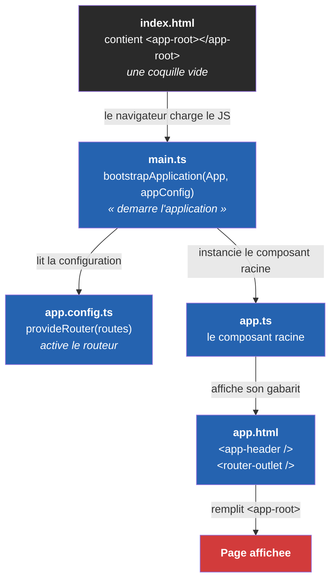
```mermaid
flowchart TB
    A["<b>index.html</b><br/>contient &lt;app-root&gt;&lt;/app-root&gt;<br/><i>une coquille vide</i>"]
    B["<b>main.ts</b><br/>bootstrapApplication(App, appConfig)<br/><i>« demarre l'application »</i>"]
    C["<b>app.config.ts</b><br/>provideRouter(routes)<br/><i>active le routeur</i>"]
    D["<b>app.ts</b><br/>le composant racine"]
    E["<b>app.html</b><br/>&lt;app-header /&gt;<br/>&lt;router-outlet /&gt;"]
    F["<b>Page affichee</b>"]

    A -->|"le navigateur charge le JS"| B
    B -->|"lit la configuration"| C
    B -->|"instancie le composant racine"| D
    D -->|"affiche son gabarit"| E
    E -->|"remplit &lt;app-root&gt;"| F

    style A fill:#2a2a2a,color:#fff
    style B fill:#2563b0,color:#fff
    style C fill:#2563b0,color:#fff
    style D fill:#2563b0,color:#fff
    style E fill:#2563b0,color:#fff
    style F fill:#d23b3b,color:#fff
```

Le point important est le tout début. Si tu ouvres `src/index.html`, tu ne trouveras **aucun** des textes affichés à l'écran — juste une balise `<app-root></app-root>` vide. C'est normal : cette balise est un emplacement réservé. Tout le contenu visible est produit par JavaScript au moment de l'exécution, et vient le remplir.

### 2.5 Application monopage et routage

Sur un site classique, chaque lien déclenche un aller-retour complet avec le serveur : le navigateur jette la page courante, en redemande une autre, et la réaffiche. D'où le bref écran blanc entre deux pages.

Angular fonctionne autrement. C'est une **application monopage** (*SPA*) : le navigateur charge une seule fois `index.html` et tout le code JavaScript, puis se débrouille seul pour changer d'écran.

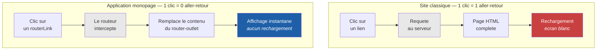
```mermaid
flowchart TB
    subgraph classique ["Site classique — 1 clic = 1 aller-retour"]
        direction LR
        C1["Clic sur<br/>un lien"] --> C2["Requete<br/>au serveur"] --> C3["Page HTML<br/>complete"] --> C4["Rechargement<br/><i>ecran blanc</i>"]
    end

    subgraph spa ["Application monopage — 1 clic = 0 aller-retour"]
        direction LR
        S1["Clic sur<br/>un routerLink"] --> S2["Le routeur<br/>intercepte"] --> S3["Remplace le contenu<br/>du router-outlet"] --> S4["Affichage instantane<br/><i>aucun rechargement</i>"]
    end

    style C4 fill:#c94040,color:#fff
    style S4 fill:#1e5fa8,color:#fff
    style C2 fill:#e8e8e8,color:#333
    style S2 fill:#e8e8e8,color:#333
```

C'est précisément le rôle de `routerLink`. Un `<a href="/competitions">` ordinaire quitterait l'application et la rechargerait entièrement — plusieurs centaines de millisecondes perdues, et tout l'état en mémoire remis à zéro. Un `<a routerLink="/competitions">` est intercepté par Angular avant que le navigateur n'agisse.

Le détail de ce qui se passe au clic :

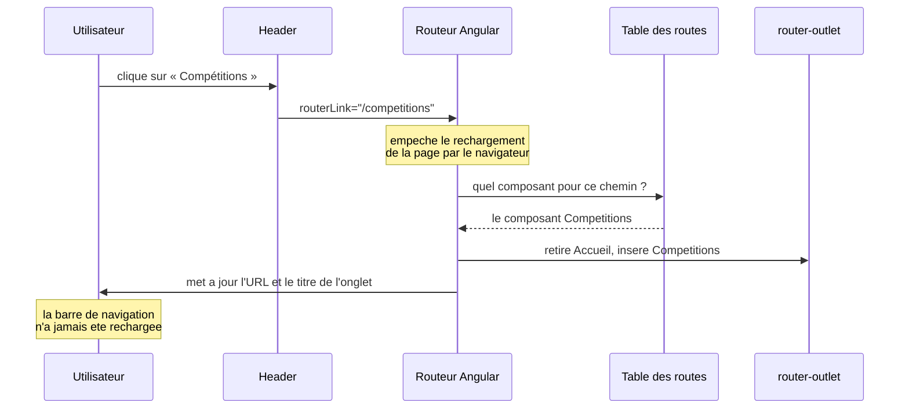
```mermaid
sequenceDiagram
    participant U as Utilisateur
    participant H as Header
    participant R as Routeur Angular
    participant T as Table des routes
    participant O as router-outlet

    U->>H: clique sur « Compétitions »
    H->>R: routerLink="/competitions"
    Note over R: empeche le rechargement<br/>de la page par le navigateur
    R->>T: quel composant pour ce chemin ?
    T-->>R: le composant Competitions
    R->>O: retire Accueil, insere Competitions
    R->>U: met a jour l'URL et le titre de l'onglet
    Note over U: la barre de navigation<br/>n'a jamais ete rechargee
```

La table des routes, elle, est une simple liste de correspondances dans `app.routes.ts` :

```ts
export const routes: Routes = [
  { path: '', component: Accueil, title: 'Accueil — Suivi Compétition' },
  { path: 'competitions', component: Competitions, title: '…' },
  { path: 'a-propos', component: APropos, title: '…' },
  { path: '**', redirectTo: '' },
];
```

Trois remarques sur ce bloc. `path: ''` correspond à la racine du site, c'est-à-dire la page d'accueil. La propriété `title` met à jour le titre de l'onglet du navigateur à chaque navigation — un détail d'accessibilité souvent oublié dans les SPA. Enfin, `path: '**'` signifie « n'importe quelle autre adresse » : c'est le filet de sécurité qui renvoie vers l'accueil si l'utilisateur tape une URL inexistante. **Il doit impérativement rester en dernier**, car Angular parcourt la liste dans l'ordre et s'arrête à la première correspondance — placé en premier, il capturerait tout.

### 2.6 L'encapsulation des styles

Une difficulté classique du CSS est qu'il est global : une règle `.carte { ... }` écrite pour une page s'applique à **toutes** les `.carte` du site, y compris celles qu'on n'avait pas en tête.

Angular supprime ce problème : le CSS d'un composant ne s'applique qu'à ce composant. En coulisses, il ajoute un attribut unique à chaque élément et réécrit les sélecteurs pour ne cibler que lui.

C'est directement observable dans notre code : la classe `.note-chantier` est définie **deux fois**, dans `accueil.css` et dans `competitions.css`, sans que les deux se gênent.

La conséquence pratique à retenir :

| Où écrire du CSS | Portée |
|---|---|
| `src/styles.css` | Toute l'application — police, couleur de fond, remise à zéro des marges |
| `mon-composant.css` | Ce composant uniquement |

En cas de doute, le CSS va dans le composant. On ne remonte une règle dans `styles.css` que lorsqu'elle concerne réellement toute l'application.

## 3. Prérequis

Pars de la branche **`etape-00-setup`**.

```
git checkout etape-00-setup
git checkout -b etape-01-angular-decouverte
```

## 4. Déroulé détaillé

### 4.1 Créer le projet Angular

Depuis la racine du dépôt :

```
ng new suivi-competition --directory frontend --routing --style css --ssr false --zoneless --skip-git --package-manager npm --defaults
```

Chaque option compte :

| Option | Effet et raison |
|---|---|
| `--directory frontend` | Crée le projet dans `frontend/` plutôt qu'à la racine, pour laisser la place au `backend/` de l'étape 4 |
| `--routing` | Met en place le routage dès le départ — on en a besoin immédiatement |
| `--style css` | CSS simple, sans préprocesseur supplémentaire à apprendre |
| `--ssr false` | Pas de rendu côté serveur : une notion avancée, inutile ici |
| `--zoneless` | Mode moderne de détection des changements ; sera expliqué à l'étape 2, quand une donnée changera vraiment |
| `--skip-git` | **Essentiel** : le dépôt Git existe déjà. Sans cette option, Angular en créerait un second, imbriqué dans le premier, ce qui empêcherait le suivi des fichiers |
| `--defaults` | Accepte les valeurs par défaut au lieu de poser des questions |

L'installation des dépendances prend une à deux minutes : npm télécharge plusieurs centaines de paquets dans `node_modules/`.

### 4.2 Générer les composants

Depuis `frontend/` :

```
ng generate component header
ng generate component pages/accueil
ng generate component pages/competitions
ng generate component pages/a-propos
```

Chaque commande crée un dossier avec ses quatre fichiers, correctement nommés et déjà reliés entre eux. On pourrait les écrire à la main, mais la commande évite les fautes de frappe dans les chemins — une source d'erreurs pénible car silencieuse.

Le chemin `pages/accueil` range le composant dans un sous-dossier `pages/`. Ce n'est pas une obligation d'Angular, juste une convention utile : elle distingue d'un coup d'œil les composants qui sont des **pages entières** de ceux qui sont des **morceaux réutilisables**, comme `header`.

Attention au nom de la classe générée : Angular convertit `a-propos` en `APropos`. C'est ce nom-là qu'il faudra importer dans `app.routes.ts`.

### 4.3 Déclarer les routes

Fichier complet — `src/app/app.routes.ts` :

```ts
import { Routes } from '@angular/router';
import { Accueil } from './pages/accueil/accueil';
import { Competitions } from './pages/competitions/competitions';
import { APropos } from './pages/a-propos/a-propos';

export const routes: Routes = [
  { path: '', component: Accueil, title: 'Accueil — Suivi Compétition' },
  { path: 'competitions', component: Competitions, title: 'Compétitions — Suivi Compétition' },
  { path: 'a-propos', component: APropos, title: 'À propos — Suivi Compétition' },
  { path: '**', redirectTo: '' },
];
```

Les trois `import` du haut vont chercher les classes des composants dans leurs fichiers respectifs. Le chemin `'./pages/accueil/accueil'` s'écrit **sans l'extension `.ts`** — c'est une convention de TypeScript, qui l'ajoute tout seul.

`Routes` est un **type** : en écrivant `routes: Routes`, on annonce à TypeScript que cette variable est une liste de routes. Si tu écris `compnent` au lieu de `component`, l'éditeur souligne l'erreur immédiatement, au lieu de te laisser découvrir le problème dans le navigateur. C'est tout l'intérêt des types, expliqué au glossaire.

Rappel du piège vu en 2.5 : `path: '**'` doit rester **la dernière ligne**. Angular lit la liste de haut en bas et s'arrête à la première correspondance.

### 4.4 Construire la coquille

`src/app/app.html` devient volontairement très court :

```html
<app-header />

<main class="contenu">
  <router-outlet />
</main>
```

Tout est dit en quatre lignes : la barre de navigation en haut, puis la zone variable. `<app-header />` utilise le sélecteur déclaré par le composant `Header` ; `<router-outlet />` est l'emplacement que le routeur remplira.

Pour que ces deux balises soient reconnues, `app.ts` doit les importer :

```ts
@Component({
  imports: [RouterOutlet, Header],
  selector: 'app-root',
  styleUrl: './app.css',
  templateUrl: './app.html',
})
export class App {}
```

C'est l'application concrète de la règle vue en 2.2 : ce que le gabarit utilise, le fichier `.ts` doit l'importer.

Le CSS de la coquille tient en quelques lignes — `src/app/app.css` :

```css
.contenu {
  max-width: 1100px;   /* la ligne de texte ne s'etire pas a l'infini */
  margin: 0 auto;      /* centre le bloc horizontalement */
  padding: 2.5rem 1.25rem 4rem;
}
```

`max-width` mérite un mot : sur un écran large, un paragraphe qui occupe toute la largeur devient pénible à lire, parce que l'œil perd la ligne en revenant à gauche. Limiter la largeur du contenu est une règle de lisibilité de base.

Deux fichiers complètent le démarrage, et il est utile de les avoir lus au moins une fois même si on n'y touchera pas avant longtemps.

`src/main.ts` — le tout premier code exécuté :

```ts
import { bootstrapApplication } from '@angular/platform-browser';
import { appConfig } from './app/app.config';
import { App } from './app/app';

bootstrapApplication(App, appConfig)
  .catch((err) => console.error(err));
```

Il dit une seule chose : « démarre l'application à partir du composant `App`, avec cette configuration ». Le `.catch(...)` affiche l'erreur dans la console du navigateur si le démarrage échoue.

`src/app/app.config.ts` — la configuration :

```ts
import { ApplicationConfig, provideBrowserGlobalErrorListeners } from '@angular/core';
import { provideRouter } from '@angular/router';
import { routes } from './app.routes';

export const appConfig: ApplicationConfig = {
  providers: [
    provideBrowserGlobalErrorListeners(),
    provideRouter(routes)
  ]
};
```

Le tableau `providers` liste les services activés dans toute l'application. `provideRouter(routes)` est celui qui nous intéresse : **c'est lui qui branche le routeur** et lui donne la table des routes écrite en 4.3. Sans cette ligne, `routerLink` et `<router-outlet />` ne fonctionneraient pas.

### 4.5 La barre de navigation

Fichier complet — `src/app/header/header.html` :

```html
<header class="barre">
  <div class="barre-interieur">
    <a class="marque" routerLink="/">
      <span class="marque-pastille"></span>
      <span class="marque-texte">Suivi Compétition</span>
    </a>

    <nav class="navigation">
      <a routerLink="/" routerLinkActive="actif" [routerLinkActiveOptions]="{ exact: true }">
        Accueil
      </a>
      <a routerLink="/competitions" routerLinkActive="actif">Compétitions</a>
      <a routerLink="/a-propos" routerLinkActive="actif">À propos</a>
    </nav>
  </div>
</header>
```

Les balises `<header>` et `<nav>` ne sont pas décoratives : ce sont des balises **sémantiques**, qui indiquent la nature du contenu. Un lecteur d'écran, utilisé par une personne malvoyante, s'en sert pour annoncer « navigation » et permettre d'y sauter directement. Un `<div>` ne dit rien de tel. À apparence identique, la version sémantique est accessible ; l'autre ne l'est pas.

Chaque onglet est un lien `routerLink` accompagné de `routerLinkActive` :

```html
<a routerLink="/competitions" routerLinkActive="actif">Compétitions</a>
```

`routerLinkActive="actif"` ajoute automatiquement la classe CSS `actif` au lien **lorsque la page correspondante est affichée**. C'est ce qui met l'onglet courant en surbrillance, sans écrire la moindre ligne de logique.

Le lien vers l'accueil demande une précaution supplémentaire :

```html
<a routerLink="/" routerLinkActive="actif" [routerLinkActiveOptions]="{ exact: true }">
```

Sans `exact: true`, le lien `/` serait considéré comme actif en permanence — car `/competitions` et `/a-propos` *commencent* par `/`. Les trois onglets apparaîtraient alors allumés en même temps. Les crochets autour de `[routerLinkActiveOptions]` signalent à Angular que ce qui suit est du **code** à évaluer, et non du texte brut.

Côté apparence, voici les règles essentielles de `header.css` :

```css
.barre {
  background-color: #12203a;         /* bleu tres sombre */
  border-bottom: 1px solid #22345a;
}

.barre-interieur {
  max-width: 1100px;
  margin: 0 auto;
  height: 64px;
  display: flex;                     /* aligne les enfants sur une ligne */
  align-items: center;               /* les centre verticalement */
  justify-content: space-between;    /* marque a gauche, navigation a droite */
}

.navigation a {
  color: #b6c4dd;                    /* gris-bleu clair : lien au repos */
  text-decoration: none;             /* retire le soulignement par defaut */
  padding: 0.5rem 0.85rem;
  border-radius: 6px;
}

.navigation a:hover {
  color: #ffffff;                    /* au survol de la souris */
  background-color: #1d3157;
}

.navigation a.actif {
  color: #ffffff;                    /* page actuellement affichee */
  background-color: #2563b0;
}
```

Trois points à retenir ici.

`display: flex` place les éléments enfants sur une même ligne, et `justify-content: space-between` les pousse aux extrémités : c'est ce qui met la marque à gauche et les onglets à droite, sans aucun calcul de position.

Les trois règles `.navigation a`, `:hover` et `.actif` décrivent **trois états d'un même lien** : au repos, sous la souris, et correspondant à la page affichée. Donner un retour visuel à chacun de ces états n'est pas cosmétique — c'est ce qui permet à l'utilisateur de savoir où il est et ce qui est cliquable.

Enfin, `.actif` n'est jamais écrit dans le HTML. C'est `routerLinkActive="actif"` qui l'ajoute et le retire automatiquement selon l'URL. Le CSS se contente de décrire à quoi ressemble cet état.

### 4.6 Rédiger les pages

Les trois pages sont du HTML statique — aucune donnée, aucune logique. C'est volontaire : l'objectif de l'étape est la **structure**, pas le contenu dynamique.

**La page d'accueil** (`pages/accueil/accueil.html`) s'ouvre sur un bloc de présentation :

```html
<section class="hero">
  <p class="hero-surtitre">Plateforme de suivi</p>
  <h1 class="hero-titre">Tous tes résultats, au même endroit</h1>
  <p class="hero-texte">
    League of Legends, Valorant, Ligue 1 et Ligue des Champions : quatre univers, quatre sources
    d'information différentes. Cette plateforme les rassemble sur un seul tableau de bord.
  </p>
  <a class="bouton-principal" routerLink="/competitions">Voir les compétitions suivies</a>
</section>
```

Le bouton est un `<a routerLink>`, pas un `<button>`. La règle est simple et vaut la peine d'être retenue : **un élément qui emmène ailleurs est un lien ; un élément qui déclenche une action sur place est un bouton.** Ici on navigue, donc c'est un lien — même s'il est habillé en bouton par le CSS.

Comme ce gabarit utilise `routerLink`, le fichier `accueil.ts` doit l'importer — exactement la règle vue en 2.2 :

```ts
import { Component } from '@angular/core';
import { RouterLink } from '@angular/router';

@Component({
  imports: [RouterLink],
  selector: 'app-accueil',
  styleUrl: './accueil.css',
  templateUrl: './accueil.html',
})
export class Accueil {}
```


**La page Compétitions** (`pages/competitions/competitions.html`) est la plus instructive, parce qu'elle est volontairement mal écrite. Voici une carte :

```html
<article class="carte">
  <div class="carte-bandeau carte-bandeau--lol"></div>
  <div class="carte-corps">
    <h3>League of Legends</h3>
    <p class="carte-editeur">Riot Games</p>
    <p class="carte-texte">
      Jeu d'arène de bataille en ligne à cinq contre cinq. Les données proviendront de l'API
      officielle de Riot Games.
    </p>
  </div>
</article>
```

Ce bloc est répété **quatre fois** dans le fichier, en ne changeant que le titre, l'éditeur, le texte et la couleur du bandeau. C'est du copier-coller assumé, et c'est un problème réel : ajouter une cinquième compétition demande de dupliquer encore ; corriger une faute de frappe présente dans les quatre demande quatre corrections ; et rien ne garantit qu'on ne va pas en oublier une.

Retiens cette sensation : **l'étape 3 remplacera ces quatre blocs par un seul, parcouru automatiquement sur une liste de données.** Une boucle est beaucoup plus facile à comprendre quand on a d'abord ressenti ce qu'elle évite.

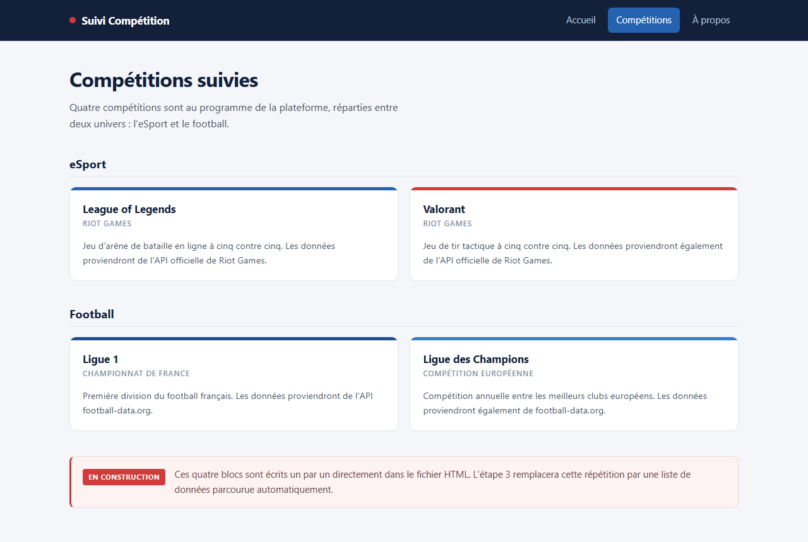

**La page À propos** (`pages/a-propos/a-propos.html`) utilise une balise moins connue, la **liste de définitions** :

```html
<dl class="stack">
  <div class="stack-ligne">
    <dt>Frontend</dt>
    <dd>Angular — la partie visible, exécutée dans le navigateur</dd>
  </div>
  <div class="stack-ligne">
    <dt>Backend</dt>
    <dd>Node.js, Express et TypeScript — le serveur qui répond aux demandes</dd>
  </div>
</dl>
```

`<dl>` (*definition list*) associe des termes à leurs définitions : `<dt>` est le terme, `<dd>` sa description. On aurait pu obtenir le même rendu avec des `<div>`, mais la version sémantique exprime la **relation** entre les deux colonnes — ce qu'un tableau de `<div>` ne fait pas.

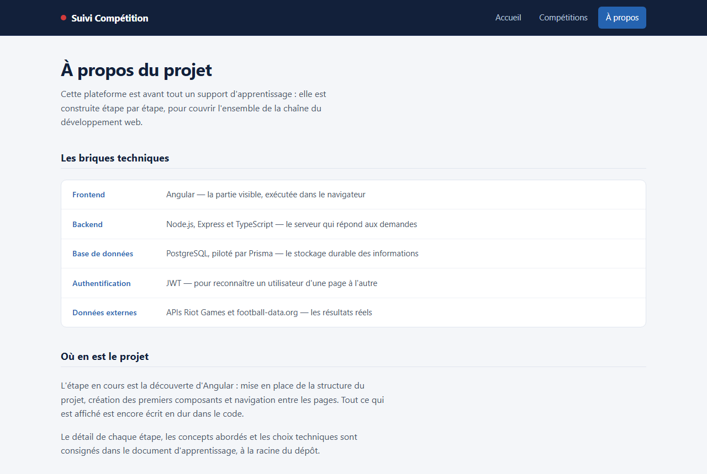

**Les styles globaux**, enfin, dans `src/styles.css` :

```css
* {
  box-sizing: border-box;
}

body {
  font-family: system-ui, -apple-system, 'Segoe UI', Roboto, sans-serif;
  font-size: 16px;
  line-height: 1.6;
  color: #1c2433;
  background-color: #f4f6f9;
}
```

`box-sizing: border-box` appliqué à tout (`*`) corrige un comportement historique du CSS déroutant : par défaut, un élément de `width: 200px` auquel on ajoute du `padding` mesure **plus** de 200 pixels au final. Avec `border-box`, la largeur annoncée est la largeur réelle, marges intérieures comprises. C'est la première ligne de presque toutes les feuilles de style modernes.

`font-family: system-ui` demande au navigateur d'utiliser la police par défaut du système — Segoe UI sur Windows, San Francisco sur Mac. L'application paraît ainsi « native » sur chaque plateforme, et aucune police n'a besoin d'être téléchargée.

Ces règles sont dans `styles.css` et non dans un composant parce qu'elles concernent **toute** l'application. C'est l'application directe de l'arbitrage vu en 2.6.

Dernier rappel sur les couleurs : elles sont écrites en dur (`#2563b0`, `#d23b3b`, `#12203a`) dans chaque fichier CSS, et donc **répétées d'un fichier à l'autre**. Le bleu `#2563b0` apparaît déjà dans quatre fichiers différents. L'étape 2 les remplacera par des variables CSS — et le passage au thème sombre montrera immédiatement pourquoi les écrire en dur était un problème.

### 4.7 Lancer et vérifier

```
npm start
```

Ce raccourci, défini dans `package.json`, exécute `ng serve`. L'application devient accessible sur **http://localhost:4200**.

Le serveur reste actif et surveille les fichiers : chaque sauvegarde déclenche une recompilation et un rafraîchissement automatique du navigateur. Pour l'arrêter, `Ctrl + C` dans le terminal.

Deux autres commandes utiles :

```
npm test          # execute les tests automatiques
npm run build     # produit la version optimisee dans dist/
```

Les captures d'écran qui illustrent ce document sont produites automatiquement, pendant que le serveur tourne, depuis la racine du dépôt :

```
bash scripts/captures.sh etape-01
```

Le script pilote Microsoft Edge en mode « headless » — c'est-à-dire sans fenêtre visible — pour charger chaque page et l'enregistrer dans `docs/images/`. L'intérêt d'automatiser ça plutôt que de faire des captures à la main : quand l'interface changera à l'étape suivante, une seule commande régénérera toutes les illustrations d'un coup, sans risque d'en oublier une.

## 5. Livrable attendu

- L'application démarre sur `http://localhost:4200` sans erreur.
- La barre de navigation affiche trois onglets : Accueil, Compétitions, À propos.
- Cliquer sur un onglet change le contenu **sans rechargement** de la page, et l'URL se met à jour.
- L'onglet correspondant à la page affichée est mis en surbrillance.
- La page *Compétitions* présente les quatre compétitions du projet.
- Une URL inexistante (`http://localhost:4200/nimportequoi`) renvoie vers l'accueil.
- `npm test` et `npm run build` s'exécutent sans erreur.

## 6. Checklist d'auto-vérification

1. Quels sont les quatre fichiers d'un composant, et que contient chacun ?
   - *À relire :* § 2.2 « Anatomie d'un composant : quatre fichiers »
2. Le gabarit `header.html` utilise `routerLink`. Que faut-il faire dans `header.ts` pour que ça fonctionne, et que se passe-t-il si on l'oublie ?
   - *À relire :* § 2.2 « Anatomie d'un composant : quatre fichiers » (réglage `imports`)
3. Pourquoi la barre de navigation ne disparaît-elle pas quand on change de page ?
   - *À relire :* § 2.1 « Le composant, brique de base » et § 2.5 « Application monopage et routage »
4. Quelle différence concrète entre `<a href="/competitions">` et `<a routerLink="/competitions">` ?
   - *À relire :* § 2.5 « Application monopage et routage »
5. Pourquoi la route `{ path: '**' }` doit-elle être écrite en dernier ?
   - *À relire :* § 2.5 « Application monopage et routage » (rappelé en § 4.3 « Déclarer les routes »)
6. La classe `.note-chantier` est définie dans deux fichiers CSS différents. Pourquoi les deux ne se contredisent-elles pas ?
   - *À relire :* § 2.6 « L'encapsulation des styles »
7. Si tu ouvres `src/index.html`, tu n'y trouves aucun des textes affichés à l'écran. D'où viennent-ils ?
   - *À relire :* § 2.4 « La chaîne de démarrage »

## 7. Branche d'arrivée

À la fin de cette étape, ton code doit être poussé sur **`etape-01-angular-decouverte`**.

L'étape suivante partira de cette branche pour créer `etape-02-theme`, qui remplacera les couleurs en dur par des variables CSS et ajoutera la bascule entre thème clair et thème sombre.

---

# Étape 2 — Charte graphique et thèmes clair/sombre

## 1. Objectifs

À la fin de cette étape, tu dois savoir :

- expliquer pourquoi écrire une couleur en dur dans plusieurs fichiers est un problème, et ce qu'une **variable CSS** y change ;
- définir deux jeux de couleurs et basculer de l'un à l'autre sans dupliquer une seule règle de style ;
- expliquer ce qu'est un **signal** et pourquoi Angular en a besoin pour mettre l'affichage à jour ;
- retenir un choix utilisateur d'une visite à l'autre avec `localStorage`, en gérant le cas où il est indisponible ;
- expliquer pourquoi un script placé dans `index.html` évite un éclair de lumière au chargement ;
- vérifier qu'un contraste texte/fond reste lisible, et corriger quand il ne l'est pas.

## 2. Concepts abordés

### 2.1 Le problème qu'on vient résoudre

À la fin de l'étape 1, l'application fonctionnait. Mais le bleu `#2563b0` était écrit **dans quatre fichiers différents** : `header.css`, `accueil.css`, `competitions.css` et `a-propos.css`.

Tant qu'on n'y touche pas, ça marche. Les ennuis commencent dès qu'il faut changer quelque chose :

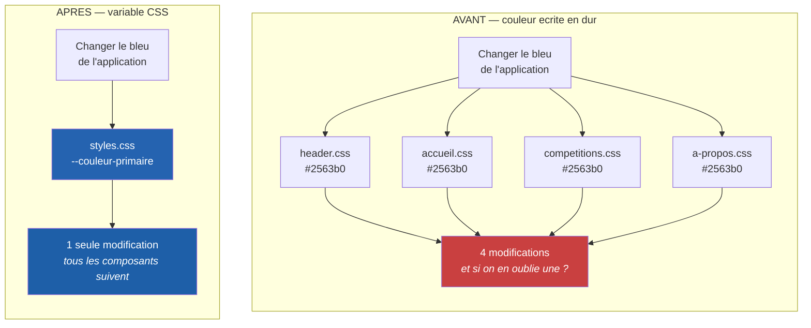
```mermaid
flowchart TB
    subgraph avant ["AVANT — couleur ecrite en dur"]
        direction TB
        A1["Changer le bleu<br/>de l'application"]
        A2["header.css<br/>#2563b0"]
        A3["accueil.css<br/>#2563b0"]
        A4["competitions.css<br/>#2563b0"]
        A5["a-propos.css<br/>#2563b0"]
        A6["4 modifications<br/><i>et si on en oublie une ?</i>"]
        A1 --> A2 & A3 & A4 & A5 --> A6
    end

    subgraph apres ["APRES — variable CSS"]
        direction TB
        B1["Changer le bleu<br/>de l'application"]
        B2["styles.css<br/>--couleur-primaire"]
        B3["1 seule modification<br/><i>tous les composants suivent</i>"]
        B1 --> B2 --> B3
    end

    style A6 fill:#c94040,color:#fff
    style B3 fill:#1e5fa8,color:#fff
    style B2 fill:#2563b0,color:#fff
```

Le vrai problème n'est pas le nombre de modifications — c'est le **risque d'en oublier une**. Une seule occurrence oubliée, et l'application se retrouve avec deux bleus légèrement différents, sans que personne ne le remarque avant longtemps.

Et le thème sombre rend cette approche carrément impossible : il faudrait écrire **deux fois** chaque règle de style, une par thème. Le fichier doublerait de taille, et chaque modification future devrait être faite en double.

### 2.2 La variable CSS

Une **variable CSS** est une valeur nommée, définie une fois et réutilisée partout. Son nom commence obligatoirement par deux tirets :

```css
:root {
  --couleur-primaire: #2563b0;      /* on definit */
}

.bouton {
  background-color: var(--couleur-primaire);   /* on utilise */
}
```

`:root` désigne l'élément racine du document, c'est-à-dire la balise `<html>`. Définir une variable là revient à la rendre disponible partout dans la page, puisque tout le reste est à l'intérieur.

`var(--couleur-primaire)` va chercher la valeur. Si elle change, tout ce qui l'utilise change avec elle — automatiquement, sans que le navigateur ait besoin de recharger quoi que ce soit.

Attention à ne pas confondre avec les **variables d'environnement** vues à l'étape 0 : rien à voir. Une variable CSS vit dans la feuille de style, est lisible par tout le monde, et sert à organiser des valeurs d'apparence. Une variable d'environnement vit hors du code et sert à protéger des secrets.

### 2.3 Deux jeux de valeurs

C'est ici que le mécanisme devient réellement puissant. Une variable peut être **redéfinie** dans un contexte plus précis, et tout ce qui l'utilise suit sans être modifié.

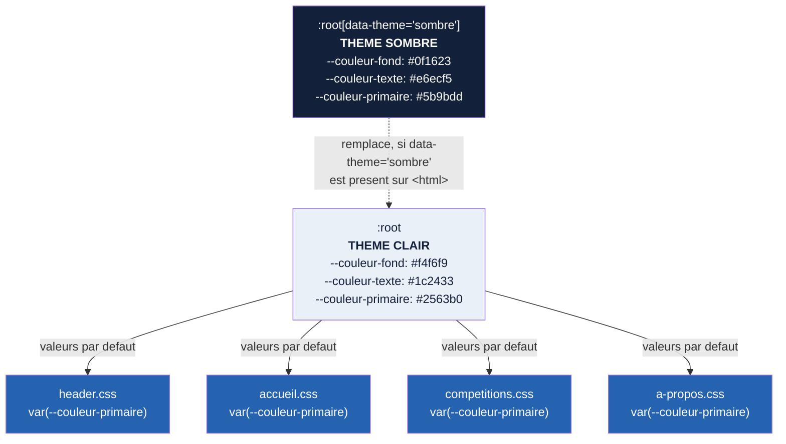
```mermaid
flowchart TB
    R[":root<br/><b>THEME CLAIR</b><br/>--couleur-fond: #f4f6f9<br/>--couleur-texte: #1c2433<br/>--couleur-primaire: #2563b0"]
    D[":root[data-theme='sombre']<br/><b>THEME SOMBRE</b><br/>--couleur-fond: #0f1623<br/>--couleur-texte: #e6ecf5<br/>--couleur-primaire: #5b9bdd"]

    H["header.css<br/>var(--couleur-primaire)"]
    A["accueil.css<br/>var(--couleur-primaire)"]
    C["competitions.css<br/>var(--couleur-primaire)"]
    P["a-propos.css<br/>var(--couleur-primaire)"]

    R -->|"valeurs par defaut"| H & A & C & P
    D -.->|"remplace, si data-theme='sombre'<br/>est present sur &lt;html&gt;"| R

    style R fill:#eaf0f8,color:#12203a
    style D fill:#12203a,color:#fff
    style H fill:#2563b0,color:#fff
    style A fill:#2563b0,color:#fff
    style C fill:#2563b0,color:#fff
    style P fill:#2563b0,color:#fff
```

Le point essentiel : **les quatre fichiers de composants ne sont jamais modifiés.** Ils demandent `var(--couleur-primaire)` et se moquent complètement de savoir laquelle des deux définitions leur répond. Toute la bascule se joue sur un seul attribut, posé sur une seule balise.

C'est exactement ce que fait le bouton : il écrit `data-theme="sombre"` sur `<html>`, et le navigateur recalcule toutes les couleurs.

### 2.4 Le signal : une donnée qui prévient Angular

Le bouton doit changer d'icône : une lune en thème clair (« passer en sombre »), un soleil en thème sombre.

Pour ça, le composant doit retenir le thème courant. On pourrait écrire une variable ordinaire :

```ts
theme = 'clair';   // NE FONCTIONNERAIT PAS
```

Le problème est qu'Angular n'a **aucun moyen de savoir** que cette variable a changé. Rien ne le prévient, donc il ne redessine rien, et l'icône resterait figée.

La solution est le **signal** : une valeur qui prévient Angular quand elle change.

```ts
readonly theme = signal<Theme>('clair');   // creation

theme();                                    // lecture  -> avec des parentheses
theme.set('sombre');                        // ecriture
```

Les parenthèses à la lecture déroutent au début. Elles sont pourtant logiques : lire un signal n'est pas consulter une case mémoire, c'est **lui demander sa valeur** — et c'est à ce moment précis qu'Angular note « ce bout d'affichage dépend de ce signal ». Plus tard, quand `.set()` est appelé, il sait exactement quoi rafraîchir : ce bout-là, et rien d'autre.

Voici ce qui se passe au clic, de bout en bout :

```mermaid
sequenceDiagram
    participant U as Utilisateur
    participant B as Bouton
    participant C as Composant Header
    participant H as Balise &lt;html&gt;
    participant N as Moteur CSS
    participant S as localStorage

    U->>B: clic
    B->>C: (click)="basculerTheme()"
    C->>C: theme.set('sombre')
    Note over C: le signal previent Angular :<br/>l'icone passe de la lune au soleil
    C->>H: dataset.theme = 'sombre'
    H->>N: l'attribut a change
    N->>N: :root[data-theme='sombre']<br/>remplace les variables
    N-->>U: toutes les couleurs basculent
    C->>S: setItem('theme', 'sombre')
    Note over S: le choix survivra<br/>a la fermeture du navigateur
```

Remarque la répartition des rôles : **Angular ne gère que l'icône.** Le changement de toutes les couleurs de l'application est entièrement pris en charge par le moteur CSS du navigateur, à partir d'un seul attribut modifié. C'est beaucoup plus efficace que de faire recalculer des styles par du JavaScript.

### 2.5 Retenir le choix

Un thème qu'il faut re-sélectionner à chaque visite n'a aucun intérêt. Il faut donc stocker le choix quelque part qui survive à la fermeture du navigateur : c'est le rôle de `localStorage`.

```ts
localStorage.setItem('theme', 'sombre');   // ecrire
localStorage.getItem('theme');             // lire  -> 'sombre'
```

C'est un petit espace de rangement que le navigateur réserve à chaque site, sous forme de paires nom/valeur. Trois limites à connaître dès maintenant :

- il ne stocke que du **texte** ;
- il est propre à **un navigateur et une machine** — un choix fait sur le PC ne suivra pas sur le téléphone ;
- il peut être **indisponible** : navigation privée, nettoyage, ou politique d'entreprise qui bloque le stockage.

Ce dernier point explique un détail du code. Chaque accès est entouré d'un `try / catch` :

```ts
try {
  localStorage.setItem(CLE_STOCKAGE, nouveauTheme);
} catch {
  // Stockage indisponible : le theme fonctionne quand meme,
  // il ne sera simplement pas retenu au prochain chargement.
}
```

`try / catch` signifie « essaie ceci ; si ça échoue, fais cela plutôt que de tout arrêter ». Sans lui, un navigateur en mode privé pourrait faire planter la bascule de thème entièrement. Avec lui, la fonctionnalité se dégrade proprement : le thème change, il n'est simplement pas mémorisé.

C'est un principe qui vaut bien au-delà de cet exemple : **une fonctionnalité annexe qui échoue ne doit jamais casser la fonctionnalité principale.** On le retrouvera à l'étape 11, quand une API externe sera indisponible.

### 2.6 L'éclair blanc, et pourquoi un script dans `index.html`

Il reste un problème de chronologie, invisible dans le code mais très visible à l'écran.

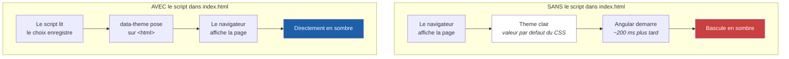
```mermaid
flowchart TB
    subgraph sans ["SANS le script dans index.html"]
        direction LR
        S1["Le navigateur<br/>affiche la page"] --> S2["Theme clair<br/><i>valeur par defaut du CSS</i>"] --> S3["Angular demarre<br/><i>~200 ms plus tard</i>"] --> S4["Bascule en sombre"]
    end

    subgraph avec ["AVEC le script dans index.html"]
        direction LR
        A1["Le script lit<br/>le choix enregistre"] --> A2["data-theme pose<br/>sur &lt;html&gt;"] --> A3["Le navigateur<br/>affiche la page"] --> A4["Directement en sombre"]
    end

    style S2 fill:#ffffff,color:#333
    style S4 fill:#c94040,color:#fff
    style A4 fill:#1e5fa8,color:#fff
```

Sans précaution, un utilisateur qui a choisi le thème sombre voit d'abord la page en **clair** pendant une fraction de seconde, le temps qu'Angular démarre — puis elle bascule. C'est bref, mais très désagréable : un éclair blanc en pleine nuit.

La cause est simple : Angular est du JavaScript, qui doit être téléchargé puis exécuté. Le navigateur, lui, affiche la page dès qu'il le peut, sans attendre.

La solution est de poser le thème **avant** que quoi que ce soit ne s'affiche, avec un petit script placé directement dans le `<head>` de `index.html`. C'est le seul JavaScript écrit en dur dans cette page, et c'est justifié : il doit s'exécuter avant tout le reste.

Ce script gère aussi le cas de la **première visite**, où `localStorage` est encore vide. Plutôt que d'imposer arbitrairement le thème clair, il consulte la préférence réglée dans le système d'exploitation, via `prefers-color-scheme`. Quelqu'un qui a configuré son Windows en sombre arrive donc directement sur une application sombre.

### 2.7 Le contraste, et une erreur qu'il a fallu corriger

Le cadre du projet demande de vérifier les contrastes dans les deux thèmes. Ce n'est pas une formalité — cette étape en donne une démonstration concrète.

Le **contraste** est l'écart de luminosité entre un texte et son fond, exprimé par un rapport. Les règles d'accessibilité fixent un minimum de **4,5:1** pour du texte de taille normale.

En thème clair, le bouton « Voir les compétitions suivies » est en texte blanc sur le bleu `#2563b0` : **5,9:1**. Confortable.

Mais en thème sombre, le bleu est éclairci pour rester visible sur fond foncé — il devient `#5b9bdd`. Et là, le même texte blanc tombe à **2,9:1**, nettement sous le seuil. Le bouton devient pénible à lire.

La première version du code faisait exactement cette erreur, parce que la couleur du texte était figée :

```css
.bouton-principal {
  background-color: var(--couleur-primaire);
  color: #ffffff;              /* fige en blanc -> illisible en theme sombre */
}
```

La correction consiste à faire de cette couleur une variable elle aussi :

```css
.bouton-principal {
  background-color: var(--couleur-primaire);
  color: var(--couleur-sur-primaire);
}
```

Avec `--couleur-sur-primaire` valant `#ffffff` en thème clair et `#0b111c` — un bleu presque noir — en thème sombre, qui remonte le contraste à **6,3:1**.

La leçon est plus générale que ce cas précis : **dès qu'une couleur de fond change avec le thème, la couleur du texte posé dessus doit changer avec elle.** Les deux forment une paire indissociable.

## 3. Prérequis

Pars de la branche **`etape-01-angular-decouverte`**.

```
git checkout etape-01-angular-decouverte
git checkout -b etape-02-theme
```

## 4. Déroulé détaillé

### 4.1 Définir la palette

Tout se passe dans `src/styles.css`, qui devient le fichier de référence de la charte graphique.

Le choix des couleurs suit la règle du projet : **le bleu domine, le rouge accentue**. Le bleu structure la navigation, les boutons d'action et les liens ; le rouge est réservé à ce qui doit attirer l'œil — l'étiquette « en construction », et plus tard les indicateurs de match en direct. C'est une règle de design classique : si tout est mis en valeur, plus rien ne l'est.

Voici le jeu du thème clair :

```css
:root {
  /* --- Fonds et surfaces --- */
  --couleur-fond: #f4f6f9;
  --couleur-surface: #ffffff;
  --couleur-bordure: #dfe5ee;
  --couleur-bordure-douce: #eef1f6;

  /* --- Textes --- */
  --couleur-texte: #1c2433;
  --couleur-texte-doux: #4a5568;
  --couleur-texte-discret: #8592a8;

  /* --- Bleu : couleur dominante --- */
  --couleur-primaire: #2563b0;
  --couleur-primaire-forte: #1d4f8f;
  --couleur-primaire-claire: #3a7bd0;
  --couleur-primaire-profonde: #12203a;

  /* --- Rouge : couleur d'accent, utilisee avec parcimonie --- */
  --couleur-accent: #cc3333;
  --couleur-accent-fond: #fdf3f3;
  --couleur-accent-bordure: #f2d4d4;
  --couleur-accent-texte: #6b4545;

  /* --- Couleurs de texte POSEES SUR le bleu et sur le rouge --- */
  --couleur-sur-primaire: #ffffff;
  --couleur-sur-accent: #ffffff;

  color-scheme: light;
}
```

Deux remarques sur ce bloc.

Les noms décrivent un **rôle**, pas une apparence : `--couleur-surface` et non `--blanc`. C'est délibéré — en thème sombre, cette même variable vaudra un bleu très foncé. Une variable nommée `--blanc` qui contient du bleu nuit serait un piège permanent.

`color-scheme: light` n'est pas une variable mais une propriété standard. Elle prévient le navigateur de la nature du thème, pour qu'il adapte les éléments **qu'il dessine lui-même** : barres de défilement, listes déroulantes, champs de formulaire. Sans elle, on se retrouve avec une barre de défilement blanche éclatante au bord d'une page sombre.

Le thème sombre ne redéfinit que les valeurs — aucune règle de style n'est réécrite :

```css
:root[data-theme='sombre'] {
  --couleur-fond: #0f1623;
  --couleur-surface: #172233;
  --couleur-bordure: #26344a;
  --couleur-bordure-douce: #1e2b3d;

  --couleur-texte: #e6ecf5;
  --couleur-texte-doux: #a9b6ca;
  --couleur-texte-discret: #7686a0;

  /* Le bleu est eclairci et legerement desature : le meme #2563b0 que sur
     fond clair deviendrait trop sombre pour rester lisible ici. */
  --couleur-primaire: #5b9bdd;
  --couleur-primaire-forte: #7db3e8;
  --couleur-primaire-claire: #4a8acc;
  --couleur-primaire-profonde: #0b111c;

  /* Le rouge est adouci : un rouge vif sur fond sombre « vibre » et fatigue
     l'oeil, tout en restant reconnaissable comme la couleur d'accent. */
  --couleur-accent: #e56a6a;
  --couleur-accent-fond: #2a1a1d;
  --couleur-accent-bordure: #4a2a2e;
  --couleur-accent-texte: #e0b4b4;

  /* Sur ces bleus et rouges eclaircis, c'est un texte TRES SOMBRE qui
     redevient lisible (voir 2.7). */
  --couleur-sur-primaire: #0b111c;
  --couleur-sur-accent: #0b111c;

  color-scheme: dark;
}
```

Les couleurs ne sont pas simplement inversées. Le bleu est **éclairci**, parce qu'un bleu moyen devient illisible sur fond foncé. Le rouge est **adouci**, parce qu'un rouge saturé sur fond sombre semble vibrer et fatigue l'œil. Les deux restent pourtant reconnaissables comme le bleu et le rouge de la charte : c'est l'identité visuelle qui compte, pas la valeur exacte.

Enfin, le `body` gagne une transition, pour que la bascule soit un fondu plutôt qu'un à-coup :

```css
body {
  color: var(--couleur-texte);
  background-color: var(--couleur-fond);
  transition: background-color 0.2s ease, color 0.2s ease;
}
```

### 4.2 Adapter les composants

Le travail est mécanique : dans les quatre fichiers CSS de composants, chaque couleur en dur est remplacée par la variable correspondante.

```css
/* AVANT */
.carte {
  background-color: #ffffff;
  border: 1px solid #dfe5ee;
}

/* APRES */
.carte {
  background-color: var(--couleur-surface);
  border: 1px solid var(--couleur-bordure);
}
```

Une fois l'opération terminée, **plus aucun code couleur ne doit subsister dans un fichier de composant**. C'est facile à vérifier : une recherche de `#` dans `src/app/` ne doit plus rien renvoyer.

### 4.3 Le bouton de bascule

Le gabarit du bouton, dans `header.html` :

```html
<button
  type="button"
  class="bascule-theme"
  (click)="basculerTheme()"
  [attr.aria-label]="
    theme() === 'clair' ? 'Activer le thème sombre' : 'Activer le thème clair'
  "
>
  @if (theme() === 'clair') {
    <svg …><path d="M21 12.79A9 9 0 1 1 11.21 3 7 7 0 0 0 21 12.79z" /></svg>
  } @else {
    <svg …><circle cx="12" cy="12" r="4" /><path d="M12 2v2M12 20v2…" /></svg>
  }
</button>
```

Quatre notions nouvelles ici.

`(click)="basculerTheme()"` est une **liaison d'événement**. Les parenthèses signifient « quand cet événement se produit, exécute cette méthode ». C'est l'équivalent Angular du `onclick` du HTML classique.

`[attr.aria-label]="…"` est une **liaison de propriété**. Les crochets indiquent que ce qui suit est du **code à évaluer**, pas du texte. Sans eux, l'attribut contiendrait littéralement la chaîne `theme() === 'clair' ? …`. La règle mnémotechnique : les crochets vont vers l'écran, les parenthèses viennent de l'utilisateur.

`aria-label` donne un nom au bouton pour les lecteurs d'écran. Sans lui, le bouton ne contient qu'un dessin — une personne malvoyante entendrait « bouton », sans savoir à quoi il sert. Ici elle entend « Activer le thème sombre ».

`@if (…) { … } @else { … }` affiche un bloc ou l'autre selon la condition. Ce n'est pas du HTML : c'est de la syntaxe Angular, traduite au moment du build. Les anciens tutoriels utilisent `*ngIf`, qui fait la même chose en plus lourd.

Les icônes sont des **SVG écrits à la main** plutôt qu'une bibliothèque d'icônes. Deux raisons : aucune dépendance supplémentaire à installer, et l'attribut `stroke="currentColor"` fait automatiquement prendre au dessin la couleur du texte environnant — donc il s'adapte au thème sans effort.

### 4.4 La logique du composant

Fichier complet — `src/app/header/header.ts` :

```ts
import { Component, signal } from '@angular/core';
import { RouterLink, RouterLinkActive } from '@angular/router';

/** Les deux seules valeurs possibles pour le theme. */
export type Theme = 'clair' | 'sombre';

/** Nom sous lequel le choix est range dans le stockage du navigateur. */
const CLE_STOCKAGE = 'theme';

@Component({
  imports: [RouterLink, RouterLinkActive],
  selector: 'app-header',
  styleUrl: './header.css',
  templateUrl: './header.html',
})
export class Header {
  readonly theme = signal<Theme>(this.themeApplique());

  basculerTheme(): void {
    const nouveauTheme: Theme = this.theme() === 'clair' ? 'sombre' : 'clair';

    this.theme.set(nouveauTheme);
    document.documentElement.dataset['theme'] = nouveauTheme;

    try {
      localStorage.setItem(CLE_STOCKAGE, nouveauTheme);
    } catch {
      // Stockage indisponible : le theme fonctionne quand meme.
    }
  }

  private themeApplique(): Theme {
    return document.documentElement.dataset['theme'] === 'sombre' ? 'sombre' : 'clair';
  }
}
```

`type Theme = 'clair' | 'sombre'` est une notion TypeScript très utile : un **type union**. Il déclare que la seule chose acceptable est le texte `'clair'` ou le texte `'sombre'`. Écrire `theme.set('sombre ')` avec une espace en trop devient une erreur signalée dans l'éditeur, au lieu d'un bug silencieux découvert trois semaines plus tard. C'est bien plus précis que de dire « c'est du texte ».

`document.documentElement` désigne la balise `<html>`, et `.dataset['theme']` écrit l'attribut `data-theme` dessus. C'est la ligne qui déclenche le changement de toutes les couleurs.

`private themeApplique()` mérite une explication. Le `private` signifie que cette méthode n'est utilisable qu'à l'intérieur de la classe. Elle lit le thème **déjà posé sur la balise `<html>`** par le script de `index.html` — plutôt que de relire `localStorage`. C'est volontaire : la décision (choix enregistré, ou préférence du système) a déjà été prise au chargement, et la reprendre ici reviendrait à dupliquer cette logique, avec le risque que les deux versions divergent un jour.

### 4.5 Le script anti-éclair

Dans le `<head>` de `src/index.html`, avant tout le reste :

```html
<script>
  (function () {
    var choix = null;

    // localStorage peut lever une erreur (navigation privee, cookies
    // bloques par une politique d'entreprise).
    try {
      choix = localStorage.getItem('theme');
    } catch (e) {
      choix = null;
    }

    // Aucun choix enregistre : on suit la preference du systeme
    // d'exploitation plutot que d'imposer le theme clair.
    if (choix !== 'clair' && choix !== 'sombre') {
      choix = window.matchMedia('(prefers-color-scheme: dark)').matches ? 'sombre' : 'clair';
    }

    document.documentElement.dataset.theme = choix;
  })();
</script>
```

Le test `choix !== 'clair' && choix !== 'sombre'` couvre d'un coup trois situations : rien n'a jamais été enregistré, le stockage a échoué, ou la valeur stockée a été corrompue. Dans les trois cas on retombe sur la préférence du système, ce qui est toujours un choix raisonnable.

Le code est enveloppé dans `(function () { … })()` — une fonction définie et appelée immédiatement. L'intérêt : la variable `choix` n'existe qu'à l'intérieur et disparaît ensuite, au lieu de traîner dans l'espace global de la page où elle pourrait entrer en collision avec autre chose.

### 4.6 Les tests

Deux tests sont ajoutés dans `header.spec.ts` :

```ts
it('bascule du theme clair vers le theme sombre au clic', async () => {
  const bouton = (fixture.nativeElement as HTMLElement).querySelector(
    '.bascule-theme',
  ) as HTMLButtonElement;

  expect(component.theme()).toBe('clair');

  bouton.click();
  await fixture.whenStable();

  expect(component.theme()).toBe('sombre');
  expect(document.documentElement.dataset['theme']).toBe('sombre');
});

it('retient le choix du theme dans le stockage du navigateur', () => {
  component.basculerTheme();
  expect(localStorage.getItem('theme')).toBe('sombre');

  component.basculerTheme();
  expect(localStorage.getItem('theme')).toBe('clair');
});
```

Un détail important dans la préparation des tests :

```ts
beforeEach(async () => {
  document.documentElement.dataset['theme'] = 'clair';
  localStorage.clear();
  …
});
```

`beforeEach` s'exécute avant **chaque** test. Sans cette remise à zéro, le premier test laisserait le thème en sombre et le second démarrerait dans un état imprévisible : il passerait ou échouerait selon l'ordre d'exécution. Un test doit toujours partir d'un état connu — c'est une règle générale, pas une particularité d'Angular.

### 4.7 Les captures d'écran

Le script de captures de l'étape 1 ne savait produire qu'un seul thème. Il a été remplacé par une version Node qui pilote le navigateur plus finement :

```
npm run captures -- etape-02
```

Il produit six images — trois pages × deux thèmes. Pour forcer le thème, il pré-remplit `localStorage` **avant** que la page ne se charge, ce qui revient exactement à simuler un utilisateur ayant déjà fait son choix.

## 5. Livrable attendu

Le thème clair, inchangé par rapport à l'étape 1 — au bouton près :

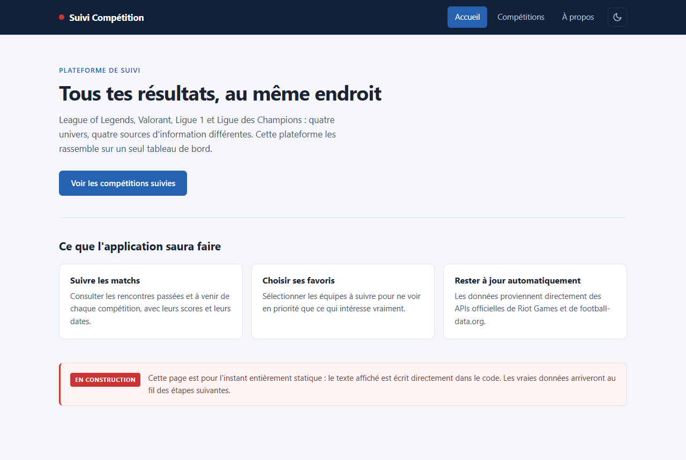

Le même écran en thème sombre :

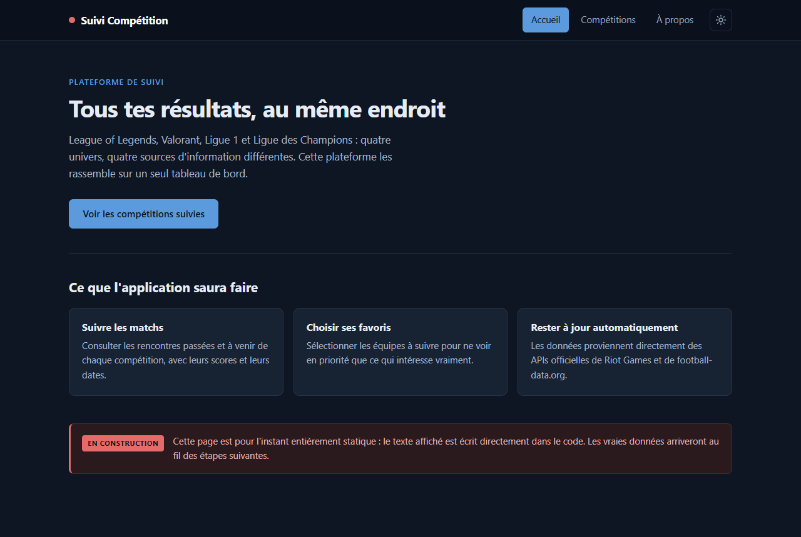

La page Compétitions dans les deux thèmes :

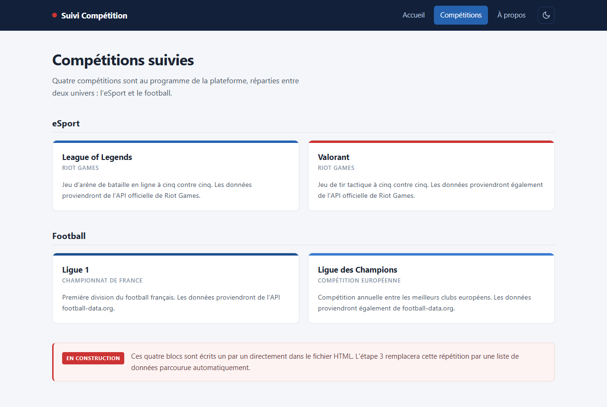

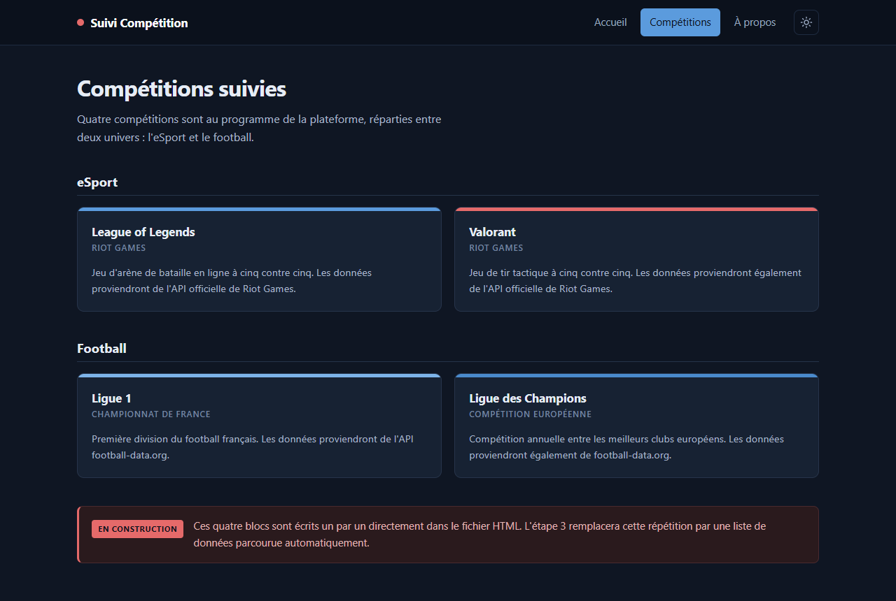

La page À propos dans les deux thèmes :

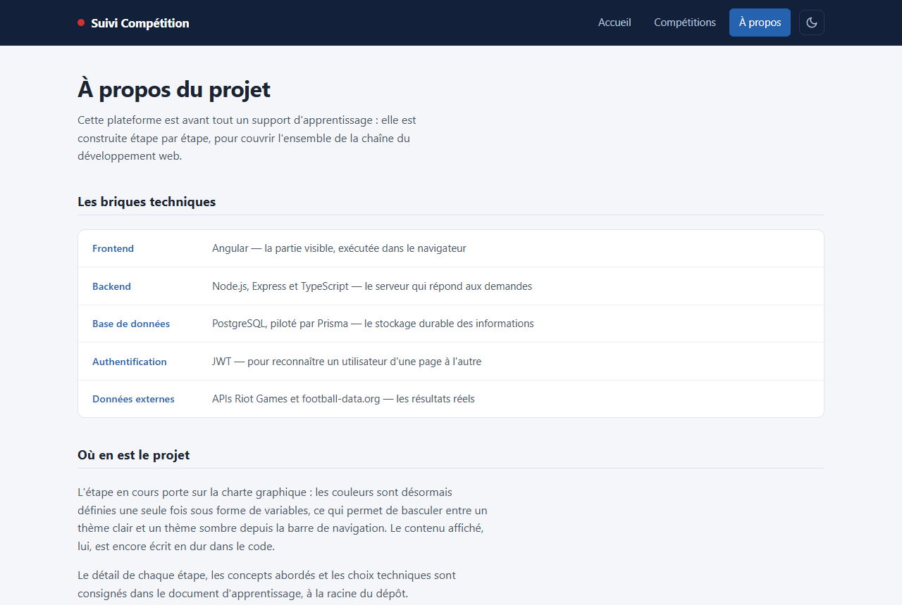

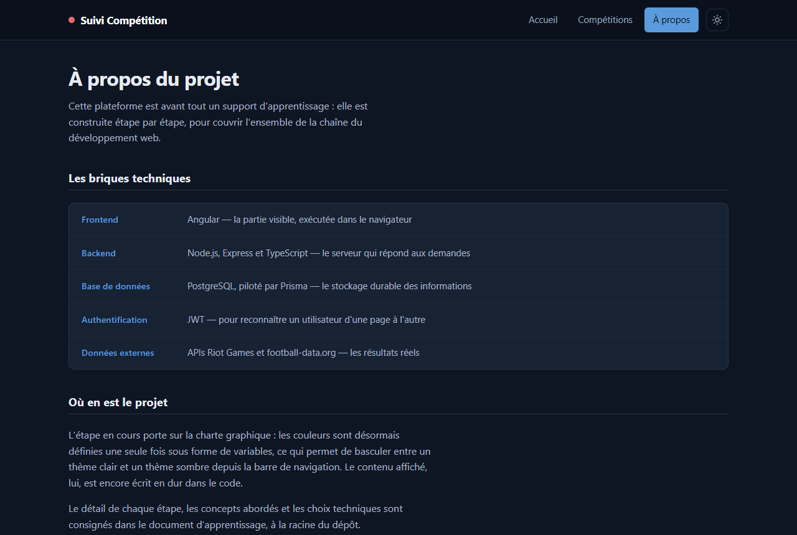

Ce qui doit fonctionner :

- le bouton de la barre de navigation bascule entre les deux thèmes ;
- son icône change (lune ↔ soleil) ;
- le choix survit à un rafraîchissement de la page **et** à la fermeture du navigateur ;
- à la première visite, l'application suit la préférence du système d'exploitation ;
- aucun éclair blanc au chargement quand le thème sombre est actif ;
- plus aucun code couleur en dur dans `src/app/` ;
- `npm test` passe — 9 tests.

## 6. Checklist d'auto-vérification

1. Le bleu apparaissait dans quatre fichiers CSS à l'étape 1. Quel était le risque concret, au-delà d'avoir quatre modifications à faire ?
   - *À relire :* § 2.1 « Le problème qu'on vient résoudre »
2. Quand on passe en thème sombre, combien de fichiers CSS de composants sont modifiés ? Pourquoi ?
   - *À relire :* § 2.3 « Deux jeux de valeurs »
3. Pourquoi une variable ordinaire (`theme = 'clair'`) ne suffirait-elle pas, là où un signal fonctionne ?
   - *À relire :* § 2.4 « Le signal : une donnée qui prévient Angular »
4. Pourquoi lit-on un signal avec des parenthèses — `theme()` — et pas simplement `theme` ?
   - *À relire :* § 2.4 « Le signal : une donnée qui prévient Angular »
5. Pourquoi les appels à `localStorage` sont-ils entourés d'un `try / catch` ? Que se passerait-il sans ?
   - *À relire :* § 2.5 « Retenir le choix »
6. Pourquoi le script de thème est-il écrit dans `index.html` plutôt que dans un composant Angular ?
   - *À relire :* § 2.6 « L'éclair blanc, et pourquoi un script dans `index.html` »
7. Du texte blanc sur le bleu passe en thème clair mais échoue en thème sombre. Pourquoi, et comment le projet le corrige-t-il ?
   - *À relire :* § 2.7 « Le contraste, et une erreur qu'il a fallu corriger »
8. Pourquoi la variable s'appelle-t-elle `--couleur-surface` et non `--blanc` ?
   - *À relire :* § 4.1 « Définir la palette »

## 7. Branche d'arrivée

À la fin de cette étape, ton code doit être poussé sur **`etape-02-theme`**.

L'étape suivante partira de cette branche pour créer `etape-03-donnees-mockees`, qui remplacera les blocs HTML répétés de la page Compétitions par une liste de données parcourue automatiquement.

---

# Étape 3 — Données mockées

## 1. Objectifs

À la fin de cette étape, tu dois savoir :

- décrire la forme d'une donnée avec une **interface** TypeScript, et dire à quoi ça sert concrètement ;
- expliquer ce qu'est un **service** et pourquoi les données ne vivent pas dans les composants ;
- demander un service à Angular avec `inject()` plutôt que de le construire toi-même ;
- afficher une liste avec `@for`, et expliquer à quoi sert `track` ;
- gérer proprement les cas particuliers : liste vide, valeur absente, score pas encore connu ;
- expliquer pourquoi on écrit des données simulées au lieu d'attendre le vrai backend.

## 2. Concepts abordés

### 2.1 Le problème qu'on vient résoudre

À la fin de l'étape 1, la page Compétitions contenait quatre blocs HTML quasi identiques, recopiés à la main. C'était volontaire — et il est temps de payer la dette.

Trois défauts, par ordre de gravité croissante :

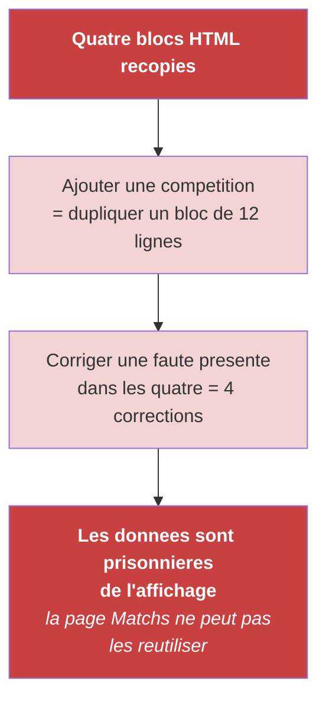
```mermaid
flowchart TB
    P["<b>Quatre blocs HTML recopies</b>"]
    D1["Ajouter une competition<br/>= dupliquer un bloc de 12 lignes"]
    D2["Corriger une faute presente<br/>dans les quatre = 4 corrections"]
    D3["<b>Les donnees sont prisonnieres<br/>de l'affichage</b><br/><i>la page Matchs ne peut pas<br/>les reutiliser</i>"]

    P --> D1 --> D2 --> D3

    style P fill:#c94040,color:#fff
    style D3 fill:#c94040,color:#fff
    style D1 fill:#f2d4d4,color:#333
    style D2 fill:#f2d4d4,color:#333
```

Le troisième est le vrai problème. Tant que « League of Legends » n'existe que sous forme de texte dans un fichier HTML, **aucune autre page ne peut s'en servir**. La page Matchs a besoin du nom de la compétition de chaque rencontre : sans séparation, il faudrait le recopier encore.

La solution tient en une phrase : **séparer ce qui est affiché de la façon dont c'est affiché.**

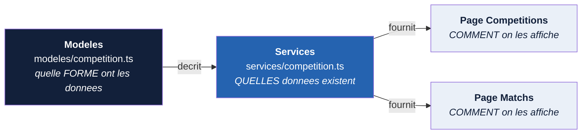
```mermaid
flowchart LR
    M["<b>Modeles</b><br/>modeles/competition.ts<br/><i>quelle FORME ont les donnees</i>"]
    S["<b>Services</b><br/>services/competition.ts<br/><i>QUELLES donnees existent</i>"]
    C1["<b>Page Competitions</b><br/><i>COMMENT on les affiche</i>"]
    C2["<b>Page Matchs</b><br/><i>COMMENT on les affiche</i>"]

    M -->|"decrit"| S
    S -->|"fournit"| C1
    S -->|"fournit"| C2

    style M fill:#12203a,color:#fff
    style S fill:#2563b0,color:#fff
    style C1 fill:#eaf0f8,color:#12203a
    style C2 fill:#eaf0f8,color:#12203a
```

### 2.2 L'interface : décrire la forme d'une donnée

Une **interface** TypeScript décrit les champs qu'un objet doit contenir, et de quel type est chacun.

```ts
export type Univers = 'esport' | 'football';

export interface Competition {
  id: string;
  nom: string;
  organisateur: string;
  univers: Univers;
  description: string;
}
```

Le point le plus déroutant au début : **une interface ne produit aucun code**. Elle disparaît entièrement au moment du build — le JavaScript envoyé au navigateur n'en contient aucune trace.

Son rôle est ailleurs. Elle sert pendant l'**écriture** : oublier un champ obligatoire, écrire `nom: 42`, ou taper `competition.non` au lieu de `competition.nom` devient une erreur soulignée dans l'éditeur, avant même d'avoir lancé quoi que ce soit. Sans elle, ces trois fautes produiraient une page silencieusement cassée.

Elle sert aussi de documentation : lire l'interface suffit à savoir ce que contient une compétition.

`Univers` mérite un mot à part. C'est un **type union** : il n'accepte que les deux textes exacts `'esport'` et `'football'`. On aurait pu écrire `univers: string`, mais alors `'footbal'` passerait sans broncher — et la compétition n'apparaîtrait dans aucune des deux sections, sans le moindre message d'erreur. Un bug particulièrement pénible, parce que rien ne signale qu'il existe.

Le modèle `Match` introduit une autre notion :

```ts
export interface Match {
  competitionId: string;
  domicile: Equipe;
  exterieur: Equipe;
  scoreDomicile: number | null;
  scoreExterieur: number | null;
  date: Date;
  statut: StatutMatch;
}
```

`number | null` dit : « un nombre, **ou** rien du tout ». C'est la façon honnête de représenter le score d'un match qui n'a pas encore commencé. Écrire `scoreDomicile: number` obligerait à inventer une valeur — `0` par exemple — et l'affichage montrerait alors un match à venir avec un score de 0-0, ce qui est faux.

Remarque aussi `competitionId: string` plutôt qu'un objet `Competition` complet. Un match ne contient que l'**identifiant** de sa compétition. C'est exactement ainsi que fonctionnera la base de données à l'étape 6 : les tables se référencent par identifiant, pas en s'imbriquant. Adopter cette forme dès maintenant évitera une refonte plus tard.

### 2.3 Le service : où vivent les données

Un **service** est une classe qui regroupe des données et de la logique, en dehors de tout composant. La règle de partage des rôles :

| Rôle | Qui s'en occupe |
|---|---|
| **Quelles** données existent | le service |
| **Comment** elles sont affichées | le composant |

```ts
@Service()
export class CompetitionService {
  private readonly competitions: Competition[] = [ /* … */ ];

  listerToutes(): Competition[] {
    return this.competitions;
  }

  listerParUnivers(univers: Univers): Competition[] {
    return this.competitions.filter((competition) => competition.univers === univers);
  }
}
```

`@Service()` est le décorateur qui signale à Angular « cette classe est un service ». Attention en cherchant de l'aide en ligne : c'est une écriture récente, arrivée avec Angular 22. La quasi-totalité des tutoriels montre encore `@Injectable({ providedIn: 'root' })`, qui fait exactement la même chose.

Le mot `private` devant `competitions` est important. Il signifie que le tableau n'est accessible **que depuis l'intérieur de la classe**. Les composants ne peuvent pas y toucher directement : ils passent obligatoirement par les méthodes. Cette discipline paie à l'étape 5, quand les données ne seront plus un tableau mais le résultat d'un appel réseau — seul l'intérieur du service changera.

### 2.4 L'injection de dépendances

Un composant qui a besoin d'un service ne le construit pas. Il le **demande** :

```ts
export class Competitions {
  private readonly competitionService = inject(CompetitionService);

  readonly competitionsEsport = this.competitionService.listerParUnivers('esport');
  readonly competitionsFootball = this.competitionService.listerParUnivers('football');
}
```

Nulle part on n'écrit `new CompetitionService()`. On appelle `inject()`, et Angular fournit l'instance. Ce mécanisme s'appelle l'**injection de dépendances**.

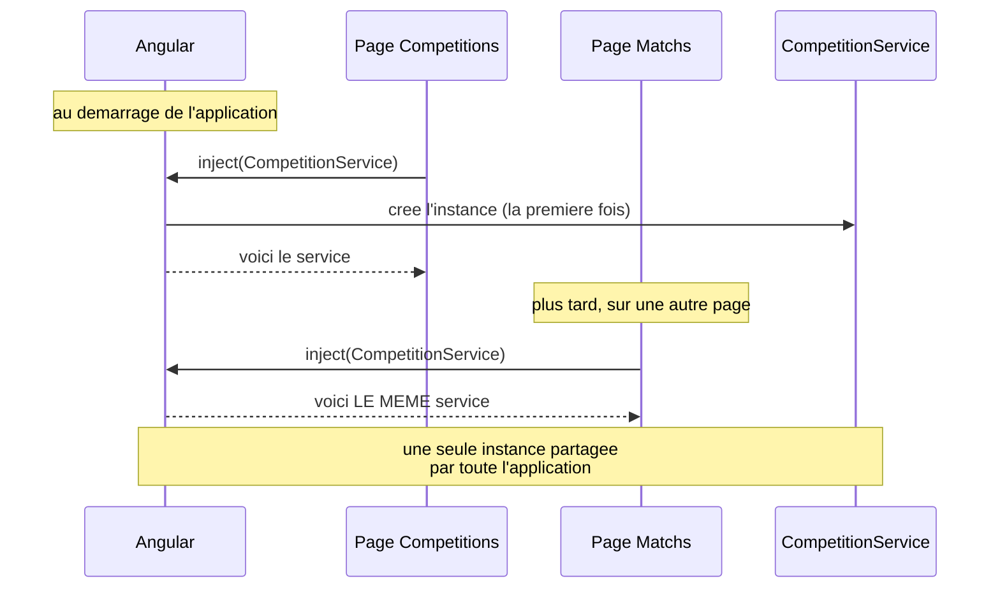
```mermaid
sequenceDiagram
    participant A as Angular
    participant C as Page Competitions
    participant M as Page Matchs
    participant S as CompetitionService

    Note over A: au demarrage de l'application
    C->>A: inject(CompetitionService)
    A->>S: cree l'instance (la premiere fois)
    A-->>C: voici le service

    Note over M: plus tard, sur une autre page
    M->>A: inject(CompetitionService)
    A-->>M: voici LE MEME service
    Note over A,S: une seule instance partagee<br/>par toute l'application
```

Deux bénéfices concrets.

**Une seule instance pour toute l'application** — un *singleton*. Les deux pages voient exactement les mêmes données. Si chacune construisait son propre service, on aurait deux copies indépendantes, et un ajout dans l'une n'apparaîtrait pas dans l'autre.

**Le remplacement devient possible.** Dans un test, on peut demander à Angular de fournir une version de remplacement du service, avec des données fabriquées pour l'occasion. C'est impossible si le composant construit lui-même sa dépendance — on serait coincé avec la vraie.

### 2.5 La boucle `@for`

Côté gabarit, le bloc `@for` répète un morceau de HTML pour chaque élément d'une liste :

```html
@for (competition of competitionsEsport; track competition.id) {
  <article class="carte">
    <h3>{{ competition.nom }}</h3>
    <p class="carte-editeur">{{ competition.organisateur }}</p>
  </article>
} @empty {
  <p class="vide">Aucune compétition eSport suivie pour le moment.</p>
}
```

Quatre blocs deviennent un seul. Ajouter une cinquième compétition ne demande plus de toucher au HTML — une ligne de données suffit.

**`track` est obligatoire**, et ce n'est pas une contrainte arbitraire. Il indique à Angular ce qui identifie chaque élément de façon unique.

Sans repère, quand une liste change, Angular ne peut pas savoir si un élément a été déplacé, modifié ou remplacé : il détruirait et reconstruirait tout. Avec `track competition.id`, il sait exactement quel élément est lequel, et ne touche qu'à ce qui a réellement bougé. Sur une liste de matchs qui se rafraîchit toutes les trente secondes, la différence est très visible.

**`@empty`** couvre le cas de la liste vide. Sans lui, une liste vide ne produit rien — une zone blanche, sans explication, que l'utilisateur interprète comme un bug. Prévoir ce cas dès l'écriture coûte deux lignes ; le découvrir en production coûte beaucoup plus.

### 2.6 Les pipes

Les dates sont stockées comme de vrais objets `Date`, pas comme du texte. C'est indispensable pour pouvoir les **comparer** et **trier** les matchs par ordre chronologique.

Mais un objet `Date` affiché tel quel donne `Mon Sep 14 2026 17:00:00 GMT+0200 (heure d'été d'Europe centrale)` — illisible.

Un **pipe** met la valeur en forme au moment de l'affichage, et seulement là :

```html
{{ match.date | date: 'dd/MM/yyyy' }}     <!-- 14/09/2026 -->
{{ match.date | date: 'HH:mm' }}          <!-- 17:00 -->
```

La barre verticale `|` se lit « passe cette valeur à travers ». Le principe à retenir : **la donnée reste brute dans le code, et n'est transformée en texte qu'au dernier moment, pour l'écran.** Formater la date dès le stockage rendrait le tri impossible.

## 3. Prérequis

Pars de la branche **`etape-02-theme`**.

```
git checkout etape-02-theme
git checkout -b etape-03-donnees-mockees
```

## 4. Déroulé détaillé

### 4.1 Créer les modèles

Trois fichiers dans un nouveau dossier `src/app/modeles/`. Ils ne contiennent que des descriptions de formes — aucune donnée, aucune logique.

`modeles/equipe.ts` :

```ts
export interface Equipe {
  id: string;
  nom: string;
  /** Abreviation de trois lettres affichee dans les listes : « PSG », « KC ». */
  trigramme: string;
}
```

`modeles/competition.ts` et `modeles/match.ts` suivent le même principe (voir le code en 2.2).

Le dossier s'appelle `modeles` et non `models` : le projet est en français, autant s'y tenir partout. La cohérence compte plus que la langue choisie.

### 4.2 Créer les services

La CLI génère la structure :

```
ng generate service services/competition
ng generate service services/match
```

Puis on remplit. Voici `services/competition.ts`, en entier :

```ts
import { Service } from '@angular/core';
import { Competition, Univers } from '../modeles/competition';

@Service()
export class CompetitionService {
  private readonly competitions: Competition[] = [
    {
      id: 'lol',
      nom: 'League of Legends',
      organisateur: 'Riot Games',
      univers: 'esport',
      description: "Jeu d'arène de bataille en ligne à cinq contre cinq. …",
    },
    // … trois autres competitions
  ];

  listerToutes(): Competition[] {
    return this.competitions;
  }

  listerParUnivers(univers: Univers): Competition[] {
    return this.competitions.filter((competition) => competition.univers === univers);
  }

  trouverParId(id: string): Competition | undefined {
    return this.competitions.find((competition) => competition.id === id);
  }
}
```

`filter` et `find` sont deux méthodes standard des tableaux JavaScript, pas des inventions d'Angular. `filter` garde **tous** les éléments qui satisfont une condition et renvoie un nouveau tableau ; `find` renvoie **le premier** qui convient, ou `undefined` s'il n'y en a aucun.

C'est ce `undefined` qui explique le type de retour `Competition | undefined`. TypeScript force alors l'appelant à prévoir le cas — on y revient en 4.4.

Dans `services/match.ts`, les équipes sont déclarées à part avant d'être utilisées :

```ts
const KC: Equipe = { id: 'kc', nom: 'Karmine Corp', trigramme: 'KC' };
const G2: Equipe = { id: 'g2', nom: 'G2 Esports', trigramme: 'G2' };
// …

private readonly matchs: Match[] = [
  {
    id: 'm1',
    competitionId: 'lol',
    domicile: KC,
    exterieur: G2,
    scoreDomicile: 1,
    scoreExterieur: 0,
    date: new Date('2026-09-14T17:00:00'),
    statut: 'en-direct',
  },
  // …
];
```

Écrire « Karmine Corp » une seule fois, puis réutiliser `KC`, n'est pas qu'une économie de frappe : c'est une garantie. Recopié à la main dans chaque match, le nom finirait par diverger — « Karmine Corp » ici, « Karmine corp » là — et le programme y verrait deux équipes différentes.

Le service expose une méthode qui filtre **et** trie :

```ts
listerParStatut(statut: StatutMatch): Match[] {
  return this.matchs
    .filter((match) => match.statut === statut)
    .sort((a, b) => a.date.getTime() - b.date.getTime());
}
```

`.getTime()` convertit une date en nombre de millisecondes, ce qui permet de les soustraire. `sort` attend une fonction qui renvoie un nombre négatif, nul ou positif selon l'ordre souhaité — ici, du plus ancien au plus récent.

### 4.3 Brancher la page Compétitions

Le composant se réduit à trois lignes utiles :

```ts
import { Component, inject } from '@angular/core';
import { CompetitionService } from '../../services/competition';

@Component({
  imports: [],
  selector: 'app-competitions',
  styleUrl: './competitions.css',
  templateUrl: './competitions.html',
})
export class Competitions {
  private readonly competitionService = inject(CompetitionService);

  readonly competitionsEsport = this.competitionService.listerParUnivers('esport');
  readonly competitionsFootball = this.competitionService.listerParUnivers('football');
}
```

Et le gabarit perd les trois quarts de son volume (voir 2.5).

Un détail de style intéressant. À l'étape 1, chaque carte avait une classe CSS différente pour son bandeau coloré : `carte-bandeau--lol`, `carte-bandeau--valorant`… Avec une boucle, ça ne tient plus — le HTML est écrit une seule fois pour toutes les compétitions.

La solution réutilise un mécanisme déjà vu à l'étape 2, celui du `data-theme` :

```html
<div class="carte-bandeau" [attr.data-competition]="competition.id"></div>
```

```css
.carte-bandeau[data-competition='lol'] {
  background-color: var(--couleur-primaire);
}

.carte-bandeau[data-competition='valorant'] {
  background-color: var(--couleur-accent);
}
```

L'identifiant de la donnée est posé sur l'élément, et le CSS réagit à sa valeur — exactement comme le thème.

### 4.4 La page Matchs

C'est la nouveauté de l'étape. Elle utilise **deux** services à la fois :

```ts
export class Matchs {
  private readonly matchService = inject(MatchService);
  private readonly competitionService = inject(CompetitionService);

  readonly matchsEnDirect = this.matchService.listerParStatut('en-direct');
  readonly matchsAVenir = this.matchService.listerParStatut('a-venir');
  readonly matchsTermines = this.matchService.listerParStatut('termine');

  nomCompetition(competitionId: string): string {
    return this.competitionService.trouverParId(competitionId)?.nom ?? 'Compétition inconnue';
  }
}
```

La méthode `nomCompetition` mérite qu'on s'y arrête. Un match ne stocke que `competitionId: 'lol'` ; il faut retrouver le nom lisible. Mais `trouverParId` peut ne rien trouver, et TypeScript **refuse** qu'on ignore ce cas.

Deux opérateurs s'en chargent :

- `?.` — « si ce qui précède existe, continue ; sinon arrête-toi et renvoie `undefined` ». Sans lui, un identifiant inconnu ferait planter la page.
- `??` — « si la valeur de gauche est absente, prends celle de droite ».

Écrit sans eux, ça donnerait :

```ts
const competition = this.competitionService.trouverParId(competitionId);
if (competition === undefined) {
  return 'Compétition inconnue';
}
return competition.nom;
```

Cinq lignes pour la même chose. Les deux opérateurs ne sont pas de la coquetterie : ils rendent le traitement du cas absent si court qu'on ne se dit plus « je le ferai plus tard ».

Le gabarit affiche trois sections. La première n'apparaît que s'il y a effectivement des matchs en cours :

```html
@if (matchsEnDirect.length > 0) {
  <section class="bloc">
    <h2 class="section-titre">
      <span class="pastille-direct" aria-hidden="true"></span>
      En direct
    </h2>
    …
  </section>
}
```

Sans ce `@if`, un titre « En direct » resterait affiché au-dessus du vide les trois quarts du temps.

`aria-hidden="true"` sur la pastille rouge indique aux lecteurs d'écran de l'ignorer : c'est une décoration, et l'information « en direct » est déjà donnée par le texte juste à côté. Sans cet attribut, la personne entendrait une annonce parasite.

C'est enfin ici que le **rouge de la charte** prend tout son sens. Le cadre du projet le réserve à ce qui doit attirer l'œil — un match en cours est précisément ce cas :

```css
.pastille-direct {
  background-color: var(--couleur-accent);
  animation: pulsation 1.8s ease-in-out infinite;
}

@keyframes pulsation {
  0%, 100% { opacity: 1; }
  50%      { opacity: 0.35; }
}

/* Respecte le reglage systeme des personnes sensibles au mouvement. */
@media (prefers-reduced-motion: reduce) {
  .pastille-direct {
    animation: none;
  }
}
```

`prefers-reduced-motion` fonctionne comme le `prefers-color-scheme` de l'étape 2 : c'est un réglage du système d'exploitation. Certaines personnes — troubles vestibulaires, migraines, épilepsie — le règlent sur « réduire ». Une animation qui l'ignore peut réellement les rendre malades. Trois lignes suffisent à en tenir compte.

### 4.5 Les tests

Les services se testent sans interface, ce qui les rend particulièrement simples à vérifier :

```ts
it('separe les competitions par univers', () => {
  const esport = service.listerParUnivers('esport');
  const football = service.listerParUnivers('football');

  expect(esport.length).toBe(2);
  expect(football.length).toBe(2);
  expect(esport.every((competition) => competition.univers === 'esport')).toBe(true);
});

it('renvoie undefined pour un identifiant inconnu', () => {
  expect(service.trouverParId('echecs')).toBeUndefined();
});
```

Le second test vérifie un **cas d'échec**, et c'est au moins aussi important que le premier. Un test qui ne contrôle que le cas où tout va bien laisse passer exactement les bugs qui arrivent en vrai.

Côté composants, on vérifie que la boucle produit bien ce qu'on attend :

```ts
it('affiche une carte par competition', () => {
  const cartes = (fixture.nativeElement as HTMLElement).querySelectorAll('.carte');
  expect(cartes.length).toBe(4);
});
```

L'étape se termine avec **25 tests** répartis sur 8 fichiers.

## 5. Livrable attendu

La nouvelle page Matchs, avec ses trois sections :


La même en thème sombre — le rouge du direct reste lisible sans agresser l'œil :


La page Compétitions, visuellement identique à l'étape 2, mais dont le HTML a fondu :

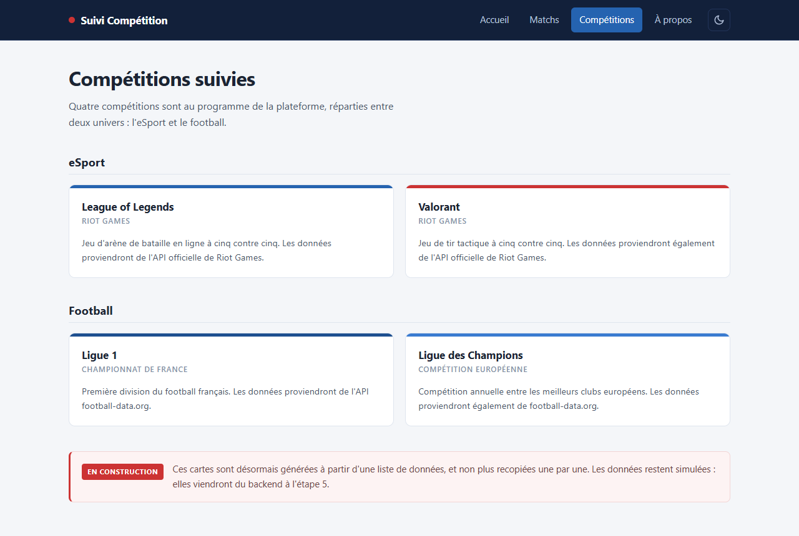

Ce qui doit fonctionner :

- la barre de navigation compte quatre onglets, dont le nouveau « Matchs » ;
- les compétitions et les matchs proviennent de services, plus du HTML ;
- les matchs en cours sont signalés en rouge, avec une pastille clignotante ;
- les matchs à venir affichent une date et une heure, pas un score ;
- les deux thèmes fonctionnent toujours sur toutes les pages ;
- `npm test` passe — 25 tests.

## 6. Checklist d'auto-vérification

1. Une interface TypeScript ne produit aucun code une fois l'application construite. À quoi sert-elle, alors ?
   - *À relire :* § 2.2 « L'interface : décrire la forme d'une donnée »
2. Pourquoi `univers: Univers` plutôt que `univers: string` ? Quel bug précis le premier évite-t-il ?
   - *À relire :* § 2.2 « L'interface : décrire la forme d'une donnée » (type `Univers`)
3. Pourquoi le score est-il `number | null` et non `number` initialisé à zéro ?
   - *À relire :* § 2.2 « L'interface : décrire la forme d'une donnée » (modèle `Match`)
4. Un match stocke `competitionId: 'lol'` et non l'objet `Competition` entier. Pourquoi ce choix, et avec quelle étape future est-il cohérent ?
   - *À relire :* § 2.2 « L'interface : décrire la forme d'une donnée » (fin de la partie)
5. Que se passerait-il si chaque composant faisait `new CompetitionService()` au lieu d'utiliser `inject()` ?
   - *À relire :* § 2.4 « L'injection de dépendances »
6. À quoi sert `track` dans un bloc `@for` ? Que ferait Angular sans cette information ?
   - *À relire :* § 2.5 « La boucle `@for` »
7. Pourquoi stocker les dates comme objets `Date` plutôt que comme texte déjà formaté ?
   - *À relire :* § 2.6 « Les pipes »
8. Que signifie `?.` et que signifie `??` dans `trouverParId(id)?.nom ?? 'Compétition inconnue'` ?
   - *À relire :* § 4.4 « La page Matchs »

## 7. Branche d'arrivée

À la fin de cette étape, ton code doit être poussé sur **`etape-03-donnees-mockees`**.

L'étape suivante partira de cette branche pour créer `etape-04-backend-bases`, qui construira le serveur Express destiné à fournir ces données pour de vrai.
