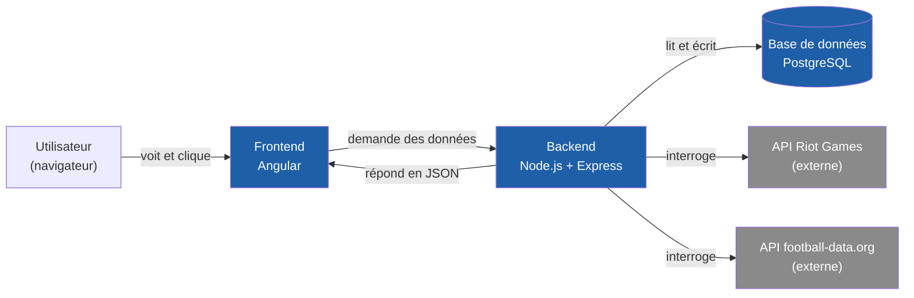
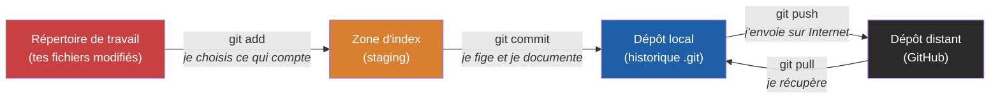
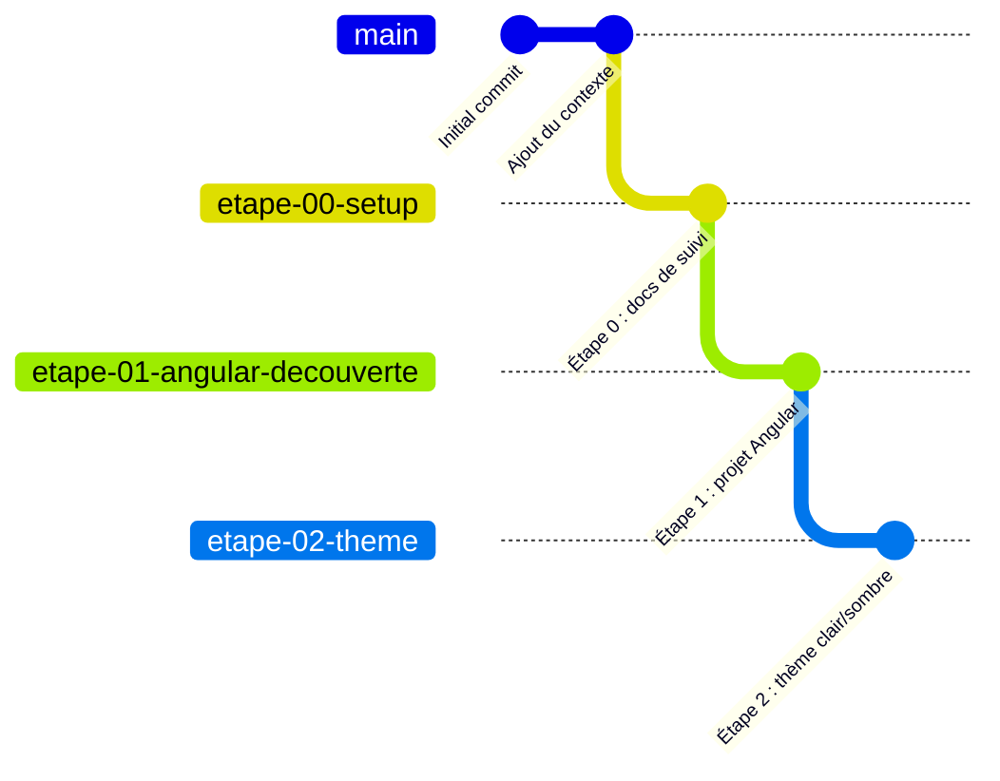
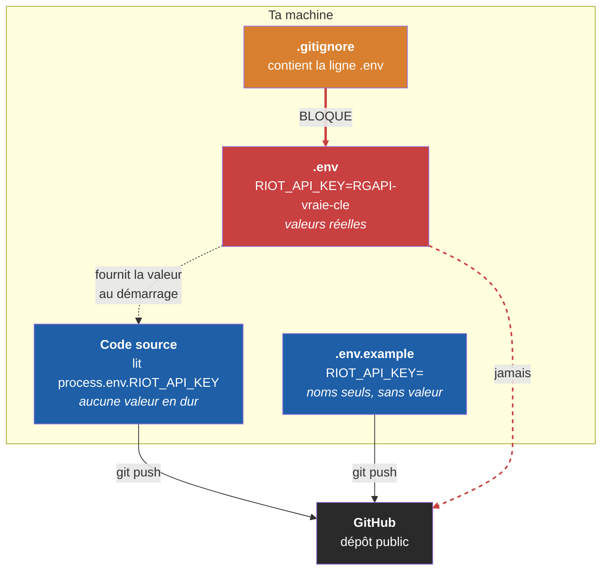
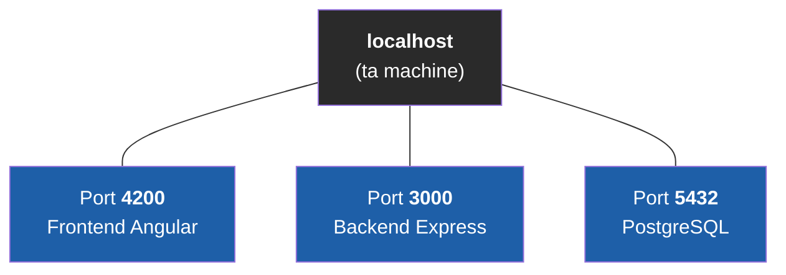
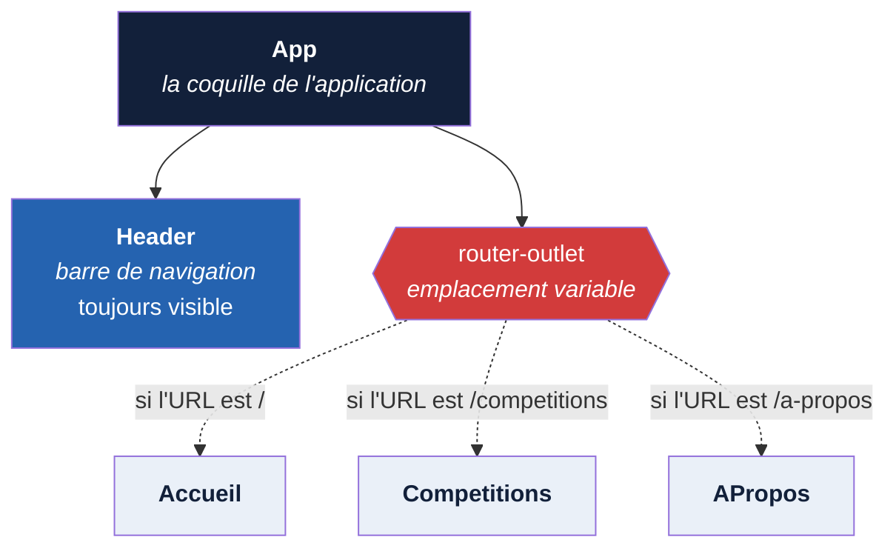
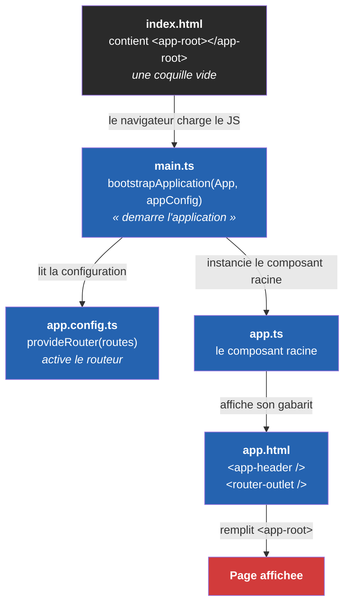
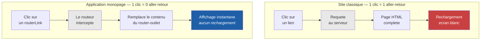
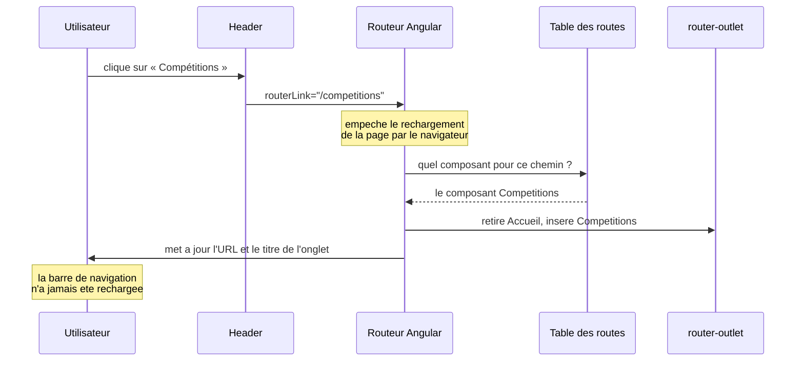

# Document d'apprentissage — Plateforme de suivi eSport

Ce document est le cours du projet. Il est rempli au fur et à mesure, une section par étape, et suit toujours la même structure : objectifs, concepts, prérequis, déroulé, livrable, checklist, branche d'arrivée.

Il part systématiquement du principe qu'aucune notion n'est acquise : chaque terme est défini au moment où il apparaît, et repris dans le [glossaire](GLOSSAIRE.md).

## Sommaire

- [Étape 0 — Mise en place de l'environnement](#étape-0--mise-en-place-de-lenvironnement)
- [Étape 1 — Découverte d'Angular](#étape-1--découverte-dangular)

---

# Étape 0 — Mise en place de l'environnement

## 1. Objectifs

À la fin de cette étape, tu dois savoir :

- expliquer **à quoi sert chacun des outils installés** et à quel moment du projet il intervient ;
- vérifier dans un terminal qu'un outil est bien installé et lire le numéro de version qu'il affiche ;
- expliquer la différence entre **Git** et **GitHub**, et ce que contient un dépôt ;
- expliquer pourquoi le projet utilise **une branche par étape**, et comment revenir à une étape antérieure ;
- expliquer pourquoi un mot de passe ou une clé d'API ne doit **jamais** être écrit dans le code, et par quoi on le remplace.

## 2. Concepts abordés

### 2.1 L'architecture générale de ce qu'on va construire

Avant d'installer quoi que ce soit, il faut comprendre **ce que chaque outil vient occuper comme place** dans l'application finale. Sans cette vue d'ensemble, une liste d'installations n'est qu'une suite de clics sans signification.

Une application web moderne est presque toujours découpée en trois morceaux distincts, qui tournent séparément et se parlent par le réseau.

Le premier est le **frontend** (littéralement « la façade »). C'est la seule partie que l'utilisateur voit : elle s'exécute **dans son navigateur**, sur sa machine à lui. Elle affiche les pages, réagit aux clics, mais ne détient aucune donnée en propre — elle doit les demander. C'est le rôle d'**Angular** ici.

Le deuxième est le **backend** (« l'arrière-boutique »). Il s'exécute sur un serveur, jamais chez l'utilisateur. Il reçoit les demandes du frontend, décide si elles sont légitimes, va chercher les données et les renvoie. C'est lui, et lui seul, qui détient les secrets : mot de passe de la base, clés d'API. C'est le rôle d'**Express**, exécuté par **Node.js**.

Le troisième est la **base de données**, qui conserve durablement les informations. Elle n'est accessible que par le backend. C'est le rôle de **PostgreSQL**.

S'ajoutent enfin les **APIs externes** — Riot Games et football-data.org — qui sont des services appartenant à d'autres entreprises, interrogés par le backend pour récupérer les vrais résultats de matchs.



Le point important, sur ce schéma : **le frontend ne parle jamais directement ni à la base de données, ni aux APIs externes.** Tout passe par le backend. Ce n'est pas une contrainte technique arbitraire, c'est une question de sécurité — on y revient en 2.4.

### 2.2 Git, GitHub, et pourquoi les deux ne sont pas la même chose

**Git** est un logiciel installé sur ta machine. Son travail est d'enregistrer l'historique complet des modifications du projet. Chaque fois que tu fais un **commit**, Git fige l'état de tous les fichiers à cet instant et l'ajoute à l'historique, avec un message qui explique le changement.

La différence avec une sauvegarde classique est fondamentale : une sauvegarde écrase la version précédente, un commit **s'ajoute**. Rien n'est jamais perdu, et on peut revenir à n'importe quel point du passé.

**GitHub** est un service web qui héberge une copie de ce dépôt sur Internet. Git fonctionne très bien sans GitHub — l'historique est complet en local. GitHub apporte trois choses : une sauvegarde hors de ta machine, une interface web pour consulter le code, et la possibilité de collaborer.

Le passage du travail en cours jusqu'à GitHub se fait en trois temps, qu'il faut bien distinguer :



L'étape intermédiaire — la **zone d'index**, ou *staging* — surprend souvent au début. Pourquoi ne pas commiter directement tout ce qui a changé ? Parce qu'elle permet de **choisir** : si tu as modifié cinq fichiers pour deux raisons différentes, tu peux faire deux commits séparés, chacun cohérent et correctement décrit. Un historique lisible vaut beaucoup mieux qu'un historique exhaustif mais confus.

### 2.3 Pourquoi une branche par étape

Une **branche** est une ligne de développement parallèle dans le dépôt. Créer une branche revient à poser un marque-page dans l'historique et à continuer à écrire à partir de là, sans toucher à ce qui précède.

Le cadre du projet impose une branche par étape, nommée `etape-XX-nom-court`. Cette règle a un but précis : **chaque branche est un état du projet connu comme fonctionnel.** Si l'étape 7 part en vrac et devient impossible à déboguer, il reste toujours possible de repartir de l'étape 6 intacte, sans avoir à défaire les modifications une par une.



Chaque branche part de la précédente et contient donc tout son contenu, plus le sien. `main` reste de côté jusqu'à la toute fin : elle est réservée au projet terminé et aux deux documents finaux.

### 2.4 Les secrets, et pourquoi ils ne vivent pas dans le code

C'est le concept le plus important de cette étape, et le seul dont une erreur est **définitive**.

Le projet manipulera des **secrets** : le mot de passe de PostgreSQL, la clé d'API Riot Games, la clé football-data.org. Un secret est une information qui donne un accès — quiconque la possède peut agir à ta place.

Le réflexe naturel du débutant est d'écrire la clé directement dans le code, parce que c'est ce qui fonctionne le plus vite. Le problème n'apparaît qu'au moment du `git push` : le code part sur GitHub, et le secret avec lui. Et comme Git conserve **tout l'historique**, le supprimer dans un commit ultérieur ne le retire pas — il reste consultable dans les commits précédents. Un secret publié une fois doit être considéré comme perdu et régénéré.

La solution est de sortir le secret du code et de le placer dans un fichier `.env`, que le `.gitignore` empêche d'être commité :



Le fichier `.env.example`, lui, part bien sur GitHub. Il ne contient que les **noms** des variables, sans les valeurs. Son rôle est documentaire : il indique à quiconque récupère le projet quelles variables il doit renseigner, sans qu'aucun secret n'ait circulé.

C'est aussi ce qui explique le point relevé en 2.1 : le frontend s'exécute dans le navigateur de l'utilisateur, donc **tout ce qu'il contient est lisible par cet utilisateur**. Une clé d'API placée dans le frontend est une clé publique. C'est pour ça qu'elle reste côté backend, qui tourne sur un serveur auquel personne n'a accès.

### 2.5 Les ports

Plusieurs programmes vont tourner en même temps sur ta machine et communiquer par le réseau. Le **port** est le numéro qui permet de les distinguer : l'adresse identifie la machine, le port identifie le programme à l'intérieur.



`localhost` est le nom réservé qui désigne toujours « la machine sur laquelle je suis ». Ouvrir `http://localhost:4200` dans le navigateur signifie donc : « contacte le programme qui écoute sur le port 4200 de cette machine », c'est-à-dire le serveur de développement Angular.

Les valeurs `4200`, `3000` et `5432` sont des conventions, pas des obligations. `5432` est le port historique de PostgreSQL, et le conserver évite d'avoir à le préciser dans chaque outil de connexion.

## 3. Prérequis

Pars de la branche **`main`**.

```
git checkout main
```

Aucune connaissance préalable n'est nécessaire pour cette étape.

## 4. Déroulé détaillé

### 4.1 Installer les outils

Sept outils sont nécessaires pour démarrer. Voici ce que chacun apporte et comment vérifier qu'il fonctionne.

| Outil | Rôle dans le projet | Commande de vérification |
|---|---|---|
| **Node.js** | Exécute le JavaScript hors navigateur — fait tourner le backend et les outils de développement | `node -v` |
| **npm** | Installe les bibliothèques ; livré avec Node.js | `npm -v` |
| **Angular CLI** | Crée et sert le projet Angular | `ng version` |
| **Git** | Gère l'historique des versions | `git --version` |
| **VS Code** | Éditeur de code | `code -v` |
| **PostgreSQL** | Base de données | via pgAdmin |
| **pgAdmin** *(ou DBeaver)* | Explorer la base à la souris | ouvrir l'application |

La vérification n'est pas une formalité. Une commande qui répond `command not found` signifie que le programme n'est pas installé **ou** que le système ne sait pas où le trouver — dans les deux cas, il faut régler le problème avant d'avancer, sinon l'erreur ressurgira plus tard sous une forme plus difficile à diagnostiquer.

Angular CLI s'installe avec npm, en mode **global** :

```
npm install -g @angular/cli
```

L'option `-g` (*global*) installe le paquet pour toute la machine plutôt que dans un projet. C'est indispensable ici : la commande `ng` sert justement à **créer** le projet Angular, donc elle doit exister avant lui.

À l'installation de PostgreSQL, deux écrans demandent un choix :

- le **port** : conserver `5432`, la valeur standard ;
- la **locale** : conserver `DEFAULT`, qui reprend les réglages régionaux français de Windows — utile pour que les tris sur des noms accentués se comportent correctement.

L'assistant **Stack Builder** proposé en fin d'installation peut être annulé : il sert à ajouter des composants optionnels dont le projet n'a pas besoin.

Le mot de passe choisi pour l'utilisateur `postgres` pendant l'installation est un **secret** : il sera nécessaire à l'étape 6 et devra être placé dans `.env`.

### 4.2 Installer les extensions VS Code

| Extension | Ce qu'elle apporte |
|---|---|
| Angular Language Service | Autocomplétion et détection d'erreurs dans les fichiers Angular |
| ESLint | Signale les erreurs et les mauvaises pratiques pendant la frappe |
| Prettier | Met en forme le code automatiquement à la sauvegarde |
| GitLens | Affiche qui a modifié chaque ligne et quand |
| DotENV | Colore les fichiers `.env` pour les rendre lisibles |
| Thunder Client | Teste les routes du backend sans passer par le frontend |
| Markdown Preview Mermaid Support | Affiche les schémas Mermaid dans l'aperçu Markdown de VS Code |

La dernière mérite une explication : sans elle, les blocs ` ```mermaid ` de ce document s'affichent comme du texte brut dans VS Code. Ils se rendent correctement sur GitHub dans tous les cas, mais l'extension évite d'avoir à ouvrir le navigateur pour relire un schéma.

### 4.3 Structurer le dépôt

Le dépôt existe déjà sur GitHub. Il s'agit maintenant d'y créer la branche de l'étape et les documents que le projet impose de tenir à jour.

```
git checkout -b etape-00-setup
```

`checkout -b` fait deux choses : `-b` crée la branche, `checkout` bascule dessus. Toute modification faite ensuite appartiendra à cette branche, pas à `main`.

Quatre fichiers constituent le socle documentaire du projet :

| Fichier | Rôle |
|---|---|
| `CONTEXTE.md` | Cadre du projet — règles, stack, découpage des étapes. Fait foi en cas de doute. |
| `GLOSSAIRE.md` | Tous les termes techniques rencontrés, définis simplement |
| `DOCUMENT-APPRENTISSAGE.md` | Ce document — le cours, une section par étape |
| `.env.example` | Liste des variables d'environnement nécessaires, sans les valeurs |

### 4.4 Vérifier le `.gitignore`

Le `.gitignore` est déjà en place. Deux lignes sont critiques et méritent d'être vérifiées à l'œil :

```
node_modules/
.env
```

La première évite d'envoyer sur GitHub un dossier de plusieurs centaines de mégaoctets, entièrement reconstructible par `npm install`. La seconde est la protection décrite en 2.4 — c'est elle qui empêche les secrets de partir.

### 4.5 Enregistrer le travail

```
git add .
git commit -m "Etape 0 : structuration du depot et documents de suivi"
git push -u origin etape-00-setup
```

`git add .` place tous les fichiers modifiés dans la zone d'index. `git commit -m` fige cet ensemble avec un message. `git push -u origin etape-00-setup` envoie la branche sur GitHub ; l'option `-u` établit le lien entre la branche locale et sa jumelle distante, ce qui permettra d'écrire simplement `git push` les fois suivantes.

## 5. Livrable attendu

- Les sept outils sont installés et répondent à leur commande de vérification.
- Les extensions VS Code sont installées.
- La branche `etape-00-setup` existe en local et sur GitHub.
- Elle contient `CONTEXTE.md`, `GLOSSAIRE.md`, `DOCUMENT-APPRENTISSAGE.md`, `.env.example`, `.gitignore` et `README.md`.
- Aucun secret ne figure dans le dépôt.

## 6. Checklist d'auto-vérification

Réponds sans relire le document — si une réponse ne vient pas, la notion mérite une relecture. Sous chaque question, la ligne *À relire* indique la partie du cours où se trouve la réponse.

1. Quelle est la différence entre Git et GitHub ? Lequel des deux fonctionne sans connexion Internet ?
   - *À relire :* § 2.2 « Git, GitHub, et pourquoi les deux ne sont pas la même chose »
2. Que se passe-t-il si tu écris ta clé d'API Riot directement dans le code et que tu fais `git push` ? Pourquoi la supprimer dans un commit suivant ne règle-t-il pas le problème ?
   - *À relire :* § 2.4 « Les secrets, et pourquoi ils ne vivent pas dans le code »
3. Pourquoi le fichier `node_modules/` est-il exclu du dépôt alors qu'il est indispensable pour faire tourner le projet ?
   - *À relire :* § 4.4 « Vérifier le `.gitignore` »
4. Le frontend pourrait techniquement appeler l'API Riot directement, sans passer par le backend. Pourquoi ne fait-on pas ça ?
   - *À relire :* § 2.1 « L'architecture générale de ce qu'on va construire », puis fin du § 2.4 « Les secrets, et pourquoi ils ne vivent pas dans le code »
5. Si l'étape 7 devient impossible à déboguer, comment reviens-tu à un état fonctionnel ?
   - *À relire :* § 2.3 « Pourquoi une branche par étape »
6. Que signifie le `-g` dans `npm install -g @angular/cli`, et pourquoi est-il nécessaire ici ?
   - *À relire :* § 4.1 « Installer les outils »

## 7. Branche d'arrivée

À la fin de cette étape, ton code doit être poussé sur **`etape-00-setup`**.

L'étape suivante partira de cette branche pour créer `etape-01-angular-decouverte`.

---

# Étape 1 — Découverte d'Angular

## 1. Objectifs

À la fin de cette étape, tu dois savoir :

- expliquer ce qu'est un **composant** Angular et pourquoi une interface se découpe en composants ;
- reconnaître les quatre fichiers qui forment un composant et dire à quoi sert chacun ;
- retrouver ton chemin dans l'arborescence d'un projet Angular ;
- expliquer ce qui se passe entre l'ouverture de `index.html` et l'affichage de la page ;
- expliquer ce qu'est une **application monopage** et en quoi le routage Angular diffère d'un lien HTML classique ;
- créer un composant, lui associer une route, et naviguer vers lui.

## 2. Concepts abordés

### 2.1 Le composant, brique de base

Une page web construite « à l'ancienne » est un seul fichier HTML. Tant qu'elle est petite, ça tient. Passé quelques centaines de lignes, trois problèmes apparaissent : on ne retrouve plus rien, le moindre changement risque d'en casser un autre ailleurs, et tout ce qui se répète doit être copié-collé — puis corrigé à dix endroits le jour où il change.

Angular répond à ça avec le **composant** : un morceau d'écran autonome, qui embarque *avec lui* tout ce qui le concerne — son HTML, son CSS et sa logique. La page n'est plus un bloc, c'est un assemblage.

Voici ce qu'on obtient à la fin de cette étape — la page d'accueil de l'application :


Cet écran n'est pas un bloc unique. Il est assemblé à partir de deux composants distincts : la **barre sombre du haut** est le composant `Header`, et **tout ce qui est en dessous** est le composant `Accueil`. Ce sont deux fichiers séparés, développés indépendamment l'un de l'autre.

Concrètement, notre application est un emboîtement de composants :



Ce schéma explique une chose qu'on observe directement dans le navigateur : quand tu cliques sur un onglet, **la barre de navigation ne clignote pas**. Elle n'est pas rechargée, parce qu'elle ne fait pas partie de la zone qui change. Seul le contenu du `router-outlet` est remplacé.

### 2.2 Anatomie d'un composant : quatre fichiers

Chaque composant généré par Angular CLI produit quatre fichiers qui portent le même nom :

| Fichier | Rôle | Analogie |
|---|---|---|
| `header.ts` | La logique : les données et le comportement | Le cerveau |
| `header.html` | Le **gabarit** : ce qui est affiché | Le corps |
| `header.css` | L'apparence, appliquée à ce composant seul | Les vêtements |
| `header.spec.ts` | Les tests automatiques | Le contrôle qualité |

Le fichier `.ts` est le point d'entrée. Voici celui de notre barre de navigation, ligne par ligne :

```ts
import { Component } from '@angular/core';
import { RouterLink, RouterLinkActive } from '@angular/router';

@Component({
  imports: [RouterLink, RouterLinkActive],
  selector: 'app-header',
  styleUrl: './header.css',
  templateUrl: './header.html',
})
export class Header {}
```

Les deux lignes `import` vont chercher des outils dans Angular — comme on sortirait deux outils d'une boîte avant de commencer.

`@Component({ ... })` est un **décorateur** : une étiquette posée sur la classe qui suit, qui dit à Angular « ceci n'est pas une classe ordinaire, c'est un composant ». Sans lui, la classe `Header` ne serait qu'un objet TypeScript sans aucun lien avec l'affichage.

À l'intérieur, quatre réglages :

- `selector: 'app-header'` — le **nom de balise** sous lequel ce composant s'utilise ailleurs. C'est ce qui permet d'écrire `<app-header />` dans un autre gabarit. Le préfixe `app-` évite toute confusion avec une vraie balise HTML.
- `templateUrl` et `styleUrl` — les chemins vers le HTML et le CSS du composant.
- `imports: [RouterLink, RouterLinkActive]` — la liste de ce dont **le gabarit** a besoin. C'est le point le plus contre-intuitif au début : si `header.html` utilise `routerLink`, il faut que `header.ts` l'ait importé, sinon Angular ne reconnaît pas l'attribut et l'ignore silencieusement.

Ce tableau `imports` est la marque des composants dits **standalone** (« autonomes ») : chaque composant déclare lui-même ses besoins. C'est le fonctionnement par défaut d'Angular aujourd'hui. Attention en cherchant de l'aide en ligne : une grande partie des tutoriels décrit encore l'ancienne approche, à base de `NgModule`, où les dépendances étaient déclarées en bloc pour un groupe de composants. Si un exemple trouvé sur Internet parle de `declarations` ou de `@NgModule`, il est antérieur à ce qu'on utilise ici.

Enfin, `export class Header {}` : la classe est vide pour l'instant parce que la barre de navigation n'a aucune donnée ni aucun comportement — elle se contente d'afficher des liens fixes. C'est ici que viendront les variables et les fonctions à partir de l'étape 2.

### 2.3 L'arborescence du projet

Le projet Angular a été créé dans un sous-dossier `frontend/`, et non à la racine du dépôt. C'est un choix d'anticipation : à l'étape 4, un dossier `backend/` viendra à côté. Les deux resteront ainsi nettement séparés, chacun avec ses propres dépendances.

```
Appli-suivi-competition/          <- le depot Git
├── CONTEXTE.md                    <- cadre du projet
├── DOCUMENT-APPRENTISSAGE.md      <- ce document
├── GLOSSAIRE.md
├── .env.example
└── frontend/                      <- le projet Angular
    ├── package.json               <- dependances et scripts
    ├── angular.json               <- configuration de l'outil Angular
    ├── tsconfig.json              <- configuration de TypeScript
    ├── node_modules/              <- bibliotheques (jamais versionne)
    ├── public/
    │   └── favicon.ico            <- icone de l'onglet
    └── src/                       <- TOUT le code ecrit a la main
        ├── index.html             <- la seule vraie page HTML
        ├── main.ts                <- point de demarrage
        ├── styles.css             <- styles globaux
        └── app/
            ├── app.ts             <- composant racine
            ├── app.html
            ├── app.css
            ├── app.config.ts      <- configuration de l'application
            ├── app.routes.ts      <- table des routes
            ├── header/            <- composant barre de navigation
            │   ├── header.ts
            │   ├── header.html
            │   ├── header.css
            │   └── header.spec.ts
            └── pages/             <- un dossier par page
                ├── accueil/
                ├── competitions/
                └── a-propos/
```

La règle à retenir : **tout ce que tu écris à la main vit dans `src/`.** Le reste est soit de la configuration, soit généré automatiquement.

### 2.4 La chaîne de démarrage

Comprendre comment Angular démarre évite de considérer l'affichage comme de la magie. Cinq fichiers se passent le relais :



Le point important est le tout début. Si tu ouvres `src/index.html`, tu ne trouveras **aucun** des textes affichés à l'écran — juste une balise `<app-root></app-root>` vide. C'est normal : cette balise est un emplacement réservé. Tout le contenu visible est produit par JavaScript au moment de l'exécution, et vient le remplir.

### 2.5 Application monopage et routage

Sur un site classique, chaque lien déclenche un aller-retour complet avec le serveur : le navigateur jette la page courante, en redemande une autre, et la réaffiche. D'où le bref écran blanc entre deux pages.

Angular fonctionne autrement. C'est une **application monopage** (*SPA*) : le navigateur charge une seule fois `index.html` et tout le code JavaScript, puis se débrouille seul pour changer d'écran.



C'est précisément le rôle de `routerLink`. Un `<a href="/competitions">` ordinaire quitterait l'application et la rechargerait entièrement — plusieurs centaines de millisecondes perdues, et tout l'état en mémoire remis à zéro. Un `<a routerLink="/competitions">` est intercepté par Angular avant que le navigateur n'agisse.

Le détail de ce qui se passe au clic :



La table des routes, elle, est une simple liste de correspondances dans `app.routes.ts` :

```ts
export const routes: Routes = [
  { path: '', component: Accueil, title: 'Accueil — Suivi Compétition' },
  { path: 'competitions', component: Competitions, title: '…' },
  { path: 'a-propos', component: APropos, title: '…' },
  { path: '**', redirectTo: '' },
];
```

Trois remarques sur ce bloc. `path: ''` correspond à la racine du site, c'est-à-dire la page d'accueil. La propriété `title` met à jour le titre de l'onglet du navigateur à chaque navigation — un détail d'accessibilité souvent oublié dans les SPA. Enfin, `path: '**'` signifie « n'importe quelle autre adresse » : c'est le filet de sécurité qui renvoie vers l'accueil si l'utilisateur tape une URL inexistante. **Il doit impérativement rester en dernier**, car Angular parcourt la liste dans l'ordre et s'arrête à la première correspondance — placé en premier, il capturerait tout.

### 2.6 L'encapsulation des styles

Une difficulté classique du CSS est qu'il est global : une règle `.carte { ... }` écrite pour une page s'applique à **toutes** les `.carte` du site, y compris celles qu'on n'avait pas en tête.

Angular supprime ce problème : le CSS d'un composant ne s'applique qu'à ce composant. En coulisses, il ajoute un attribut unique à chaque élément et réécrit les sélecteurs pour ne cibler que lui.

C'est directement observable dans notre code : la classe `.note-chantier` est définie **deux fois**, dans `accueil.css` et dans `competitions.css`, sans que les deux se gênent.

La conséquence pratique à retenir :

| Où écrire du CSS | Portée |
|---|---|
| `src/styles.css` | Toute l'application — police, couleur de fond, remise à zéro des marges |
| `mon-composant.css` | Ce composant uniquement |

En cas de doute, le CSS va dans le composant. On ne remonte une règle dans `styles.css` que lorsqu'elle concerne réellement toute l'application.

## 3. Prérequis

Pars de la branche **`etape-00-setup`**.

```
git checkout etape-00-setup
git checkout -b etape-01-angular-decouverte
```

## 4. Déroulé détaillé

### 4.1 Créer le projet Angular

Depuis la racine du dépôt :

```
ng new suivi-competition --directory frontend --routing --style css --ssr false --zoneless --skip-git --package-manager npm --defaults
```

Chaque option compte :

| Option | Effet et raison |
|---|---|
| `--directory frontend` | Crée le projet dans `frontend/` plutôt qu'à la racine, pour laisser la place au `backend/` de l'étape 4 |
| `--routing` | Met en place le routage dès le départ — on en a besoin immédiatement |
| `--style css` | CSS simple, sans préprocesseur supplémentaire à apprendre |
| `--ssr false` | Pas de rendu côté serveur : une notion avancée, inutile ici |
| `--zoneless` | Mode moderne de détection des changements ; sera expliqué à l'étape 2, quand une donnée changera vraiment |
| `--skip-git` | **Essentiel** : le dépôt Git existe déjà. Sans cette option, Angular en créerait un second, imbriqué dans le premier, ce qui empêcherait le suivi des fichiers |
| `--defaults` | Accepte les valeurs par défaut au lieu de poser des questions |

L'installation des dépendances prend une à deux minutes : npm télécharge plusieurs centaines de paquets dans `node_modules/`.

### 4.2 Générer les composants

Depuis `frontend/` :

```
ng generate component header
ng generate component pages/accueil
ng generate component pages/competitions
ng generate component pages/a-propos
```

Chaque commande crée un dossier avec ses quatre fichiers, correctement nommés et déjà reliés entre eux. On pourrait les écrire à la main, mais la commande évite les fautes de frappe dans les chemins — une source d'erreurs pénible car silencieuse.

Le chemin `pages/accueil` range le composant dans un sous-dossier `pages/`. Ce n'est pas une obligation d'Angular, juste une convention utile : elle distingue d'un coup d'œil les composants qui sont des **pages entières** de ceux qui sont des **morceaux réutilisables**, comme `header`.

Attention au nom de la classe générée : Angular convertit `a-propos` en `APropos`. C'est ce nom-là qu'il faudra importer dans `app.routes.ts`.

### 4.3 Déclarer les routes

Fichier complet — `src/app/app.routes.ts` :

```ts
import { Routes } from '@angular/router';
import { Accueil } from './pages/accueil/accueil';
import { Competitions } from './pages/competitions/competitions';
import { APropos } from './pages/a-propos/a-propos';

export const routes: Routes = [
  { path: '', component: Accueil, title: 'Accueil — Suivi Compétition' },
  { path: 'competitions', component: Competitions, title: 'Compétitions — Suivi Compétition' },
  { path: 'a-propos', component: APropos, title: 'À propos — Suivi Compétition' },
  { path: '**', redirectTo: '' },
];
```

Les trois `import` du haut vont chercher les classes des composants dans leurs fichiers respectifs. Le chemin `'./pages/accueil/accueil'` s'écrit **sans l'extension `.ts`** — c'est une convention de TypeScript, qui l'ajoute tout seul.

`Routes` est un **type** : en écrivant `routes: Routes`, on annonce à TypeScript que cette variable est une liste de routes. Si tu écris `compnent` au lieu de `component`, l'éditeur souligne l'erreur immédiatement, au lieu de te laisser découvrir le problème dans le navigateur. C'est tout l'intérêt des types, expliqué au glossaire.

Rappel du piège vu en 2.5 : `path: '**'` doit rester **la dernière ligne**. Angular lit la liste de haut en bas et s'arrête à la première correspondance.

### 4.4 Construire la coquille

`src/app/app.html` devient volontairement très court :

```html
<app-header />

<main class="contenu">
  <router-outlet />
</main>
```

Tout est dit en quatre lignes : la barre de navigation en haut, puis la zone variable. `<app-header />` utilise le sélecteur déclaré par le composant `Header` ; `<router-outlet />` est l'emplacement que le routeur remplira.

Pour que ces deux balises soient reconnues, `app.ts` doit les importer :

```ts
@Component({
  imports: [RouterOutlet, Header],
  selector: 'app-root',
  styleUrl: './app.css',
  templateUrl: './app.html',
})
export class App {}
```

C'est l'application concrète de la règle vue en 2.2 : ce que le gabarit utilise, le fichier `.ts` doit l'importer.

Le CSS de la coquille tient en quelques lignes — `src/app/app.css` :

```css
.contenu {
  max-width: 1100px;   /* la ligne de texte ne s'etire pas a l'infini */
  margin: 0 auto;      /* centre le bloc horizontalement */
  padding: 2.5rem 1.25rem 4rem;
}
```

`max-width` mérite un mot : sur un écran large, un paragraphe qui occupe toute la largeur devient pénible à lire, parce que l'œil perd la ligne en revenant à gauche. Limiter la largeur du contenu est une règle de lisibilité de base.

Deux fichiers complètent le démarrage, et il est utile de les avoir lus au moins une fois même si on n'y touchera pas avant longtemps.

`src/main.ts` — le tout premier code exécuté :

```ts
import { bootstrapApplication } from '@angular/platform-browser';
import { appConfig } from './app/app.config';
import { App } from './app/app';

bootstrapApplication(App, appConfig)
  .catch((err) => console.error(err));
```

Il dit une seule chose : « démarre l'application à partir du composant `App`, avec cette configuration ». Le `.catch(...)` affiche l'erreur dans la console du navigateur si le démarrage échoue.

`src/app/app.config.ts` — la configuration :

```ts
import { ApplicationConfig, provideBrowserGlobalErrorListeners } from '@angular/core';
import { provideRouter } from '@angular/router';
import { routes } from './app.routes';

export const appConfig: ApplicationConfig = {
  providers: [
    provideBrowserGlobalErrorListeners(),
    provideRouter(routes)
  ]
};
```

Le tableau `providers` liste les services activés dans toute l'application. `provideRouter(routes)` est celui qui nous intéresse : **c'est lui qui branche le routeur** et lui donne la table des routes écrite en 4.3. Sans cette ligne, `routerLink` et `<router-outlet />` ne fonctionneraient pas.

### 4.5 La barre de navigation

Fichier complet — `src/app/header/header.html` :

```html
<header class="barre">
  <div class="barre-interieur">
    <a class="marque" routerLink="/">
      <span class="marque-pastille"></span>
      <span class="marque-texte">Suivi Compétition</span>
    </a>

    <nav class="navigation">
      <a routerLink="/" routerLinkActive="actif" [routerLinkActiveOptions]="{ exact: true }">
        Accueil
      </a>
      <a routerLink="/competitions" routerLinkActive="actif">Compétitions</a>
      <a routerLink="/a-propos" routerLinkActive="actif">À propos</a>
    </nav>
  </div>
</header>
```

Les balises `<header>` et `<nav>` ne sont pas décoratives : ce sont des balises **sémantiques**, qui indiquent la nature du contenu. Un lecteur d'écran, utilisé par une personne malvoyante, s'en sert pour annoncer « navigation » et permettre d'y sauter directement. Un `<div>` ne dit rien de tel. À apparence identique, la version sémantique est accessible ; l'autre ne l'est pas.

Chaque onglet est un lien `routerLink` accompagné de `routerLinkActive` :

```html
<a routerLink="/competitions" routerLinkActive="actif">Compétitions</a>
```

`routerLinkActive="actif"` ajoute automatiquement la classe CSS `actif` au lien **lorsque la page correspondante est affichée**. C'est ce qui met l'onglet courant en surbrillance, sans écrire la moindre ligne de logique.

Le lien vers l'accueil demande une précaution supplémentaire :

```html
<a routerLink="/" routerLinkActive="actif" [routerLinkActiveOptions]="{ exact: true }">
```

Sans `exact: true`, le lien `/` serait considéré comme actif en permanence — car `/competitions` et `/a-propos` *commencent* par `/`. Les trois onglets apparaîtraient alors allumés en même temps. Les crochets autour de `[routerLinkActiveOptions]` signalent à Angular que ce qui suit est du **code** à évaluer, et non du texte brut.

Côté apparence, voici les règles essentielles de `header.css` :

```css
.barre {
  background-color: #12203a;         /* bleu tres sombre */
  border-bottom: 1px solid #22345a;
}

.barre-interieur {
  max-width: 1100px;
  margin: 0 auto;
  height: 64px;
  display: flex;                     /* aligne les enfants sur une ligne */
  align-items: center;               /* les centre verticalement */
  justify-content: space-between;    /* marque a gauche, navigation a droite */
}

.navigation a {
  color: #b6c4dd;                    /* gris-bleu clair : lien au repos */
  text-decoration: none;             /* retire le soulignement par defaut */
  padding: 0.5rem 0.85rem;
  border-radius: 6px;
}

.navigation a:hover {
  color: #ffffff;                    /* au survol de la souris */
  background-color: #1d3157;
}

.navigation a.actif {
  color: #ffffff;                    /* page actuellement affichee */
  background-color: #2563b0;
}
```

Trois points à retenir ici.

`display: flex` place les éléments enfants sur une même ligne, et `justify-content: space-between` les pousse aux extrémités : c'est ce qui met la marque à gauche et les onglets à droite, sans aucun calcul de position.

Les trois règles `.navigation a`, `:hover` et `.actif` décrivent **trois états d'un même lien** : au repos, sous la souris, et correspondant à la page affichée. Donner un retour visuel à chacun de ces états n'est pas cosmétique — c'est ce qui permet à l'utilisateur de savoir où il est et ce qui est cliquable.

Enfin, `.actif` n'est jamais écrit dans le HTML. C'est `routerLinkActive="actif"` qui l'ajoute et le retire automatiquement selon l'URL. Le CSS se contente de décrire à quoi ressemble cet état.

### 4.6 Rédiger les pages

Les trois pages sont du HTML statique — aucune donnée, aucune logique. C'est volontaire : l'objectif de l'étape est la **structure**, pas le contenu dynamique.

**La page d'accueil** (`pages/accueil/accueil.html`) s'ouvre sur un bloc de présentation :

```html
<section class="hero">
  <p class="hero-surtitre">Plateforme de suivi</p>
  <h1 class="hero-titre">Tous tes résultats, au même endroit</h1>
  <p class="hero-texte">
    League of Legends, Valorant, Ligue 1 et Ligue des Champions : quatre univers, quatre sources
    d'information différentes. Cette plateforme les rassemble sur un seul tableau de bord.
  </p>
  <a class="bouton-principal" routerLink="/competitions">Voir les compétitions suivies</a>
</section>
```

Le bouton est un `<a routerLink>`, pas un `<button>`. La règle est simple et vaut la peine d'être retenue : **un élément qui emmène ailleurs est un lien ; un élément qui déclenche une action sur place est un bouton.** Ici on navigue, donc c'est un lien — même s'il est habillé en bouton par le CSS.

Comme ce gabarit utilise `routerLink`, le fichier `accueil.ts` doit l'importer — exactement la règle vue en 2.2 :

```ts
import { Component } from '@angular/core';
import { RouterLink } from '@angular/router';

@Component({
  imports: [RouterLink],
  selector: 'app-accueil',
  styleUrl: './accueil.css',
  templateUrl: './accueil.html',
})
export class Accueil {}
```


**La page Compétitions** (`pages/competitions/competitions.html`) est la plus instructive, parce qu'elle est volontairement mal écrite. Voici une carte :

```html
<article class="carte">
  <div class="carte-bandeau carte-bandeau--lol"></div>
  <div class="carte-corps">
    <h3>League of Legends</h3>
    <p class="carte-editeur">Riot Games</p>
    <p class="carte-texte">
      Jeu d'arène de bataille en ligne à cinq contre cinq. Les données proviendront de l'API
      officielle de Riot Games.
    </p>
  </div>
</article>
```

Ce bloc est répété **quatre fois** dans le fichier, en ne changeant que le titre, l'éditeur, le texte et la couleur du bandeau. C'est du copier-coller assumé, et c'est un problème réel : ajouter une cinquième compétition demande de dupliquer encore ; corriger une faute de frappe présente dans les quatre demande quatre corrections ; et rien ne garantit qu'on ne va pas en oublier une.

Retiens cette sensation : **l'étape 3 remplacera ces quatre blocs par un seul, parcouru automatiquement sur une liste de données.** Une boucle est beaucoup plus facile à comprendre quand on a d'abord ressenti ce qu'elle évite.


**La page À propos** (`pages/a-propos/a-propos.html`) utilise une balise moins connue, la **liste de définitions** :

```html
<dl class="stack">
  <div class="stack-ligne">
    <dt>Frontend</dt>
    <dd>Angular — la partie visible, exécutée dans le navigateur</dd>
  </div>
  <div class="stack-ligne">
    <dt>Backend</dt>
    <dd>Node.js, Express et TypeScript — le serveur qui répond aux demandes</dd>
  </div>
</dl>
```

`<dl>` (*definition list*) associe des termes à leurs définitions : `<dt>` est le terme, `<dd>` sa description. On aurait pu obtenir le même rendu avec des `<div>`, mais la version sémantique exprime la **relation** entre les deux colonnes — ce qu'un tableau de `<div>` ne fait pas.


**Les styles globaux**, enfin, dans `src/styles.css` :

```css
* {
  box-sizing: border-box;
}

body {
  font-family: system-ui, -apple-system, 'Segoe UI', Roboto, sans-serif;
  font-size: 16px;
  line-height: 1.6;
  color: #1c2433;
  background-color: #f4f6f9;
}
```

`box-sizing: border-box` appliqué à tout (`*`) corrige un comportement historique du CSS déroutant : par défaut, un élément de `width: 200px` auquel on ajoute du `padding` mesure **plus** de 200 pixels au final. Avec `border-box`, la largeur annoncée est la largeur réelle, marges intérieures comprises. C'est la première ligne de presque toutes les feuilles de style modernes.

`font-family: system-ui` demande au navigateur d'utiliser la police par défaut du système — Segoe UI sur Windows, San Francisco sur Mac. L'application paraît ainsi « native » sur chaque plateforme, et aucune police n'a besoin d'être téléchargée.

Ces règles sont dans `styles.css` et non dans un composant parce qu'elles concernent **toute** l'application. C'est l'application directe de l'arbitrage vu en 2.6.

Dernier rappel sur les couleurs : elles sont écrites en dur (`#2563b0`, `#d23b3b`, `#12203a`) dans chaque fichier CSS, et donc **répétées d'un fichier à l'autre**. Le bleu `#2563b0` apparaît déjà dans quatre fichiers différents. L'étape 2 les remplacera par des variables CSS — et le passage au thème sombre montrera immédiatement pourquoi les écrire en dur était un problème.

### 4.7 Lancer et vérifier

```
npm start
```

Ce raccourci, défini dans `package.json`, exécute `ng serve`. L'application devient accessible sur **http://localhost:4200**.

Le serveur reste actif et surveille les fichiers : chaque sauvegarde déclenche une recompilation et un rafraîchissement automatique du navigateur. Pour l'arrêter, `Ctrl + C` dans le terminal.

Deux autres commandes utiles :

```
npm test          # execute les tests automatiques
npm run build     # produit la version optimisee dans dist/
```

Les captures d'écran qui illustrent ce document sont produites automatiquement, pendant que le serveur tourne, depuis la racine du dépôt :

```
bash scripts/captures.sh etape-01
```

Le script pilote Microsoft Edge en mode « headless » — c'est-à-dire sans fenêtre visible — pour charger chaque page et l'enregistrer dans `docs/images/`. L'intérêt d'automatiser ça plutôt que de faire des captures à la main : quand l'interface changera à l'étape suivante, une seule commande régénérera toutes les illustrations d'un coup, sans risque d'en oublier une.

## 5. Livrable attendu

- L'application démarre sur `http://localhost:4200` sans erreur.
- La barre de navigation affiche trois onglets : Accueil, Compétitions, À propos.
- Cliquer sur un onglet change le contenu **sans rechargement** de la page, et l'URL se met à jour.
- L'onglet correspondant à la page affichée est mis en surbrillance.
- La page *Compétitions* présente les quatre compétitions du projet.
- Une URL inexistante (`http://localhost:4200/nimportequoi`) renvoie vers l'accueil.
- `npm test` et `npm run build` s'exécutent sans erreur.

## 6. Checklist d'auto-vérification

1. Quels sont les quatre fichiers d'un composant, et que contient chacun ?
   - *À relire :* § 2.2 « Anatomie d'un composant : quatre fichiers »
2. Le gabarit `header.html` utilise `routerLink`. Que faut-il faire dans `header.ts` pour que ça fonctionne, et que se passe-t-il si on l'oublie ?
   - *À relire :* § 2.2 « Anatomie d'un composant : quatre fichiers » (réglage `imports`)
3. Pourquoi la barre de navigation ne disparaît-elle pas quand on change de page ?
   - *À relire :* § 2.1 « Le composant, brique de base » et § 2.5 « Application monopage et routage »
4. Quelle différence concrète entre `<a href="/competitions">` et `<a routerLink="/competitions">` ?
   - *À relire :* § 2.5 « Application monopage et routage »
5. Pourquoi la route `{ path: '**' }` doit-elle être écrite en dernier ?
   - *À relire :* § 2.5 « Application monopage et routage » (rappelé en § 4.3 « Déclarer les routes »)
6. La classe `.note-chantier` est définie dans deux fichiers CSS différents. Pourquoi les deux ne se contredisent-elles pas ?
   - *À relire :* § 2.6 « L'encapsulation des styles »
7. Si tu ouvres `src/index.html`, tu n'y trouves aucun des textes affichés à l'écran. D'où viennent-ils ?
   - *À relire :* § 2.4 « La chaîne de démarrage »

## 7. Branche d'arrivée

À la fin de cette étape, ton code doit être poussé sur **`etape-01-angular-decouverte`**.

L'étape suivante partira de cette branche pour créer `etape-02-theme`, qui remplacera les couleurs en dur par des variables CSS et ajoutera la bascule entre thème clair et thème sombre.
