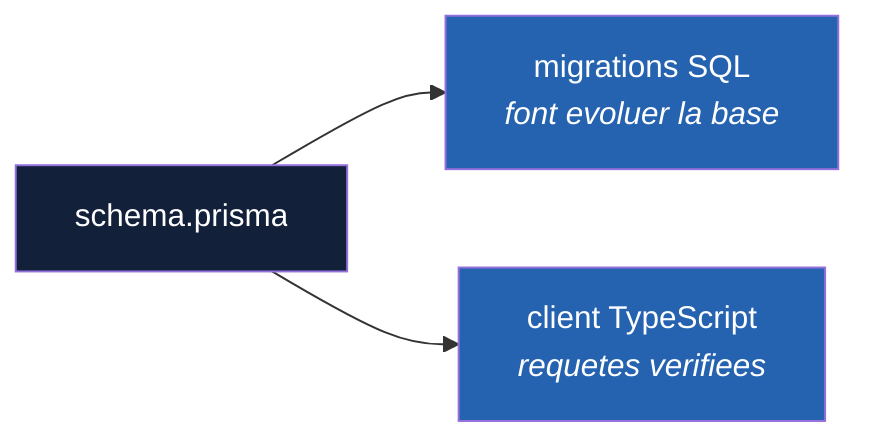

# Glossaire

Tous les termes techniques rencontrés au fil du projet, définis simplement et illustrés par un exemple tiré du projet lui-même.

Les termes sont classés par ordre alphabétique — les noms de fichiers commençant par un point sont rangés à leur première lettre (`.env` à la lettre E). L'étape à laquelle chaque terme a été introduit est indiquée entre crochets, pour retrouver le contexte dans [DOCUMENT-APPRENTISSAGE.md](DOCUMENT-APPRENTISSAGE.md).

---

### Accessibilité *[étape 2]*

Ensemble des pratiques qui rendent une application utilisable par tout le monde, y compris les personnes malvoyantes, daltoniennes, ou qui naviguent au clavier plutôt qu'à la souris.

Ce n'est pas une option cosmétique : une interface inaccessible exclut réellement des utilisateurs. Et les mêmes pratiques profitent à tous — un bon contraste aide aussi à lire un écran en plein soleil.

*Dans le projet :* balises sémantiques (`<nav>`, `<header>`, `<dl>`), `aria-label` sur le bouton de thème, vérification des **contrastes** dans les deux thèmes, et anneau de focus visible au clavier.

### Affectation de masse (*mass assignment*) *[étape 7]*

Faille de sécurité qui consiste à transmettre **tel quel** à la base l'objet envoyé par un client, au lieu d'en extraire les seuls champs autorisés.

```ts
// A NE PAS FAIRE
await prisma.competition.update({ where: { id }, data: requete.body });
```

Le client contrôle alors **toutes** les colonnes : il lui suffit d'ajouter `"id": "pirate"` au corps pour renommer la compétition — ou, dès qu'une table des utilisateurs aura une colonne `role`, `"role": "admin"` pour s'octroyer tous les droits.

La parade est la **liste blanche** (voir ce terme).

*Dans le projet :* aucun contrôleur ne transmet `requete.body` à un dépôt ; tout passe par une fonction du dossier `validation/`.

### Algorithme de hachage de mot de passe (Argon2) *[étape 8]*

Fonction qui transforme un mot de passe en **empreinte**, à sens unique : impossible de retrouver le mot de passe à partir de l'empreinte. Pour vérifier une connexion, on recalcule l'empreinte du mot de passe saisi et on compare.

Contrairement aux fonctions de hachage ordinaires (SHA-256), ces algorithmes sont volontairement **lents** et gourmands en **mémoire**, pour rendre ruineuse l'attaque qui teste des milliards de mots de passe sur une base volée. **Argon2** est le premier recommandé par l'OWASP ; bcrypt et scrypt sont les alternatives acceptées.

```
$argon2id$v=19$m=65536,p=4,t=3$<sel>$<empreinte>
```

*Dans le projet :* `backend/src/securite/mots-de-passe.ts` ; la colonne `mot_de_passe_hache` de la table `utilisateurs`.

### Angular *[étape 0]*

**Framework** (voir ce terme) de développement web créé par Google, qui sert à construire la partie visible d'une application — celle qui s'affiche dans le navigateur. Il fournit une structure toute faite pour découper une page en morceaux réutilisables et pour gérer l'affichage des données.

*Dans le projet :* c'est avec Angular que sont construites la page d'accueil, la barre de navigation et, plus tard, le tableau de bord.

### Angular CLI *[étape 0]*

Outil en ligne de commande (voir **CLI**) fourni avec Angular. Il automatise les tâches répétitives : créer un nouveau projet, générer un composant, lancer un serveur de test local.

*Dans le projet :* `ng new` a créé la structure complète du projet, et `ng generate component` a créé chacun des quatre composants de l'étape 1.

### API *[étape 0]*

Sigle de *Application Programming Interface*, en français « interface de programmation ». C'est une **porte d'entrée officielle** qu'un service met à disposition pour que d'autres programmes puissent lui demander des données ou des actions, sans passer par un écran humain.

Une analogie : un restaurant a une salle (pour les humains) et un guichet « commandes à emporter » réservé aux livreurs, avec un menu précis et des règles précises. L'API, c'est ce guichet.

*Dans le projet :* l'API de Riot Games permettra de récupérer les résultats de matchs de League of Legends sans avoir à lire le site de Riot à la main.

### `async` / `await` *[étape 6]*

Écriture qui permet d'attendre un résultat long — lecture en base, appel réseau — **sans bloquer le programme**.

```ts
export async function obtenirCompetitions(requete, reponse, suivant) {
  const competitions = await listerCompetitions();
  reponse.json(competitions);
}
```

`await` met en pause **cette requête-là** jusqu'à la réponse. Le serveur, lui, continue de traiter les autres pendant ce temps — sans quoi une seule requête lente figerait toute l'application.

Toute fonction contenant un `await` doit être marquée `async`, et renvoie alors une **Promise**. C'est le cousin de l'Observable de l'étape 5 : les deux disent « la valeur arrivera plus tard », mais une Promise n'émet qu'une seule valeur, là où un Observable peut en émettre plusieurs.

Un `await` peut échouer, d'où le `try / catch` systématique dans les contrôleurs. Sans lui, une base injoignable laisserait la requête sans réponse, et le client suspendu jusqu'à expiration du délai.

*Dans le projet :* tous les contrôleurs du backend depuis l'étape 6.

### Attaque temporelle (*timing attack*) *[étape 8]*

Attaque qui déduit une information du **temps** que met un système à répondre, sans jamais lire la réponse elle-même.

Exemple : si le serveur répond en 2 ms quand une adresse email n'existe pas, et en 70 ms quand elle existe (le temps de vérifier le mot de passe avec Argon2), un attaquant qui chronomètre ses requêtes sait quelles adresses ont un compte.

*Dans le projet :* `simulerVerification()` fait le même calcul Argon2 pour une adresse inconnue. Mesure réelle : 70 ms pour un mot de passe faux, 74 ms pour une adresse inconnue.

### Attribut `data-*` *[étape 2]*

Attribut HTML personnalisé, dont le nom commence toujours par `data-`. Il permet de stocker une information sur un élément sans détourner un attribut existant de son rôle.

Son intérêt ici : le CSS peut réagir à sa valeur (`:root[data-theme='sombre'] { ... }`), et le JavaScript peut le lire et le modifier (`document.documentElement.dataset.theme`).

*Dans le projet :* `data-theme` posé sur la balise `<html>` porte le thème courant. Le changer suffit à rebasculer toutes les couleurs de l'application.

### Augmentation de module *[étape 8]*

Mécanisme TypeScript qui **complète la description d'un type** fourni par une bibliothèque, sans modifier la bibliothèque.

```ts
declare global {
  namespace Express {
    interface Request {
      utilisateur?: UtilisateurConnecte;
    }
  }
}
```

*Dans le projet :* `backend/src/types/express.d.ts` ajoute la propriété `utilisateur` au type `Request` d'Express, remplie par le middleware `authentifier()`.

### Authentification et autorisation *[étape 8]*

Deux questions distinctes, souvent confondues :

| | Question | Échec |
|---|---|---|
| **Authentification** | « qui es-tu ? » | `401` : pas de jeton, ou jeton invalide |
| **Autorisation** | « as-tu le droit de faire ça ? » | `403` : identité connue, droit absent |

L'autorisation suppose l'authentification déjà faite.

*Dans le projet :* le middleware `authentifier()` authentifie (jeton JWT), `exigerRole('administrateur')` autorise.

### Backend *[étape 0]*

La partie d'une application qui s'exécute **sur un serveur**, jamais chez l'utilisateur. Elle reçoit les demandes du frontend, décide si elles sont légitimes, va chercher les données et les renvoie.

C'est la seule partie qui détient les secrets — mot de passe de la base, clés d'API — précisément parce que l'utilisateur n'y a pas accès.

*Dans le projet :* Node.js + Express + TypeScript, dans le dossier `backend/`.

### Bloc `@for` *[étape 3]*

Syntaxe Angular qui **répète une portion de gabarit pour chaque élément d'une liste**. C'est ce qui remplace le copier-coller de blocs HTML identiques.

```html
@for (competition of competitionsEsport; track competition.id) {
  <article class="carte">{{ competition.nom }}</article>
} @empty {
  <p>Aucune compétition suivie.</p>
}
```

`track` est **obligatoire** : il indique ce qui identifie chaque élément de façon unique. Grâce à lui, quand la liste change, Angular sait quels éléments ont bougé et ne redessine que ceux-là, au lieu de tout reconstruire.

`@empty` est un bloc optionnel, affiché quand la liste est vide. Sans lui, une liste vide ne produirait rien du tout — une page blanche sans explication.

Les anciens tutoriels utilisent à la place une directive `*ngFor`, qui fait la même chose avec une écriture plus lourde et un `track` facultatif.

*Dans le projet :* génère les cartes de compétitions et les lignes de matchs.

### Bloc `@if` *[étape 2]*

Syntaxe Angular qui affiche une portion de gabarit **uniquement si une condition est vraie**, et permet d'indiquer quoi afficher sinon avec `@else`.

```html
@if (theme() === 'clair') {
  <!-- icone lune -->
} @else {
  <!-- icone soleil -->
}
```

Ce n'est pas du HTML : c'est de la syntaxe Angular, traduite au moment du build. Les anciens tutoriels utilisent à la place une directive nommée `*ngIf`, qui fait la même chose avec une écriture plus lourde.

*Dans le projet :* choisit l'icône du bouton de bascule selon le thème actif.

### Branche *[étape 0]*

Ligne de développement parallèle à l'intérieur d'un dépôt Git. Créer une branche revient à faire une copie de travail de l'historique, sur laquelle on peut avancer librement sans toucher à la version de référence.

*Dans le projet :* chaque étape a sa branche (`etape-00-setup`, `etape-01-angular-decouverte`, …), ce qui permet de revenir à n'importe quelle étape validée en cas de blocage.

### Build (compilation) *[étape 1]*

Opération qui transforme le code source — écrit pour être lisible par un humain — en fichiers optimisés que le navigateur sait exécuter. Le TypeScript est converti en JavaScript, les fichiers sont regroupés, compressés et renommés.

*Dans le projet :* `npm run build` produit le dossier `frontend/dist/`. Ce dossier n'est pas versionné : il est entièrement reconstructible à partir du code source.

### Bundle *[étape 1]*

Fichier unique produit par le build, qui regroupe plusieurs fichiers source. L'intérêt est de réduire le nombre d'allers-retours entre le navigateur et le serveur : un gros fichier se télécharge plus vite que cinquante petits.

*Dans le projet :* le build de l'étape 1 produit un bundle `main-<code>.js` d'environ 228 ko. La suite de caractères dans le nom change à chaque build, ce qui force le navigateur à retélécharger le fichier au lieu de servir une version périmée depuis son cache.

### Chaînage optionnel (`?.`) et coalescence (`??`) *[étape 3]*

Deux écritures courtes de TypeScript pour traiter les valeurs absentes sans empiler les `if`.

`?.` — « si ce qui précède existe, continue ; sinon, arrête-toi et renvoie `undefined` ». Sans lui, appeler une propriété sur une valeur absente fait planter la page.

`??` — « si la valeur de gauche est absente, prends celle de droite ».

```ts
// Sans ces operateurs
const competition = this.competitionService.trouverParId(id);
if (competition === undefined) {
  return 'Compétition inconnue';
}
return competition.nom;

// Avec
return this.competitionService.trouverParId(id)?.nom ?? 'Compétition inconnue';
```

*Dans le projet :* affiche le nom d'une compétition à partir de son identifiant, en prévoyant le cas où elle n'existerait pas.

### Clé d'API *[étape 0]*

Mot de passe personnel fourni par un service pour identifier **qui** appelle son API. Elle permet au service de compter les appels, d'appliquer des limites, et de couper l'accès en cas d'abus.

Une clé d'API est un **secret** : quiconque la possède peut s'en servir à votre place, et les conséquences (blocage du compte, facturation) retombent sur vous.

*Dans le projet :* les clés Riot Games et football-data.org seront stockées dans le fichier `.env`, jamais écrites directement dans le code, jamais envoyées sur GitHub.

### Clé étrangère *[étape 6]*

Colonne qui contient la **clé primaire d'une autre table**, et crée ainsi un lien entre les deux.

Dans la table `matchs`, la colonne `competition_id` contient l'identifiant d'une ligne de `competitions`.

Son intérêt dépasse l'organisation : PostgreSQL **fait respecter** le lien. Insérer un match dont la compétition n'existe pas est refusé, et supprimer une compétition encore référencée l'est aussi. La base devient donc incapable de contenir un match orphelin — quelle que soit l'erreur commise dans le code qui l'alimente.

C'est ce qui explique l'ordre du script de peuplement : les compétitions et les équipes d'abord, les matchs ensuite.

### Clé primaire *[étape 6]*

Colonne qui identifie de façon **unique** chaque ligne d'une table. Deux lignes ne peuvent jamais avoir la même.

```prisma
model Competition {
  id String @id     // @id designe la cle primaire
}
```

*Dans le projet :* des identifiants lisibles (`'lol'`, `'psg'`) plutôt que des numéros automatiques. C'est un choix : ils rendent les URL et les données de test compréhensibles (`/api/competitions/lol`), au prix de devoir les inventer soi-même. Pour des données créées par des utilisateurs — comme les comptes de l'étape 8 —, un identifiant généré automatiquement sera préférable.

### CLI *[étape 0]*

Sigle de *Command Line Interface*, en français « interface en ligne de commande ». Désigne un programme qu'on utilise en tapant des commandes texte dans un terminal, plutôt qu'en cliquant dans des fenêtres.

*Dans le projet :* `git`, `npm` et `ng` (Angular CLI) sont tous des CLI. Taper `ng version` affiche la version installée d'Angular.

### Code de statut HTTP *[étape 4]*

Nombre à trois chiffres que le serveur place dans chaque réponse pour dire **comment la demande s'est passée**. Le premier chiffre donne la famille :

| Famille | Sens | Exemples courants |
|---|---|---|
| `2xx` | Succès | `200` OK, `201` Créé, `204` Pas de contenu |
| `4xx` | Le **client** a fait une erreur | `400` Requête invalide, `401` Non authentifié, `404` Introuvable, `409` Conflit, `413` Trop volumineux |
| `5xx` | Le **serveur** a échoué | `500` Erreur interne |

La distinction `4xx` / `5xx` est celle qui compte : elle dit de quel côté chercher le problème.

Renvoyer le bon code n'est pas cosmétique. Une API qui répond `200` avec un corps vide quand elle n'a rien trouvé ment à son client : celui-ci croit que tout va bien et affiche une page vide sans explication.

`401` et `403` se distinguent aussi *[étape 8]* : `401` signifie « je ne sais pas qui tu es » (malgré son nom anglais, *Unauthorized*), `403` « je sais qui tu es, et tu n'as pas le droit ». Enfin, `429` (*Too Many Requests*) signale une limitation de débit.

Deux codes sont souvent confondus. Un `400` dit « ta requête est mal écrite, inutile de la renvoyer telle quelle ». Un `409` dit « ta requête est correcte, mais l'**état actuel des données** l'empêche d'aboutir » — la même requête réussirait si la situation changeait.

*Dans le projet :* `404` pour une compétition inconnue, `400` pour un filtre ou un corps invalide, `500` pour une erreur inattendue. Depuis l'étape 7 : `201` après une création (avec l'en-tête `Location`), `204` après une suppression, `409` pour un identifiant déjà pris ou une compétition qui contient encore des matchs, `413` pour un corps de plus de 100 Ko.

### Commit *[étape 0]*

Un « point de sauvegarde » enregistré dans l'historique de Git. Un commit fige l'état de l'ensemble des fichiers à un instant donné et y attache un message expliquant ce qui a changé et pourquoi.

Contrairement à une sauvegarde classique qui écrase la version précédente, un commit **s'ajoute** à l'historique : toutes les versions antérieures restent consultables et restaurables.

*Dans le projet :* la règle est « un commit = une étape terminée et fonctionnelle ».

### Composant *[étape 1]*

Brique de base d'une application Angular. Un composant réunit **un morceau d'écran et le code qui le fait vivre** : son affichage (HTML), son apparence (CSS) et son comportement (TypeScript).

Son intérêt est de rendre l'interface modulaire : plutôt qu'un seul fichier HTML géant, la page est assemblée à partir de composants indépendants, chacun responsable d'une zone, réutilisable et modifiable sans risque pour les autres.

*Dans le projet :* `Header` (la barre de navigation), `Accueil`, `Competitions` et `APropos` sont quatre composants distincts.

### `computed()` *[étape 5]*

Crée un **signal dérivé** d'autres signaux : sa valeur se recalcule toute seule quand ceux dont il dépend changent, et jamais autrement.

```ts
private readonly competitions = signal<Competition[]>([]);

readonly competitionsEsport = computed(() =>
  this.competitions().filter((competition) => competition.univers === 'esport'),
);
```

L'intérêt par rapport à une méthode ordinaire : le calcul n'est fait qu'une fois, puis **mis en cache** tant que rien n'a changé. Une méthode appelée depuis un gabarit serait réexécutée à chaque rafraîchissement.

La règle : une donnée qu'on **reçoit** est un `signal`, une donnée qu'on **calcule à partir d'elle** est un `computed`. Ne jamais stocker dans un signal ce qui peut être dérivé — sinon les deux finissent par se contredire.

*Dans le projet :* répartition des compétitions par univers, et des matchs par statut.

### Contrainte `CHECK` *[étape 7]*

Règle posée **dans la base de données** : une condition que chaque ligne d'une table doit respecter. Une ligne qui ne la respecte pas est refusée, quel que soit le programme qui tente de l'écrire.

```sql
ALTER TABLE "matchs"
  ADD CONSTRAINT "matchs_equipes_differentes"
  CHECK ("domicile_id" <> "exterieur_id");
```

Subtilité utile : une contrainte `CHECK` ne refuse une ligne que si la condition vaut **faux**. Or une comparaison avec `NULL` ne vaut ni vrai ni faux. `CHECK (score >= 0)` laisse donc passer un score absent, et bloque un score négatif.

Prisma ne sait pas écrire ces contraintes dans `schema.prisma` : on les ajoute dans une migration créée vide avec `prisma migrate dev --create-only`, puis complétée à la main.

*Dans le projet :* deux contraintes sur la table `matchs` — équipes différentes, scores positifs.

### Contraste *[étape 2]*

Écart de luminosité entre un texte et le fond sur lequel il est posé. Il se mesure par un rapport : plus il est élevé, plus le texte est lisible.

Les règles d'accessibilité (WCAG) fixent un minimum de **4,5:1** pour du texte de taille normale. En dessous, le texte devient pénible à lire pour beaucoup de gens, et illisible pour certains.

*Dans le projet :* du texte blanc sur le bleu clair du thème sombre (`#5b9bdd`) ne donnait que 2,9:1 — sous le seuil. Il a été remplacé par un bleu très sombre, qui atteint 6,3:1. C'est pour ça que la variable `--couleur-sur-primaire` change avec le thème.

### Contrôleur *[étape 4]*

Côté backend, la fonction qui **répond à une requête**. Elle reçoit ce que le client demande et construit ce qu'on lui renvoie.

Un contrôleur ne sait pas à quelle adresse il est branché : c'est le rôle du **routeur**. Cette séparation permet de changer une URL sans toucher à la logique, et de tester la logique sans passer par le réseau.

```ts
export function obtenirCompetition(requete: Request, reponse: Response): void {
  const competition = competitions.find((c) => c.id === requete.params['id']);

  if (competition === undefined) {
    reponse.status(404).json({ erreur: 'Compétition introuvable' });
    return;
  }

  reponse.json(competition);
}
```

*Dans le projet :* `backend/src/controleurs/`.

### CORS *[étape 5]*

Sigle de *Cross-Origin Resource Sharing*. Mécanisme de sécurité **du navigateur** qui interdit par défaut à une page de lire la réponse d'un serveur situé sur une autre **origine**.

Une origine, c'est le trio **protocole + domaine + port**. Il suffit qu'un seul diffère pour que deux adresses soient considérées comme étrangères :

```
http://localhost:4200   et   http://localhost:3000   -> origines DIFFERENTES
```

À quoi ça sert ? Sans cette règle, un site malveillant que vous visitez pourrait, en arrière-plan, interroger l'API de votre banque **avec vos cookies** et lire la réponse. La restriction protège donc l'utilisateur, pas le serveur.

Pour l'autoriser, c'est le **serveur** qui doit le dire, en ajoutant un en-tête à ses réponses :

```
Access-Control-Allow-Origin: http://localhost:4200
```

Le navigateur compare cet en-tête à l'origine de la page. S'ils ne correspondent pas, il bloque la lecture — et la requête a pourtant bien été envoyée et traitée, ce qui déroute au débogage.

Deux conséquences pratiques : une erreur CORS ne se corrige **jamais** dans le frontend, toujours côté serveur ; et `curl` ou Thunder Client ne rencontrent jamais ce problème, car la règle n'existe que dans les navigateurs.

**La requête de pré-vérification** *[étape 7]*. Pour une requête qui modifie des données (`PUT`, `DELETE`) ou qui envoie du JSON, le navigateur demande d'abord la permission, avec une requête `OPTIONS` dite de *preflight*. Le serveur répond avec les méthodes qu'il autorise ; la vraie requête ne part qu'ensuite.

*Dans le projet :* le paquet `cors` déclare une origine précise plutôt que le joker `*`, qui ouvrirait l'API à n'importe quel site, et répond seul aux requêtes de pré-vérification.

### CRUD *[étape 7]*

Acronyme anglais des quatre opérations qu'on peut faire sur une donnée stockée : **C**reate (créer), **R**ead (lire), **U**pdate (modifier), **D**elete (supprimer).

Le découpage se retrouve à chaque couche d'une application, avec un vocabulaire différent :

| CRUD | HTTP | Prisma | SQL |
|---|---|---|---|
| Create | `POST` | `create` | `INSERT` |
| Read | `GET` | `findMany`, `findUnique` | `SELECT` |
| Update | `PUT` / `PATCH` | `update` | `UPDATE` |
| Delete | `DELETE` | `delete` | `DELETE` |

*Dans le projet :* les compétitions et les matchs disposent du CRUD complet depuis l'étape 7 ; les équipes restent en lecture seule.

### Décorateur *[étape 1]*

Instruction placée juste au-dessus d'une classe TypeScript, reconnaissable à son `@`, qui ajoute des informations sur cette classe sans en modifier le contenu.

*Dans le projet :* `@Component({ ... })` est ce qui dit à Angular « cette classe n'est pas une classe ordinaire, c'est un composant ; voici son sélecteur, son gabarit et sa feuille de style ». Sans ce décorateur, la classe ne serait qu'un objet TypeScript sans lien avec l'affichage.

### Défense en profondeur *[étape 7]*

Principe de sécurité qui consiste à **superposer plusieurs protections indépendantes**, pour que la défaillance de l'une soit rattrapée par une autre.

Le principe vient de l'architecture militaire — plusieurs enceintes successives plutôt qu'un seul mur — et s'applique très bien aux données d'une application :

| Couche | Rôle | Contournable ? |
|---|---|---|
| Formulaire | confort : erreur affichée avant l'envoi | oui, avec `curl` |
| API | sécurité : seul passage obligé | non, sauf bug |
| Base de données | garantie finale : contraintes | non |

*Dans le projet :* la règle « deux équipes différentes » est vérifiée par le formulaire Angular, par la validation de l'API, et par une contrainte `CHECK` en base.

### Dépendance *[étape 1]*

Bibliothèque externe dont un projet a besoin pour fonctionner. Les dépendances sont listées dans `package.json` et installées dans `node_modules/`.

On distingue deux catégories : les **dependencies**, nécessaires au fonctionnement de l'application une fois publiée (Angular lui-même), et les **devDependencies**, utiles uniquement pendant le développement (Angular CLI, Prettier, les outils de test).

*Dans le projet :* `@angular/router` est une dépendance ; `prettier` est une dépendance de développement.

### Dépôt (*repository*) *[étape 0]*

Dossier de projet suivi par Git. Il contient les fichiers du projet **et** l'intégralité de leur historique de modifications, rangé dans un sous-dossier caché nommé `.git`.

*Dans le projet :* le dossier `Appli-suivi-competition` est le dépôt. Il existe en deux exemplaires synchronisés : un **local** sur le PC, un **distant** sur GitHub.

### Données mockées (*mock*) *[étape 3]*

Données **simulées**, écrites à la main, qui tiennent la place des vraies en attendant qu'elles soient disponibles.

Leur intérêt est de découper le travail : on peut construire et tester toute l'interface — mise en page, cas de la liste vide, affichage d'un score absent — sans dépendre d'un backend qui n'existe pas encore, ni d'une API externe dont la clé n'a pas été obtenue.

Pour que le remplacement se fasse ensuite sans douleur, ces données doivent être isolées dans un **service**, jamais recopiées dans les gabarits.

*Dans le projet :* les quatre compétitions et les huit matchs, écrits en dur dans `services/competition.ts` et `services/match.ts`. À l'étape 5, seul l'intérieur de ces fichiers changera.

### Échouer tôt (*fail fast*) *[étape 8]*

Principe qui consiste à arrêter un programme **dès qu'une condition indispensable manque**, avec un message clair, plutôt que de continuer dans un état douteux.

Une erreur de configuration découverte au démarrage coûte une minute. La même, découverte en production sous la forme d'une faille ou d'un comportement étrange, peut coûter beaucoup plus.

*Dans le projet :* le serveur refuse de démarrer si `JWT_SECRET` est absent ou fait moins de 32 caractères — il n'existe volontairement aucune valeur par défaut.

### Encapsulation des styles *[étape 1]*

Mécanisme par lequel Angular **limite automatiquement la portée du CSS d'un composant à ce seul composant**.

Sans lui, une règle `.carte { ... }` écrite pour une page s'appliquerait à toutes les `.carte` de l'application, y compris celles écrites par quelqu'un d'autre pour un usage différent. Angular évite ce problème en ajoutant en coulisses un attribut unique à chaque élément du composant, et en modifiant les sélecteurs CSS pour ne cibler que lui.

*Dans le projet :* la classe `.note-chantier` est définie séparément dans `accueil.css` et dans `competitions.css`. Les deux définitions coexistent sans se gêner, alors qu'elles portent le même nom.

### Endpoint (point de terminaison) *[étape 4]*

Une adresse précise d'une API, associée à une méthode HTTP. C'est l'unité de base de ce qu'une API sait faire.

```
GET /api/competitions        -> la liste des competitions
GET /api/competitions/:id    -> une competition precise
GET /api/matchs?statut=…     -> les matchs, filtres
```

Le chemin et la méthode forment un couple : `GET /api/competitions` (lire) et `POST /api/competitions` (créer) sont deux endpoints différents, malgré la même adresse.

*Dans le projet :* quatre endpoints à l'étape 4, tous en lecture. Les endpoints d'écriture arrivent à l'étape 7.

### Entrée de composant (`input()`) *[étape 7]*

Donnée qu'un composant **reçoit de son parent**, déclarée avec la fonction `input()`.

```ts
export class ErreursChamp {
  readonly etat = input.required<ReadonlyFieldState<unknown>>();
  readonly identifiant = input.required<string>();
}
```

Le parent la remplit comme un attribut HTML :

```html
<app-erreurs-champ [etat]="formulaire.nom()" identifiant="competition-nom-erreurs" />
```

Les crochets `[etat]` évaluent une expression ; sans crochets, la valeur est transmise comme simple texte. Côté enfant, une entrée se lit comme un signal : `this.etat()`.

`input.required()` rend l'entrée obligatoire : l'oublier dans le parent devient une erreur de compilation.

*Dans le projet :* le composant `ErreursChamp`, réutilisé sous chaque champ des deux formulaires.

### Énumération de comptes *[étape 8]*

Attaque qui consiste à découvrir **quelles adresses email ont un compte** sur un site, en observant ses réponses : messages différents (« compte introuvable » / « mot de passe incorrect »), codes différents, ou durées différentes.

L'attaquant n'a alors plus qu'à concentrer ses tentatives sur les comptes existants — ou à cibler leurs propriétaires par email.

*Dans le projet :* la connexion renvoie le même `401` « Email ou mot de passe incorrect », dans le même temps, dans les deux cas. À l'inscription, l'énumération est inévitable (il faut bien signaler une adresse déjà prise) ; la **limitation de débit** en freine l'abus.

### .env *[étape 0]*

Fichier texte qui contient les **variables d'environnement** (voir ce terme) propres à une machine : mots de passe, clés d'API, adresse de la base de données. Il n'est jamais envoyé sur GitHub — il est exclu par le `.gitignore`.

*Dans le projet :* il contiendra le mot de passe PostgreSQL et les clés Riot / football-data.org.

### .env.example *[étape 0]*

Modèle du fichier `.env`, envoyé lui sur GitHub. Il liste **les noms** des variables nécessaires au projet, mais avec des valeurs vides ou factices.

Son rôle : quand quelqu'un récupère le projet, il sait immédiatement quelles variables il doit renseigner, sans qu'aucun secret n'ait circulé.

### Environnement Angular *[étape 5]*

Fichiers de configuration qui permettent au **même code** de fonctionner avec des réglages différents selon le contexte.

```
src/environments/environment.ts              -> version publiee
src/environments/environment.development.ts  -> developpement
```

Le code importe toujours `environment` et ignore lequel des deux il reçoit : c'est Angular qui remplace le fichier au moment du build, d'après la configuration d'`angular.json`.

**Attention :** ce n'est pas un endroit pour des secrets. Ces fichiers partent dans le navigateur, donc leur contenu est public — contrairement au `.env` du backend. On y met des adresses, jamais des clés.

*Dans le projet :* l'adresse de l'API — `http://localhost:3000/api` en développement, à renseigner à l'étape 14 pour la production.

### Express *[étape 4]*

**Framework** web pour Node.js. Il fournit tout ce qu'il faut pour recevoir des requêtes HTTP et y répondre : association d'adresses à des fonctions, lecture des paramètres, envoi de JSON.

Sa philosophie est d'être **minimal** : il ne décide presque rien à votre place. C'est un avantage pédagogique — chaque brique est visible et explicable — et un inconvénient en production, où il faut choisir soi-même ce que d'autres frameworks imposent.

*Dans le projet :* Express 5, dans `backend/`.

### Expression régulière *[étape 7]*

Motif qui décrit la **forme** d'un texte, et permet de vérifier qu'un texte la respecte. En JavaScript, elle s'écrit entre deux barres obliques.

```ts
const FORMAT_IDENTIFIANT = /^[a-z0-9]+(-[a-z0-9]+)*$/;

FORMAT_IDENTIFIANT.test('coupe-de-france'); // true
FORMAT_IDENTIFIANT.test('Coupe De France'); // false
```

| Morceau | Sens |
|---|---|
| `^` et `$` | début et fin du texte : rien avant, rien après |
| `[a-z0-9]` | un caractère parmi les minuscules et les chiffres |
| `+` | le morceau précédent, une fois ou plus |
| `*` | le morceau précédent, zéro fois ou plus |
| `\d{4}` | exactement quatre chiffres |
| `(Z\|+02:00)` | l'une ou l'autre possibilité |

Les expressions régulières sont très puissantes et vite illisibles : un commentaire qui donne un exemple valide est presque toujours nécessaire.

*Dans le projet :* le format des identifiants de compétition, et celui des dates ISO 8601 avec fuseau.

### Fermeture (*closure*) *[étape 8]*

Fonction qui **emporte avec elle** les variables de l'endroit où elle a été créée, et continue de s'en servir après que cet endroit a fini de s'exécuter.

```ts
export function exigerRole(role: Role): RequestHandler {
  return (requete, reponse, suivant) => {
    if (requete.utilisateur?.role !== role) { /* ... */ }
    suivant();
  };
}
```

`exigerRole('administrateur')` renvoie une nouvelle fonction, qui « se souvient » de `role`. On écrit ainsi une seule fois une logique paramétrable.

*Dans le projet :* `exigerRole`, qui fabrique un middleware pour n'importe quel rôle.

### `firstValueFrom` *[étape 7]*

Fonction de RxJS qui transforme un **Observable** en **Promise** : la promesse se résout avec la première valeur émise, ou échoue si l'Observable échoue.

```ts
try {
  await firstValueFrom(this.matchService.creer(donnees));
} catch (erreur) {
  // le serveur a refuse, ou n'a pas repondu
}
```

Elle sert de pont quand un outil attend une Promise alors qu'on dispose d'un Observable. Elle convient aux requêtes `HttpClient`, qui n'émettent qu'une seule valeur.

*Dans le projet :* l'action de soumission des formulaires, que Signal Forms exige sous forme de Promise.

### Force brute *[étape 8]*

Attaque qui consiste à **essayer systématiquement** un grand nombre de mots de passe sur un compte, jusqu'à tomber sur le bon.

Deux parades se complètent : rendre chaque essai coûteux (Argon2, côté base volée), et limiter le nombre d'essais possibles (limitation de débit, côté API en ligne).

*Dans le projet :* au-delà de 10 échecs en 15 minutes, l'API répond `429` — même au bon mot de passe.

### forkJoin *[étape 5]*

Opérateur RxJS qui lance plusieurs Observables **en parallèle** et n'émet qu'une fois que tous ont terminé.

```ts
forkJoin({
  matchs: this.matchService.listerTous(),
  competitions: this.competitionService.listerToutes(),
}).subscribe({
  next: ({ matchs, competitions }) => { /* les deux sont arrivees */ },
  error: () => { /* au moins une a echoue */ },
});
```

À utiliser quand les requêtes sont **indépendantes** : les enchaîner l'une après l'autre serait deux fois plus lent pour rien. Si l'une dépend du résultat de l'autre, `forkJoin` ne convient pas.

Comportement important : si **une seule** échoue, `error` est appelé et les résultats des autres sont perdus. C'est généralement ce qu'on veut — mieux vaut un message d'erreur clair qu'une page à moitié remplie.

*Dans le projet :* la page Matchs a besoin des matchs et des compétitions, pour traduire les identifiants en noms.

### Framework *[étape 0]*

Ensemble d'outils et de règles qui fournit une **structure de départ** pour construire un logiciel. Plutôt que de tout écrire de zéro, on remplit les emplacements prévus par le framework, qui se charge de l'assemblage.

La différence avec une simple bibliothèque : avec une bibliothèque, votre code appelle l'outil ; avec un framework, c'est le framework qui appelle votre code.

*Dans le projet :* Angular (côté navigateur) et Express (côté serveur) sont les deux frameworks retenus.

### Frontend *[étape 0]*

La partie d'une application qui s'exécute **dans le navigateur de l'utilisateur**. Elle affiche les pages et réagit aux clics, mais ne détient aucune donnée en propre : elle doit les demander au backend.

Conséquence de sécurité à ne jamais oublier : **tout ce que contient le frontend est lisible par l'utilisateur**, code compris. Une clé d'API placée là est une clé publique.

*Dans le projet :* Angular, dans le dossier `frontend/`.

### Garde de route *[étape 8]*

Fonction que le **routeur Angular** consulte avant d'afficher une page. Elle renvoie `true` pour laisser passer, ou une adresse (`UrlTree`) vers laquelle rediriger.

```ts
{ path: 'matchs/nouveau', component: MatchFormulaire, canActivate: [administrateurRequis] }
```

Une garde est du **confort**, pas de la sécurité : elle s'exécute dans le navigateur, que chacun peut modifier. La protection réelle est celle du backend.

*Dans le projet :* `administrateurRequis`, qui renvoie une personne anonyme vers `/connexion` et un simple utilisateur vers `/acces-refuse`.

### Garde de type *[étape 4]*

Fonction qui vérifie à l'exécution qu'une valeur a bien le type attendu, **et qui le fait savoir à TypeScript**.

```ts
function estStatutValide(valeur: unknown): valeur is StatutMatch {
  return typeof valeur === 'string' && STATUTS_VALIDES.includes(valeur as StatutMatch);
}
```

La partie remarquable est le type de retour `valeur is StatutMatch`. Il ne dit pas seulement « cette fonction renvoie un booléen » : il dit « si elle renvoie `true`, alors la valeur **est** un `StatutMatch` ». Après un `if (estStatutValide(x))`, TypeScript traite `x` comme un statut valide dans tout le bloc.

C'est indispensable aux frontières du système : les données venues du réseau arrivent en `unknown`, et une garde de type est ce qui permet de les faire entrer dans le monde typé sans mentir au compilateur avec un `as`.

*Dans le projet :* valide le filtre `?statut=` avant de s'en servir ; depuis l'étape 7, sert aussi à la validation d'un match envoyé par le client (`backend/src/validation/match.validation.ts`).

### Git *[étape 0]*

Logiciel de **gestion de versions** : il enregistre l'historique complet des modifications d'un projet, permet de revenir à un état antérieur, et de travailler sur plusieurs versions en parallèle grâce aux branches.

Git fonctionne entièrement sur l'ordinateur local — il n'a pas besoin d'Internet pour enregistrer l'historique.

### GitHub *[étape 0]*

Service en ligne qui héberge des dépôts Git. Il ajoute autour de Git une interface web, la sauvegarde à distance et des outils de collaboration.

Git et GitHub sont deux choses distinctes : Git est le logiciel qui gère l'historique, GitHub est un hébergeur qui stocke une copie de cet historique.

*Dans le projet :* le dépôt est hébergé sur `github.com/BenjaminPouzol/Appli-suivi-competition`.

### .gitignore *[étape 0]*

Fichier qui liste ce que Git doit **délibérément ignorer** : fichiers de secrets, dossiers générés automatiquement, fichiers temporaires. Tout ce qui y figure ne sera jamais enregistré dans un commit, même par accident.

*Dans le projet :* il y en a deux — un à la racine (qui exclut `.env`) et un dans `frontend/` créé par Angular (qui exclut `node_modules/` et `dist/`). Les deux s'appliquent, chacun à son niveau.

### HTTP *[étape 4]*

Le protocole du web : l'ensemble des règles selon lesquelles un client et un serveur s'échangent des messages.

Le principe est une conversation en deux temps. Le client envoie une **requête** — une méthode, une adresse, éventuellement un corps de données. Le serveur renvoie une **réponse** — un code de statut et, le plus souvent, un contenu.

Les méthodes principales expriment une intention :

| Méthode | Intention |
|---|---|
| `GET` | Lire, sans rien modifier |
| `POST` | Créer |
| `PUT` / `PATCH` | Modifier |
| `DELETE` | Supprimer |

Point important : HTTP est **sans mémoire**. Chaque requête est traitée indépendamment, et le serveur ne se souvient de rien entre deux appels. C'est précisément le problème que l'authentification de l'étape 8 devra résoudre.

Les méthodes d'écriture transportent un **corps** : les données à enregistrer, en JSON, annoncées par l'en-tête `Content-Type: application/json`. `PUT` remplace **toute** la ressource ; `PATCH` n'en modifie qu'une partie.

*Dans le projet :* l'étape 4 n'utilise que `GET`. L'étape 7 ajoute `POST`, `PUT` et `DELETE` sur les compétitions et les matchs — `PUT` plutôt que `PATCH`, parce que les formulaires renvoient tous les champs.

### HttpClient *[étape 5]*

Service Angular chargé des appels réseau. Il remplace le `fetch` natif du navigateur et s'y intègre mieux : il renvoie des **Observables**, convertit le JSON automatiquement, et se teste facilement.

```ts
private readonly http = inject(HttpClient);

listerToutes(): Observable<Competition[]> {
  return this.http.get<Competition[]>(this.url);
}
```

Il doit être activé au démarrage de l'application avec `provideHttpClient()` dans `app.config.ts` — sans quoi le `inject(HttpClient)` échoue.

**Attention au `<Competition[]>`** : c'est une promesse faite à TypeScript, pas une vérification. Angular ne contrôle pas que le serveur a bien renvoyé ça — il fait confiance. Si l'API changeait de format, l'erreur n'apparaîtrait qu'à l'exécution.

### Idempotence *[étape 7]*

Propriété d'une opération qui laisse les données **dans le même état**, qu'on l'exécute une fois ou plusieurs fois.

| Méthode | Idempotente ? | Rejouée deux fois |
|---|---|---|
| `GET` | oui | ne modifie rien |
| `PUT` | oui | le match est toujours « en direct, 2 à 1 » |
| `DELETE` | oui | la seconde répond `404`, mais l'état final est le même |
| `POST` | **non** | **deux** matchs créés |

C'est une question très concrète : sur un réseau instable, une requête sans réponse peut être renvoyée. Pour une opération idempotente, c'est sans conséquence ; pour un `POST`, c'est un doublon.

*Dans le projet :* le bouton « Enregistrer » est désactivé pendant l'envoi, pour qu'un double clic ne crée pas deux fois le même match.

### Index (base de données) *[étape 6]*

Structure que la base maintient à côté d'une table pour retrouver rapidement les lignes correspondant à un critère.

Sans index, filtrer les matchs par statut oblige PostgreSQL à **lire toute la table** ligne par ligne. Avec un index, il va directement aux bonnes.

```prisma
@@index([statut])
@@index([date])
```

La règle : indexer les colonnes qui servent à **filtrer** (`where`) ou à **trier** (`orderBy`). Pas les autres — chaque index occupe de l'espace et ralentit légèrement les écritures, puisqu'il faut le tenir à jour.

Sur les huit matchs du projet, l'effet est nul. Sur des dizaines de milliers, c'est la différence entre une réponse instantanée et plusieurs secondes.

### Injection de dépendances *[étape 3]*

Mécanisme par lequel un composant **déclare ce dont il a besoin**, et laisse Angular le lui fournir — au lieu de le construire lui-même.

```ts
private readonly competitionService = inject(CompetitionService);
```

Le composant ne fait jamais `new CompetitionService()`. Il demande, Angular fournit.

Deux bénéfices. D'abord, Angular ne crée qu'**une seule instance** du service pour toute l'application : tous les composants qui la demandent reçoivent la même, donc voient les mêmes données. Ensuite, dans un test, on peut demander à Angular de fournir une version de remplacement du service — ce qui serait impossible si le composant le construisait lui-même.

*Dans le projet :* les pages Matchs et Compétitions reçoivent leurs services par `inject()`.

### Installation globale (`-g`) *[étape 0]*

Option de npm qui installe un paquet **sur toute la machine** plutôt que dans un projet précis. Le programme installé devient alors utilisable comme une commande depuis n'importe quel dossier.

*Dans le projet :* `npm install -g @angular/cli` a rendu la commande `ng` disponible partout, ce qui est nécessaire puisqu'elle sert justement à créer le projet — donc avant que le projet existe.

### Intercepteur HTTP *[étape 8]*

Fonction qui s'intercale entre le code qui envoie une requête avec `HttpClient` et le réseau. **Toutes** les requêtes passent par elle, dans les deux sens : elle peut modifier la requête au départ, et réagir à la réponse au retour.

```ts
const requeteAvecJeton = requete.clone({
  setHeaders: { Authorization: `Bearer ${jeton}` },
});
```

Une requête `HttpClient` est **immuable** : on en crée une copie modifiée avec `clone()`.

*Dans le projet :* `intercepteurAuthentification` joint le jeton aux seules requêtes vers notre API, et ferme la session sur un `401`.

### Interface *[étape 3]*

En TypeScript, une interface décrit **la forme que doit avoir un objet** : quels champs il contient, et de quel type est chacun.

```ts
export interface Competition {
  id: string;
  nom: string;
  univers: Univers;
}
```

Une interface ne produit aucun code : elle disparaît au moment du build. Son rôle est entièrement de **vérification**, pendant l'écriture. Oublier un champ obligatoire, écrire `nom: 42`, ou taper `competition.non` au lieu de `competition.nom` devient une erreur signalée immédiatement dans l'éditeur.

Elle sert aussi de documentation : lire l'interface suffit à savoir ce que contient une compétition, sans fouiller le code qui la manipule.

*Dans le projet :* `Competition`, `Equipe` et `Match`, dans `src/app/modeles/`.

### JSON *[étape 4]*

Sigle de *JavaScript Object Notation*. Format de texte servant à échanger des données structurées entre programmes.

```json
{
  "id": "lol",
  "nom": "League of Legends",
  "univers": "esport"
}
```

Son intérêt : il est lisible par un humain, et compris par tous les langages — pas seulement JavaScript, malgré son nom.

Une limite à connaître, qui a une conséquence directe dans le projet : **JSON ne connaît que les textes, les nombres, les booléens, les listes, les objets et `null`.** Pas de dates. Une date qui traverse le réseau devient forcément du texte, et doit être reconvertie à l'arrivée.

*Dans le projet :* format de toutes les réponses de l'API. C'est pour ça que les dates y sont stockées comme chaînes ISO (`'2026-09-14T17:00:00.000Z'`), là où le frontend utilise des objets `Date`.

### JWT (JSON Web Token) *[étape 8]*

Format de **jeton** d'authentification : une chaîne en trois parties séparées par des points — en-tête, contenu, signature.

```
eyJhbGciOiJIUzI1NiJ9 . eyJwc2V1ZG8iOiJFc3NhaSIsInJvbGUi... . <signature>
{"alg":"HS256"}        {"pseudo":"Essai","role":...,"exp":...}
```

Les deux premières parties sont seulement **encodées** (base64url) : lisibles par tous. La signature, calculée avec un secret que seul le serveur connaît, empêche toute modification. **Un JWT est signé, pas chiffré** : rien de confidentiel ne doit y figurer.

Le serveur ne garde aucune trace des jetons émis : l'authentification est **sans état**. C'est rapide, mais un jeton ne peut pas être révoqué avant son expiration.

*Dans le projet :* fabriqué à la connexion (`backend/src/securite/jetons.ts`), rangé dans `localStorage`, envoyé dans l'en-tête `Authorization: Bearer ...`.

### Liaison de données (*binding*) *[étape 2]*

Mécanisme qui relie le gabarit d'un composant à sa logique. Angular propose trois écritures, qu'on distingue par leur ponctuation :

| Écriture | Sens | Exemple |
|---|---|---|
| `{{ ... }}` | Affiche une valeur dans le texte | `{{ theme() }}` |
| `[propriete]="..."` | Donne une valeur **calculée** à un attribut | `[attr.title]="..."` |
| `(evenement)="..."` | Réagit à une action de l'utilisateur | `(click)="basculerTheme()"` |

La règle mnémotechnique : les **crochets** vont vers l'écran (une donnée entre dans l'affichage), les **parenthèses** viennent de l'utilisateur (un événement sort de l'écran).

Sans crochets, la valeur est prise pour du texte brut : `title="theme()"` afficherait littéralement `theme()`.

*Dans le projet :* le bouton de bascule utilise les trois formes.

### Limitation de débit (*rate limiting*) *[étape 8]*

Mécanisme qui limite le **nombre de requêtes** qu'un même client peut faire dans un intervalle de temps. Au-delà, le serveur répond `429 Too Many Requests` sans traiter la requête.

*Dans le projet :* `express-rate-limit` sur l'inscription et la connexion — 10 échecs par quart d'heure par adresse IP. Le compteur vit en mémoire et repart de zéro au redémarrage du serveur.

### Liste blanche *[étape 7]*

Façon de filtrer des données en **énumérant ce qui est autorisé**, et en rejetant tout le reste. Son contraire, la liste noire, énumère ce qui est interdit — et oublie immanquablement quelque chose.

```ts
return {
  valide: true,
  // L'objet est RECONSTRUIT champ par champ : tout ce que le client aurait
  // ajoute d'autre (« id », « role »...) reste a la porte.
  donnees: { nom, organisateur, univers: univers as Univers, description },
};
```

*Dans le projet :* les fonctions de `backend/src/validation/` reconstruisent un objet neuf à partir des seuls champs attendus. C'est la parade à l'**affectation de masse**.

### Locale *[étape 0]*

Réglage qui définit les conventions régionales d'un système : langue, format des dates, ordre alphabétique et traitement des caractères accentués.

*Dans le projet :* la locale `DEFAULT` choisie à l'installation de PostgreSQL reprend les paramètres français de Windows, pour que les tris sur des noms d'équipes accentués se comportent correctement.

### localStorage (stockage local) *[étape 2]*

Petit espace de stockage que le navigateur réserve à chaque site, sous forme de paires nom/valeur. Contrairement à une variable ordinaire, son contenu **survit à la fermeture de l'onglet et du navigateur**.

Trois limites à connaître : il ne stocke que du texte ; il est propre à un navigateur et à une machine (un choix fait sur le PC ne suit pas sur le téléphone) ; et il peut être indisponible ou vidé (navigation privée, nettoyage, politique d'entreprise). Un code qui le lit doit donc toujours prévoir le cas où il ne répond pas.

Il ne convient pas au stockage de données sensibles : n'importe quel script de la page peut le lire.

*Dans le projet :* retient le thème choisi d'une visite à l'autre — `localStorage.setItem('theme', 'sombre')`.

### Markdown *[étape 0]*

Langage de mise en forme de texte très simple, reconnaissable à sa syntaxe légère (`#` pour un titre, `**gras**`, `- ` pour une puce). Les fichiers portent l'extension `.md`.

Son intérêt : le fichier reste lisible tel quel dans un éditeur de texte, tout en s'affichant proprement mis en forme sur GitHub.

### Mermaid *[étape 0]*

Outil qui transforme du **texte** en **schéma**. On décrit le diagramme avec quelques lignes de syntaxe, et l'affichage dessine automatiquement les cases et les flèches.

Son intérêt ici : comme un schéma Mermaid est du texte, Git le suit exactement comme du code — on voit l'historique de ses modifications, ce qui serait impossible avec une image dessinée à la main.

### Middleware *[étape 4]*

Fonction placée **sur le trajet d'une requête**, entre son arrivée et la réponse. Elle peut l'inspecter, la modifier, l'arrêter net, ou la laisser continuer vers la suite.

L'image utile est celle d'une chaîne de contrôles que la requête traverse dans l'ordre :

```
requete --> express.json() --> routes --> routeIntrouvable --> gestionnaireErreurs
```

**L'ordre de déclaration est l'ordre d'exécution**, et c'est la source d'erreur la plus fréquente avec Express. Un middleware « route introuvable » déclaré avant les routes répondrait 404 à absolument tout.

Express reconnaît un middleware de **gestion d'erreurs** au fait qu'il prend quatre paramètres au lieu de trois, le premier étant l'erreur. Avec trois paramètres, il serait traité comme un middleware ordinaire et ne recevrait jamais les erreurs.

*Dans le projet :* `express.json()` fourni par Express, plus deux filets de sécurité maison dans `backend/src/middlewares/erreurs.ts`.

### Migration *[étape 6]*

Fichier SQL qui décrit **une modification de la structure** de la base : créer une table, ajouter une colonne, poser un index.

Les migrations forment une suite ordonnée et versionnée dans Git, au même titre que le code :

```
prisma/migrations/
  20260914195450_creation_initiale/
    migration.sql
```

Leur intérêt est double. D'abord, **reproduire la même base partout** : la machine d'un collègue, celle de l'intégration continue, le serveur de production — chacune rejoue la même suite et obtient exactement la même structure. Ensuite, garder la trace de l'évolution du schéma, avec la possibilité de revenir en arrière.

Une règle importante : **une migration déjà appliquée ailleurs ne se modifie jamais.** On en écrit une nouvelle qui corrige. Modifier l'ancienne créerait des bases divergentes selon qu'elles l'ont jouée avant ou après.

Quand le schéma Prisma ne sait pas exprimer une modification — une **contrainte `CHECK`**, par exemple —, `prisma migrate dev --create-only` crée la migration **sans l'appliquer**. On y écrit alors le SQL soi-même, avant de lancer `prisma migrate dev`.

*Dans le projet :* `npx prisma migrate dev` compare le schéma à la base, génère le SQL nécessaire et l'applique. La seconde migration, `contraintes_matchs` (étape 7), a été écrite à la main.

### node_modules/ *[étape 0]*

Dossier créé automatiquement par npm, qui contient le code de toutes les bibliothèques téléchargées pour un projet. Il peut peser plusieurs centaines de mégaoctets et contenir des dizaines de milliers de fichiers.

Il n'est jamais envoyé sur GitHub : il est entièrement reconstructible à partir de `package.json`, avec une seule commande `npm install`.

### Node.js *[étape 0]*

Programme qui permet d'exécuter du **JavaScript en dehors d'un navigateur**, directement sur un ordinateur ou un serveur.

Historiquement, JavaScript ne tournait que dans les pages web. Node.js a sorti le langage du navigateur, ce qui permet d'écrire aussi la partie serveur d'une application en JavaScript.

*Dans le projet :* c'est Node.js qui exécutera le backend Express, et c'est aussi lui qui fait tourner les outils de développement comme Angular CLI.

### npm *[étape 0]*

Sigle de *Node Package Manager*, le **gestionnaire de paquets** installé automatiquement avec Node.js. Il télécharge les bibliothèques dont un projet a besoin et tient à jour la liste de ces dépendances.

### Observable *[étape 5]*

Représente une valeur qui **arrivera plus tard**, ou plusieurs, ou aucune — et qui peut aussi échouer.

C'est ce que renvoie `HttpClient`, et le changement par rapport à l'étape 3 est profond :

```ts
// Etape 3 : les donnees sont DEJA la
listerToutes(): Competition[]

// Etape 5 : les donnees ARRIVERONT, ou pas
listerToutes(): Observable<Competition[]>
```

Le type dit désormais la vérité sur le temps. Lire un tableau en mémoire est instantané ; interroger un serveur prend des dizaines de millisecondes et peut échouer.

Un Observable ne fait **rien** tant qu'on ne s'y abonne pas. `subscribe()` déclenche la requête et fournit les réactions :

```ts
service.listerToutes().subscribe({
  next: (competitions) => { /* ca a marche */ },
  error: () => { /* ca a echoue */ },
});
```

**Ne jamais laisser `error` vide.** Sans lui, une API éteinte laisse la page bloquée sur « Chargement… » indéfiniment, sans aucune explication pour l'utilisateur.

Les opérateurs, utilisés dans `.pipe()`, transforment les valeurs au passage — `map` par exemple convertit chaque élément.

À rapprocher du **signal** de l'étape 2 : un signal contient une valeur *maintenant*, un Observable décrit des valeurs *dans le temps*. Dans ce projet, les Observables servent au réseau, et leur résultat est rangé dans des signaux pour l'affichage.

### ORM *[étape 6]*

Sigle d'*Object-Relational Mapping*. Outil qui fait la traduction entre les **tables** d'une base relationnelle et les **objets** d'un langage de programmation.

Sans ORM, on écrit du SQL à la main et on convertit soi-même les résultats :

```sql
SELECT * FROM matchs WHERE statut = 'en_direct' ORDER BY date ASC;
```

Avec un ORM :

```ts
prisma.match.findMany({
  where: { statut: 'en_direct' },
  orderBy: { date: 'asc' },
});
```

Trois bénéfices : le code est vérifié à l'écriture (une faute de frappe sur un nom de colonne devient une erreur d'éditeur, pas un plantage à l'exécution), les résultats arrivent déjà typés, et les valeurs sont échappées automatiquement — ce qui **élimine les injections SQL**.

Le prix : une couche de plus à apprendre, et des requêtes complexes parfois plus faciles à écrire directement en SQL. Connaître le SQL reste donc nécessaire, l'ORM ne le remplace pas.

### package.json *[étape 1]*

Carte d'identité d'un projet Node.js. Il contient son nom, sa version, la liste de ses **dépendances** et la liste de ses **scripts** — des raccourcis vers des commandes plus longues.

*Dans le projet :* `frontend/package.json` définit le script `start`, ce qui permet d'écrire `npm start` au lieu de `ng serve`. C'est aussi ce fichier qui permet à `npm install` de reconstruire `node_modules/` à l'identique sur une autre machine.

### Paquet (*package*) *[étape 0]*

Bibliothèque de code réutilisable, publiée par quelqu'un d'autre et installable en une commande. Utiliser un paquet évite de réécrire une fonctionnalité que d'autres ont déjà résolue et éprouvée.

*Dans le projet :* `@angular/cli` est un paquet ; Express et Prisma en seront d'autres.

### Peuplement (*seed*) *[étape 6]*

Script qui remplit une base vide avec un jeu de données de départ.

Son intérêt : n'importe qui récupérant le projet obtient une base utilisable **en une commande**, sans rien saisir à la main. C'est aussi ce qui permet de repartir d'un état propre après une erreur.

Le script doit pouvoir être **relancé sans danger**. D'où l'emploi d'`upsert` — « mets à jour si ça existe, crée sinon » — plutôt que de `create`, qui échouerait à la seconde exécution sur un identifiant déjà pris.

*Dans le projet :* `npx prisma db seed` insère 4 compétitions, 14 équipes et 8 matchs. À ne pas confondre avec les **données mockées** de l'étape 3 : celles-ci remplaçaient une base absente, celles-là remplissent une base bien réelle.

### pgAdmin *[étape 0]*

Application graphique livrée avec PostgreSQL, qui permet d'explorer une base de données à la souris : voir les tables, leur contenu, et écrire des requêtes SQL sans passer par le terminal.

*Dans le projet :* servira à partir de l'étape 6. **DBeaver** est une alternative équivalente.

### Pipe *[étape 3]*

Petit outil de **mise en forme pour l'affichage**, utilisé dans un gabarit avec une barre verticale `|`.

```html
{{ match.date | date: 'dd/MM/yyyy' }}     <!-- 14/09/2026 -->
```

Le principe : la donnée reste brute dans le code — ici un objet `Date`, manipulable, comparable, triable — et n'est transformée en texte lisible qu'au dernier moment, pour l'écran. Formater la date dès le stockage rendrait impossible de trier les matchs par ordre chronologique.

*Dans le projet :* `DatePipe` affiche la date et l'heure des rencontres. Comme tout ce qu'utilise un gabarit, il doit figurer dans le tableau `imports` du composant.

### Port *[étape 0]*

Numéro qui identifie **un programme précis** sur une machine, parmi tous ceux qui écoutent le réseau. L'adresse IP désigne la machine ; le port désigne le service à l'intérieur de cette machine.

Analogie : l'adresse IP est l'adresse d'un immeuble, le port est le numéro d'appartement.

*Dans le projet :* PostgreSQL écoute sur le port `5432`, le serveur de développement Angular sur le `4200`, et le backend Express utilisera le `3000`.

### PostgreSQL *[étape 0]*

**SGBD** (voir ce terme) relationnel, gratuit et open source. Il stocke les données dans des tables liées entre elles, et se pilote avec le langage SQL.

*Dans le projet :* il stockera les équipes, les matchs, les compétitions, les utilisateurs et leurs favoris.

### `prefers-color-scheme` *[étape 2]*

Requête CSS qui permet de connaître la préférence d'apparence réglée dans le système d'exploitation de l'utilisateur : thème clair ou thème sombre.

Son intérêt : plutôt que d'imposer un thème par défaut arbitraire, on respecte le réglage que la personne a déjà choisi pour toute sa machine.

*Dans le projet :* consultée en JavaScript via `window.matchMedia('(prefers-color-scheme: dark)')`, elle sert de valeur de repli lors de la toute première visite, quand `localStorage` ne contient encore aucun choix.

### Prisma *[étape 6]*

L'**ORM** retenu pour ce projet. Sa particularité est de partir d'un fichier unique, `schema.prisma`, qui sert de **source de vérité** :



Les commandes utiles :

| Commande | Rôle |
|---|---|
| `prisma migrate dev` | Compare le schéma à la base et applique les changements |
| `prisma generate` | Régénère le client TypeScript |
| `prisma db seed` | Exécute le script de peuplement |
| `prisma studio` | Ouvre une interface web pour explorer les données |

**Piège de Prisma 7 :** `migrate dev` ne régénère **pas** le client. Après toute modification du schéma, il faut lancer `prisma generate`, sinon le code continue de voir l'ancienne structure.

### Redirection ouverte (*open redirect*) *[étape 8]*

Faille d'une page qui redirige vers une adresse **fournie dans l'URL**, sans vérifier qu'elle reste sur le site.

Un attaquant envoie un lien vers la vraie page de connexion — `/connexion?retour=https://site-pirate.example` —, la victime s'y connecte en toute confiance, puis se retrouve sur une copie du site qui lui redemande son mot de passe.

*Dans le projet :* `adresseDeRetour()` n'accepte qu'un chemin commençant par une seule barre oblique (`/matchs`), et refuse `//site-pirate.example`, qu'un navigateur interprète comme un autre site.

### Relation *[étape 6]*

Lien entre deux tables, porté par une **clé étrangère**.

La forme la plus courante est **un-à-plusieurs** : une compétition a plusieurs matchs, un match appartient à une seule compétition. Dans un schéma Prisma, elle s'écrit des deux côtés :

```prisma
model Competition {
  matchs Match[]      // le cote « plusieurs » — n'est PAS une colonne
}

model Match {
  competitionId String        // LA colonne reelle
  competition   Competition @relation(fields: [competitionId], references: [id])
}
```

Seul `competitionId` existe réellement en base. Les champs `matchs` et `competition` sont **reconstitués par Prisma** pour le confort d'écriture — d'où l'option `include`, qui demande de rapporter les lignes liées en une seule requête plutôt qu'une par élément.

Quand deux relations relient les mêmes tables — une équipe est à domicile *ou* à l'extérieur —, il faut les **nommer** (`@relation("EquipeDomicile")`), sans quoi Prisma ne sait pas quelle clé étrangère correspond à quel champ.

### REST *[étape 4]*

Style de conception d'API, très répandu, fondé sur une idée simple : **l'adresse désigne une ressource, la méthode HTTP désigne ce qu'on en fait**.

```
GET    /api/competitions       lire la liste
GET    /api/competitions/lol   lire un element
POST   /api/competitions       creer
DELETE /api/competitions/lol   supprimer
```

L'adresse ne contient donc jamais de verbe : on n'écrit pas `/api/getCompetitions`, parce que `GET` le dit déjà.

Ce n'est pas une norme officielle mais une convention. Son intérêt est la prévisibilité : un développeur qui découvre une API REST devine la moitié de ses adresses sans lire la documentation.

*Dans le projet :* l'API suit ces conventions dès l'étape 4. L'étape 7 les complète : `PUT /api/matchs/:id` pour modifier, et l'en-tête `Location` qui donne l'adresse d'une ressource tout juste créée.

### Rétrécissement de type (*narrowing*) *[étape 7]*

Mécanisme par lequel TypeScript **restreint** le type possible d'une valeur après un test.

```ts
const resultat = await mettreAJourCompetition(id, donnees);
// resultat : Competition | 'introuvable'

if (resultat === 'introuvable') {
  reponse.status(404).json({ erreur: 'Compétition introuvable' });
  return;
}

// resultat : Competition -- le cas 'introuvable' a ete ecarte
reponse.json(resultat);
```

Après le `if` et son `return`, TypeScript sait que `resultat` ne peut plus valoir `'introuvable'`. Avant le test, il refuserait `resultat.nom`.

C'est ce qui rend les types union réellement sûrs : impossible d'utiliser un résultat sans avoir d'abord traité les cas d'échec.

*Dans le projet :* tous les contrôleurs d'écriture ; voir aussi **garde de type** et **union discriminée**.

### Routage (*routing*) *[étape 1]*

Mécanisme qui associe une **adresse** (l'URL affichée dans la barre du navigateur) à un **contenu** (le composant à afficher).

*Dans le projet :* le routage est configuré dans `app.routes.ts`. Il fait correspondre `/competitions` au composant `Competitions`.

### Route *[étape 1]*

Une entrée de la configuration du routage : la correspondance entre un chemin d'URL et le composant à afficher.

*Dans le projet :* `{ path: 'a-propos', component: APropos }` est une route. La route `{ path: '**', redirectTo: '' }` est particulière : `**` signifie « n'importe quelle autre adresse », et sert à renvoyer vers l'accueil quand l'utilisateur tape une URL qui n'existe pas.

### router-outlet *[étape 1]*

Balise Angular qui marque, dans un gabarit, **l'emplacement où le contenu de la page courante doit s'insérer**.

Tout ce qui est écrit autour d'elle reste affiché en permanence ; seul ce qu'elle contient change lors d'une navigation.

*Dans le projet :* dans `app.html`, la barre de navigation est placée au-dessus du `<router-outlet />`. C'est pour ça qu'elle ne disparaît jamais quand on change de page.

### routerLink *[étape 1]*

Attribut Angular qui remplace le `href` d'un lien classique. Il déclenche une navigation **interne** : le routeur change le contenu affiché sans recharger la page.

*Dans le projet :* `<a routerLink="/competitions">` navigue instantanément, là où `<a href="/competitions">` provoquerait un rechargement complet de l'application.

Son compagnon `routerLinkActive` applique automatiquement une classe CSS au lien correspondant à la page affichée — c'est ce qui met en surbrillance l'onglet courant dans la barre de navigation.

### Routeur Express *[étape 4]*

Objet qui regroupe un ensemble de routes liées, pour pouvoir les brancher d'un bloc sur un préfixe d'adresse.

```ts
// competitions.routes.ts -- les chemins sont RELATIFS
routeurCompetitions.get('/', listerCompetitions);
routeurCompetitions.get('/:id', obtenirCompetition);

// index.ts -- le prefixe est decide ici
routeurApi.use('/competitions', routeurCompetitions);
```

Le `/` du premier fichier devient donc `/api/competitions`. L'intérêt : chaque groupe de routes vit dans son fichier, et le préfixe peut changer à un seul endroit.

Les deux-points marquent un **paramètre** : `/:id` accepte n'importe quelle valeur, récupérée ensuite par `requete.params['id']`.

À ne pas confondre avec le **routage Angular** de l'étape 1, qui associe une URL à un composant côté navigateur. Ici, il s'agit d'associer une URL à une fonction côté serveur.

### RxJS *[étape 5]*

Bibliothèque qui fournit les **Observables** et la centaine d'opérateurs qui vont avec. Angular s'en sert pour tout ce qui arrive dans le temps : appels réseau, événements, formulaires.

Sa réputation d'outil difficile vient de son immense surface : on peut passer des mois à en explorer les opérateurs. En pratique, quatre suffisent pour couvrir l'essentiel d'un projet comme celui-ci :

| Opérateur | Rôle |
|---|---|
| `map` | Transformer chaque valeur au passage |
| `forkJoin` | Attendre plusieurs Observables en parallèle |
| `catchError` | Rattraper une erreur |
| `switchMap` | Enchaîner un appel sur le résultat d'un autre |

*Dans le projet :* `map` convertit les dates texte en objets `Date`, `forkJoin` attend les deux requêtes de la page Matchs.

### Sans état (*stateless*) *[étape 8]*

Se dit d'un serveur qui **ne garde aucune information** entre deux requêtes : chaque requête apporte tout ce qu'il faut pour être traitée.

Une authentification par JWT est sans état : le jeton contient l'identité et le rôle, et sa signature suffit à le vérifier, sans consulter de liste de sessions.

| | Sans état (JWT) | Avec état (session serveur) |
|---|---|---|
| Vérification | signature, sans lecture en base | lecture de la session en base |
| Déconnexion | le client oublie le jeton | le serveur supprime la session |
| Révocation immédiate | **impossible** avant expiration | possible |

*Dans le projet :* promouvoir un compte administrateur ne change pas le rôle écrit dans ses jetons déjà émis — il faut se reconnecter.

### Secret *[étape 0]*

Toute information qui donne un accès et qui ne doit jamais être rendue publique : mot de passe, clé d'API, jeton d'authentification.

Règle absolue du projet : un secret ne s'écrit jamais dans le code et ne part jamais sur GitHub. Un secret publié par erreur doit être considéré comme compromis et régénéré — le supprimer dans un commit ultérieur ne suffit pas, puisqu'il reste consultable dans l'historique.

### Sel (*salt*) *[étape 8]*

Valeur **aléatoire** mélangée à un mot de passe avant de le hacher, différente pour chaque empreinte.

Sans sel, deux personnes qui choisissent `azerty123` auraient la même empreinte, et un attaquant pourrait précalculer une fois pour toutes les empreintes des mots de passe courants. Avec un sel, chaque empreinte est unique et toute table précalculée devient inutile.

Le sel n'est **pas secret** : il est rangé en clair dans l'empreinte elle-même.

*Dans le projet :* Argon2 tire un sel à chaque appel de `hacherMotDePasse()`.

### Sélecteur (*selector*) *[étape 1]*

Nom de la balise HTML sous laquelle un composant s'utilise dans un gabarit.

*Dans le projet :* le composant `Header` déclare `selector: 'app-header'`, ce qui permet de l'insérer en écrivant `<app-header />`. Le préfixe `app-` évite toute collision avec une balise HTML existante ou avec une bibliothèque tierce.

### Serveur de développement *[étape 1]*

Petit serveur web local, lancé par `ng serve`, qui sert l'application pendant qu'on la construit. Il surveille les fichiers et, à chaque sauvegarde, recompile et rafraîchit automatiquement le navigateur — c'est le **rechargement à chaud** (*hot reload*).

Il n'est destiné qu'au développement : il privilégie la vitesse de recompilation sur l'optimisation, et ne doit jamais servir à publier une application.

*Dans le projet :* il tourne sur `http://localhost:4200`.

### Service *[étape 3]*

Classe qui regroupe **des données et de la logique réutilisables**, hors de tout composant. Un composant s'occupe de l'affichage ; un service s'occupe de ce qui est affiché.

```ts
@Service()
export class CompetitionService {
  listerToutes(): Competition[] { … }
}
```

En Angular 22, le décorateur `@Service()` remplace l'écriture plus ancienne `@Injectable({ providedIn: 'root' })`, qu'on croise encore dans la plupart des tutoriels. Les deux font la même chose : rendre la classe disponible partout dans l'application, en **un seul exemplaire** partagé — un *singleton*.

Trois raisons de sortir les données des composants : deux pages peuvent utiliser la même source sans la dupliquer ; la logique se teste sans passer par l'interface ; et changer l'origine des données (données simulées → appel réseau) ne touche qu'un fichier.

*Dans le projet :* `CompetitionService` et `MatchService`. À l'étape 5, seul leur intérieur changera pour interroger le backend.

### SGBD *[étape 0]*

Sigle de « Système de Gestion de Base de Données ». Programme spécialisé dans le stockage, l'organisation et la restitution de grandes quantités de données, qui garantit en plus leur cohérence et gère plusieurs accès simultanés.

### Signal *[étape 2]*

Valeur qui **prévient Angular quand elle change**, pour qu'il mette à jour l'affichage tout seul.

Une variable ordinaire ne fait pas ça : si on la modifie, rien ne signale à Angular qu'il faut redessiner quoi que ce soit. Un signal, lui, garde la trace des endroits du gabarit qui l'utilisent, et les rafraîchit précisément — eux seuls, pas toute la page.

Trois gestes à connaître :

```ts
readonly theme = signal<Theme>('clair');   // creation
theme();                                    // lecture  -> avec des parentheses
theme.set('sombre');                        // ecriture
```

Les parenthèses à la lecture surprennent au début, mais elles sont logiques : lire un signal n'est pas consulter une case mémoire, c'est **demander sa valeur**, et c'est à ce moment-là qu'Angular note qui s'y intéresse.

*Dans le projet :* `theme` dans le composant `Header`. C'est ce qui fait changer l'icône du bouton au clic, sans code d'affichage écrit à la main.

### Signal Forms *[étape 7]*

Système de formulaires d'Angular, stable depuis Angular 22, entièrement construit sur les **signaux**.

Tout part d'un signal qui contient les valeurs — le **modèle**. La fonction `form()` construit le formulaire autour, et un **schéma** y déclare les règles :

```ts
private readonly champs = signal({ nom: '', organisateur: '' });

readonly formulaire = form(this.champs, (chemin) => {
  required(chemin.nom, { message: 'Indique le nom de la compétition.' });
  maxLength(chemin.nom, 80, { message: '80 caractères maximum.' });
});
```

Dans le gabarit, `[formField]` relie un champ HTML au modèle **dans les deux sens**, et `[formRoot]` gère la soumission :

```html
<form [formRoot]="formulaire">
  <input id="nom" [formField]="formulaire.nom" />
</form>
```

Chaque champ expose son état sous forme de signaux : `formulaire.nom().value()`, `.touched()`, `.invalid()`, `.errors()`. Les règles `hidden()` et `disabled()` retirent un champ de la validation.

Angular propose aussi les formulaires **réactifs** (`FormGroup`), très répandus dans le code existant, et les formulaires **pilotés par le gabarit** (`ngModel`), plus anciens.

*Dans le projet :* les formulaires de match et de compétition.

### Situation de concurrence (*race condition*) *[étape 7]*

Bug qui dépend de **l'ordre d'arrivée** d'opérations simultanées. Le code est correct quand les opérations se succèdent, et faux quand elles se chevauchent.

L'exemple classique est « vérifier, puis agir » :

```
Requete A : l'identifiant « coupe-de-france » est-il libre ?  -> oui
Requete B : l'identifiant « coupe-de-france » est-il libre ?  -> oui
Requete A : cree « coupe-de-france »                         -> OK
Requete B : cree « coupe-de-france »                         -> refus
```

Ces bugs sont rares, donc presque impossibles à reproduire, et d'autant plus pénibles à corriger. La parade habituelle est de laisser trancher la seule source qui voit toutes les écritures : la base de données, et ses contraintes d'unicité.

*Dans le projet :* `insererCompetition` ne vérifie pas l'identifiant avant de créer ; il interprète le refus de la base (code Prisma `P2002`).

### SPA (application monopage) *[étape 1]*

Sigle de *Single Page Application*. Type d'application web dans lequel le navigateur ne charge **qu'une seule vraie page HTML**, au tout début. Les changements d'écran sont ensuite produits par du JavaScript qui réécrit le contenu, sans jamais redemander une page complète au serveur.

L'avantage est la fluidité : pas d'écran blanc, pas de rechargement. L'inconvénient est que le premier chargement est plus lourd, puisqu'il embarque tout le code de l'application.

*Dans le projet :* c'est le mode de fonctionnement d'Angular. Le fichier `index.html` est la seule page réellement servie.

### SQL *[étape 6]*

Langage utilisé pour interroger et modifier une base de données relationnelle. Il est **déclaratif** : on décrit le résultat voulu, pas la façon de l'obtenir — c'est la base qui choisit comment s'y prendre.

```sql
SELECT nom FROM competitions WHERE univers = 'football' ORDER BY nom;
```

Les quatre opérations de base : `SELECT` (lire), `INSERT` (créer), `UPDATE` (modifier), `DELETE` (supprimer).

Bien que le projet utilise **Prisma**, connaître le SQL reste nécessaire : pour lire les migrations générées, pour comprendre ce qu'une requête coûte réellement, et pour les cas complexes où écrire du SQL directement reste plus simple.

*Dans le projet :* visible dans les fichiers `prisma/migrations/*/migration.sql`, et utilisable à la main dans pgAdmin ou DBeaver.

### Standalone (composant autonome) *[étape 1]*

Se dit d'un composant Angular qui déclare lui-même tout ce dont il a besoin, dans son propre tableau `imports`.

Cette approche est le comportement par défaut depuis les versions récentes d'Angular. Elle en remplace une plus ancienne, fondée sur des « modules » (`NgModule`) qui déclaraient les dépendances pour un groupe de composants. Beaucoup de tutoriels en ligne montrent encore l'ancienne façon de faire — c'est une source fréquente de confusion.

*Dans le projet :* `Header` importe `RouterLink` directement dans son décorateur, parce que son gabarit en a besoin.

### Template (gabarit) *[étape 1]*

Fichier HTML d'un composant : il décrit ce que le composant affiche. Ce n'est pas du HTML ordinaire — Angular y reconnaît une syntaxe supplémentaire (`routerLink`, `[propriete]`, et plus tard les boucles et conditions).

*Dans le projet :* `header.html` est le gabarit du composant `Header`.

### Terminal *[étape 0]*

Fenêtre dans laquelle on tape des commandes texte pour piloter l'ordinateur, par opposition à l'interface graphique où l'on clique.

*Dans le projet :* toutes les commandes `git`, `npm` et `ng` s'y exécutent. VS Code en intègre un, accessible par le menu *Terminal → Nouveau terminal*.

### Thunder Client *[étape 0]*

Extension VS Code qui permet d'**envoyer des requêtes HTTP à une API** et d'en lire les réponses, sans passer par le frontend. Équivalent graphique de `curl` dans le terminal, ou de Postman en application séparée.

Son intérêt principal est le **diagnostic par isolement**. Quand une page ne s'affiche pas correctement, il y a deux suspects : le serveur répond mal, ou le frontend appelle mal. Interroger l'API directement tranche immédiatement.

Point important vu à l'étape 5 : le **CORS** est une règle du navigateur uniquement. Une API qui fonctionne dans Thunder Client peut très bien être bloquée depuis une page web — ce n'est donc pas une preuve que tout va bien côté navigateur, mais c'est la preuve que le serveur, lui, fait son travail.

Il devient indispensable à partir de l'étape 7 : les requêtes `POST`, `PUT` et `DELETE` exigent de choisir une méthode et d'envoyer un corps JSON, ce qui est impossible depuis la barre d'adresse d'un navigateur.

*Dans le projet :* vérifier les endpoints de l'API indépendamment d'Angular.

### Type générique *[étape 7]*

Type « à trou », dont une partie est laissée en paramètre et remplie au moment de l'utilisation. Le paramètre s'écrit entre chevrons, souvent avec la lettre `T` :

```ts
type ResultatValidation<T> =
  | { valide: true; donnees: T }
  | { valide: false; erreurs: ErreurChamp[] };

ResultatValidation<Competition>   // donnees est une Competition
ResultatValidation<DonneesMatch>  // donnees est un DonneesMatch
```

Le projet en utilise depuis l'étape 5 sans les nommer : `Observable<Competition[]>`, `Promise<void>`, `signal<string | null>` sont des types génériques dont le trou a été rempli.

L'intérêt est d'écrire **une seule fois** une structure valable pour de nombreux types, sans renoncer à la vérification de TypeScript.

*Dans le projet :* `ResultatValidation<T>`, dans `backend/src/validation/validation.ts`.

### Type union *[étape 3]*

Type TypeScript qui n'autorise qu'une **liste fermée de valeurs**, séparées par des barres verticales.

```ts
export type Univers = 'esport' | 'football';
export type StatutMatch = 'a-venir' | 'en-direct' | 'termine';
```

C'est bien plus précis que `string`. Avec `string`, écrire `'footbal'` ou `'En Direct'` passe sans broncher et produit un bug silencieux — une carte qui n'apparaît nulle part, sans message d'erreur. Avec un type union, l'éditeur refuse la valeur au moment de la frappe.

Bénéfice secondaire : l'autocomplétion propose les valeurs possibles, ce qui évite d'avoir à les retrouver dans le code.

*Dans le projet :* `Univers`, `StatutMatch`, et `Theme` (`'clair' | 'sombre'`) introduit à l'étape 2.

### TypeScript *[étape 1]*

Langage de programmation qui **ajoute les types au JavaScript**. Un type indique la nature d'une valeur : texte, nombre, liste d'équipes…

Son intérêt : les erreurs de nature (passer un texte là où un nombre est attendu) sont signalées **pendant l'écriture du code**, dans l'éditeur, au lieu de provoquer un bug au moment de l'exécution. L'éditeur peut aussi proposer une autocomplétion bien plus précise.

Le navigateur ne comprend pas TypeScript : le build le convertit en JavaScript avant exécution.

*Dans le projet :* tout le code Angular et, plus tard, tout le backend sont écrits en TypeScript — c'est ce qui permet d'utiliser un seul langage sur toute la stack.

### Union discriminée *[étape 7]*

**Type union** dont chaque forme possède une propriété commune — le **discriminant** — avec une valeur différente. Tester cette propriété suffit à TypeScript pour savoir de quelle forme il s'agit.

```ts
type ResultatValidation<T> =
  | { valide: true; donnees: T }
  | { valide: false; erreurs: ErreurChamp[] };

if (!validation.valide) {
  repondreDonneesInvalides(reponse, validation.erreurs); // erreurs existe ici
  return;
}
await insererCompetition(validation.donnees); // donnees existe ici
```

Il est impossible d'accéder à `donnees` sans avoir d'abord vérifié `valide` : l'oubli devient une erreur de compilation.

*Dans le projet :* le résultat de toutes les fonctions de validation du backend.

### UTC et fuseaux horaires *[étape 5]*

UTC est le **temps de référence universel**. Une date stockée en UTC se reconnaît à son `Z` final : `2026-09-15T16:00:00.000Z`.

Le principe à retenir : un instant n'a qu'**une seule** valeur universelle, mais s'affiche différemment selon l'endroit où l'on se trouve. En septembre, la France est à UTC+2 (heure d'été), donc `16:00Z` s'affiche « 18:00 » à Paris.

D'où la règle : **stocker en UTC, convertir à l'affichage**. Enregistrer une heure locale sans préciser le fuseau est ambigu — impossible de savoir de quelle heure locale il s'agit, et le même match s'afficherait à des heures différentes selon le pays du visiteur.

`new Date('…Z')` interprète correctement la date, et `DatePipe` la convertit automatiquement vers le fuseau du navigateur. Le piège classique : `new Date('2026-09-15T18:00:00')` **sans** le `Z` est interprété comme une heure *locale*, ce qui donne un résultat différent selon la machine.

*Dans le projet :* toutes les dates de l'API portent le `Z`. Un bug de deux heures a justement été introduit puis corrigé à cette étape — voir le document d'apprentissage.

### UUID *[étape 7]*

Sigle de *Universally Unique Identifier*. Identifiant de 36 caractères tiré au hasard, par exemple `3f2b8c1e-9a4d-4e6b-8f0a-2c7d5e9b1a43`.

L'espace des valeurs possibles est si vaste que deux tirages identiques sont, en pratique, impossibles. On peut donc en générer sans consulter la base pour vérifier qu'il est libre.

*Dans le projet :* `@default(uuid())` dans le modèle `Match` — un nouveau match reçoit automatiquement son identifiant.

### Validation (des données) *[étape 7]*

Vérification qu'une donnée venue de l'extérieur a bien la forme attendue **avant** de s'en servir : type, présence, longueur, format, cohérence entre champs.

Elle a deux rôles très différents selon l'endroit où elle a lieu :

- **dans le frontend**, c'est un **confort** : l'erreur s'affiche avant même l'envoi ;
- **dans le backend**, c'est une **sécurité** : n'importe qui peut envoyer n'importe quoi à l'API sans passer par le formulaire.

La première ne dispense donc jamais de la seconde. Une bonne validation collecte **toutes** les erreurs d'un coup, et renvoie des données reconstruites par **liste blanche**.

*Dans le projet :* `backend/src/validation/` (réponse `400` avec le détail par champ) et les schémas Signal Forms des formulaires.

### Variable CSS (*custom property*) *[étape 2]*

Valeur nommée, définie une seule fois et réutilisée partout dans les feuilles de style. Son nom commence obligatoirement par deux tirets, et on la lit avec `var()` :

```css
:root {
  --couleur-primaire: #2563b0;   /* definition */
}

.bouton {
  background-color: var(--couleur-primaire);   /* utilisation */
}
```

Deux avantages décisifs. D'abord, une couleur ne s'écrit **qu'à un seul endroit** : la changer partout ne demande qu'une modification. Ensuite — et c'est ce qui rend le thème sombre possible — la valeur d'une variable peut être **redéfinie selon le contexte**, sans toucher au code qui l'utilise.

À ne pas confondre avec une **variable d'environnement** (voir ce terme), qui n'a rien à voir : celle-ci vit dans le CSS et est publique, l'autre vit hors du code et sert à protéger des secrets.

*Dans le projet :* toutes les couleurs sont définies dans `src/styles.css`, en deux jeux — un pour le thème clair, un pour le thème sombre.

### Variable d'environnement *[étape 0]*

Valeur nommée, fournie à un programme **depuis l'extérieur** de son code, au moment où il démarre.

Son intérêt est double : le même code peut fonctionner sur plusieurs machines avec des réglages différents (adresse de base de données locale ou de production), et les secrets restent séparés du code, donc absents de GitHub.

*Dans le projet :* `DATABASE_URL` et `RIOT_API_KEY` seront des variables d'environnement, définies dans `.env`.

### VS Code (Visual Studio Code) *[étape 0]*

Éditeur de code gratuit développé par Microsoft. Au-delà de l'écriture de texte, il apporte la coloration syntaxique, la détection d'erreurs à la frappe, l'intégration de Git et un terminal intégré.

*Dans le projet :* éditeur principal, complété par des extensions (Angular Language Service, ESLint, Prettier, GitLens, DotENV, Thunder Client).

### XSS (Cross-Site Scripting) *[étape 8]*

Faille qui permet de faire **exécuter un script malveillant** dans la page d'un site — par exemple en glissant `<script>` dans un pseudo que le site afficherait tel quel. Le script agit alors avec tous les droits de la page : il peut lire `localStorage`, et donc voler un jeton qui y serait rangé.

Angular protège nativement contre la XSS : toute valeur affichée avec `{{ }}` est **échappée**, c'est-à-dire affichée comme du texte au lieu d'être interprétée comme du HTML.

*Dans le projet :* c'est le risque principal du choix de ranger le jeton dans `localStorage` (voir étape 8, § 2.4).
